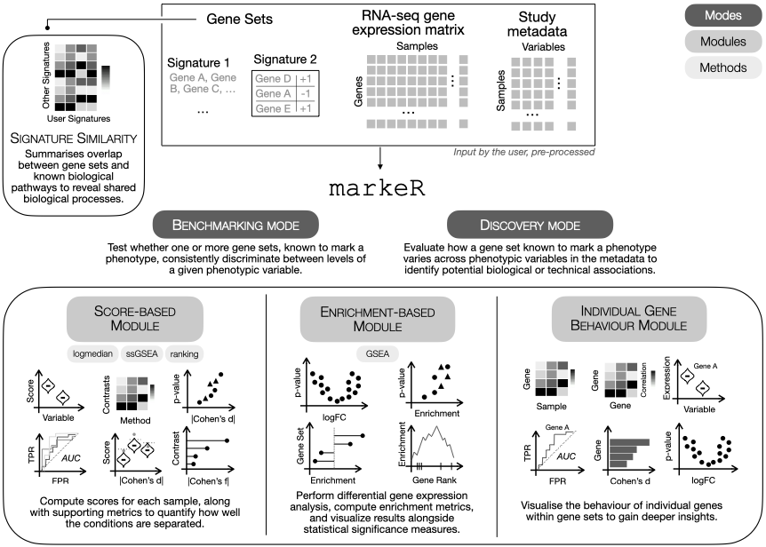

<!-- README.md is generated from README.Rmd. Please edit that file -->

```{r, include = FALSE}
knitr::opts_chunk$set(
  collapse = TRUE,
  comment = "#>",
  fig.path = "man/figures/README-",
  out.width = "100%"
)
```

# markeR <a href="https://diseasetranscriptomicslab.github.io/markeR/"></a>

<!-- badges: start -->

<!---->
[](https://diseasetranscriptomicslab.github.io/markeR/)

[](https://codecov.io/gh/DiseaseTranscriptomicsLab/markeR)
<!-- [](https://github.com/DiseaseTranscriptomicsLab/markeR/actions/workflows/R-CMD-check.yaml)-->
<!-- [](https://github.com/DiseaseTranscriptomicsLab/markeR/actions/workflows/bioc-check.yml) -->

<!-- badges: end -->

**`markeR`** is an R package that provides a modular and extensible framework for the systematic evaluation of gene sets as phenotypic markers using transcriptomic data. The package is designed to support both quantitative analyses and visual exploration of gene set behaviour across experimental and clinical phenotypes.

> **To cite `markeR` please use:** 
>
> Martins-Silva R, Kaizeler A, Barbosa-Morais NL (2026). "Exploring molecular signatures of senescence with markeR, an R Toolkit for evaluating gene sets as
  phenotypic markers." NAR Genomics and Bioinformatics, 8(2), lqag057. doi:10.1093/nargab/lqag057
 
The folder `inst/Paper/` is in the **paper** branch and contains all scripts and materials used in the original `markeR` paper to reproduce analyses and figures.  You can browse it [here](https://github.com/DiseaseTranscriptomicsLab/markeR/tree/paper/inst/Paper).





## Table of Contents 

- [Installation](#installation)  
- [Tutorials](#tutorials)  
- [Requirements](#requirements)
- [Common Workflow](#common-workflow)  
  - [1. Input Requirements](#1-input-requirements)  
  - [2. Select Mode of Analysis](#2-select-mode-of-analysis)  
  - [3. Choose a Quantification Approach](#3-choose-a-quantification-approach)  
    - [3.1 Score-Based Approach](#31-score-based-approach)  
    - [3.2 Enrichment-Based Approach](#32-enrichment-based-approach)  
  - [4. Visualisation and Evaluation](#4-visualisation-and-evaluation)  
  - [5. Individual Gene Exploration (Optional)](#5-individual-gene-exploration-optional)  
  - [6. Compare with Reference Gene Sets (Optional)](#6-compare-with-reference-gene-sets-optional)  
- [Python Bridge](#python-bridge)
- [Contact](#contact)


## Installation 


Install the latest release from Bioconductor:

```{r, eval=FALSE}
# Install from Bioconductor
if (!requireNamespace("BiocManager", quietly = TRUE))
    install.packages("BiocManager")
BiocManager::install("markeR")
library(markeR)
```
 

Or install the latest development release of `markeR` from [GitHub](https://github.com/) with:
   
``` r
# install.packages("devtools")
devtools::install_github("DiseaseTranscriptomicsLab/markeR@*release")
```

## Tutorials

The following tutorials are available:

* [Introduction to markeR][tutorial-introduction]
* [Benchmarking Mode][tutorial-benchmarking]
* [Discovery Mode][tutorial-discovery]
* [Signature Similarity][tutorial-signaturesimilarity]

## Requirements

This package is officially supported on `R > 4.5.0`. ⚠️ Older versions of `R` may work, but are not officially supported due to upstream dependency constraints. In some cases, installing older versions of dependencies (e.g., via `renv`, `CRAN` snapshots, or `checkpoint`) can restore compatibility. 

## Common Workflow

### 1. Input Requirements 

Depending on the analysis mode, inputs vary slightly.

* **Gene Set(s)**:  
  A named list where each element represents one gene set:

  * Use a **character vector** for gene sets where direction of enrichment is not known.
  * Use a **data frame** with gene names and a directionality column (`-1` for down-regulated, `+1` for up-regulated)

This structure supports both **Discovery Mode** (single gene set) and **Benchmarking Mode** (multiple gene sets).

```{r example-gene-sets-vector, echo=FALSE}
# Gene set without direction
gene_set1 <- c("GeneA", "GeneB", "GeneC", "GeneD")

# Gene set with direction
gene_set2 <- data.frame(
  gene = c("GeneX", "GeneY", "GeneZ"),
  direction = c(1, -1, 1),
  stringsAsFactors = FALSE
)

# Combine both into a named list
gene_sets <- list(
  Set1 = gene_set1,
  Set2 = gene_set2
)
```

```{r show-gene-set, echo=TRUE}
# Example 
gene_sets
```
  
* **Expression Data Frame**:  
  A filtered and normalised, non log-transformed, gene expression matrix (genes × samples). Row names must be gene identifiers; column names must match sample IDs in the metadata. 
  
  **Warning:** If you are using microarray data or outputs from common RNA-seq pipelines (*e.g.*, edgeR), note that the expression values may already be log2-normalised. The input to `markeR` must necessarily be **non-log-transformed**. If your data are log2-transformed, you can revert them by applying `2^data`.


```{r example-expression-matrix, echo=FALSE}
# Simulate expression matrix: 10 genes × 5 samples
set.seed(123)
genes <- c("GeneA", "GeneB", "GeneC", "GeneD", "GeneX", "GeneY", "GeneZ", "GeneM", "GeneN", "GeneO")
samples <- paste0("Sample", 1:5)
expr_matrix <- matrix(rnorm(10*5, mean=5, sd=2), nrow=10, dimnames = list(genes, samples))
expr_df <- as.data.frame(expr_matrix)
```

```{r show-expression-matrix, echo=TRUE}
head(expr_df)
```

* **Sample Metadata**:  
  A data frame with samples as rows and annotations as columns. The first column should contain sample IDs matching the expression matrix column names.

```{r example-metadata, echo=FALSE}
# Simulate sample metadata
metadata <- data.frame(
  SampleID = samples,
  Condition = rep(c("Control", "Treatment"), length.out=5),
  Age = sample(25:50, 5, replace=TRUE)
)
```

```{r show-metadata, echo=TRUE}
metadata
```

### 2. Select Mode of Analysis

`markeR` provides two modes of operation:

* **Benchmarking**:
evaluates gene sets' performance in marking a metadata variable, *i.e.*, a phenotype, returning comparative visualisations across scoring and enrichment methods.

* **Discovery**:
examines the relationship between a gene set and one or more variables of interest, suitable for exploratory or hypothesis-generating analyses. 

### 3. Choose a Quantification Approach

Two complementary strategies are implemented for quantifying associations between gene sets and phenotypes:

#### 3.1 Score-Based Approach


A score summarising the collective expression of a gene set therein is assigned **to each sample**. Scores can be visualised using built-in functions, or used directly in downstream analyses (*e.g.*, comparisons between phenotypic groups of samples, correlations with numerical phenotypes). 

Available methods:

* **Log2-median**: mean of the across-sample normalised log2 median-centred expression levels of the genes in the set; for bidirectional gene sets, the sample score is the partial score for the subset of putatively upregulated genes minus that of the downregulated subset.

* **Ranking**: mean expression rank of gene set members in each sample; for bidirectional gene sets, the sample score is the partial score for the subset of putatively upregulated genes minus that of the downregulated subset, and normalised by the number of genes in the set. 

* **ssGSEA**: single-sample gene set enrichment score using ssGSEA; for bidirectional gene sets, the sample score is the partial score for the subset of putatively upregulated genes minus that of the downregulated subset.

Gene sets that are robust phenotypic markers are expected to yield consistently high scores across methods.

#### 3.2 Enrichment-Based Approach

Enrichment-based methods implement **Gene Set Enrichment Analysis (GSEA)**. Genes are ranked according to differential expression statistics, and a Normalised Enrichment Score (NES) per variable of interest is computed, accompanied by a p-value adjusted for multiple hypothesis testing.

### 4. Visualisation and Evaluation

In **Benchmarking Mode**, `markeR` offers a range of visual summaries: 

* Violin plots of score distributions by categorical phenotype;
* Scatter plots of association between scores and numerical phenotypes;
* Volcano plots and heatmaps of scores or differential gene set expression based on effect sizes (Cohen’s *d* or *f*);
* ROC curves and respective AUC values of gene sets' phenotypic classification performance;
* Violin plots of effect size distributions (Cohen’s *d*) for pairwise group differences in scores, for original and simulated gene sets;
* Plots summarising NES alongside adjusted p-values (*e.g.*, lollipop plots); 
* GSEA plots showing running enrichment scores across ranked gene lists.


In **Discovery Mode**, the output focuses on a single gene set:

* Score distributions stratified by variable;
* Effect sizes for pairwise and multiple-group differences (Cohen's *d* and *f*, respectively);
* Cross-variable summaries of NES and adjusted p-values (*e.g.*, lollipop plots).

The Benchmarking Mode offers the most comprehensive set of features. Users are allowed to seamlessly move from Discovery to Benchmarking once a variable of interest has been identified and further testing is required. Benchmarking is designed to evaluate multiple gene sets simultaneously, whereas Discovery focuses on the performance of a single gene set.

### 5. Individual Gene Exploration  
   
To better understand the contribution of individual genes within a gene set, and identify whether specific genes drive the set's collective signal,  `markeR` provides `VisualiseIndividualGenes.` Available options include:

* Expression heatmaps of genes across samples or groups of samples;
* Violin plots showing cross-sample expression distributions of individual genes; 
* Heatmaps of pairwise cross-sample expression correlation between genes in the set;
* ROC curves and AUC values to evaluate single genes' performance as phenotypic markers;
* Effect size estimation (Cohen’s *d*) of expression differences between groups of samples;
* Principal Component Analysis (PCA) of expression of genes in the set, to evaluate which genes dominate collective variance and how samples separate according to the gene set's expression.

### 6. Compare with Reference Gene Sets  

`markeR` also supports comparison of user-defined gene sets against reference collections (e.g., MSigDB). Two complementary similarity metrics are implemented:

* **Jaccard Index**:
the ratio of the number of genes in common over the total number of genes in the two sets.

* **Log Odds Ratio (logOR)** from Fisher’s exact test of association between gene sets, given a specified gene universe.

Filters can be applied based on similarity thresholds (e.g., minimum Jaccard, OR, or Fisher's test p-value).

## Python Bridge

For users who prefer Python, a lightweight bridge is available in
`python/` that allows calling any `markeR` function from a Python
environment via [`rpy2`](https://rpy2.github.io/). It includes a tutorial
workflow script and a generic command-line wrapper. See
[`python/README.md`](inst/python/README.md) for installation
instructions and usage examples.


## Contact 

📩 For any questions or concerns, feel free to reach out:

**Rita Martins-Silva**  
Email: [rita.silva@medicina.ulisboa.pt](mailto:rita.silva@medicina.ulisboa.pt)

[tutorial-introduction]: https://diseasetranscriptomicslab.github.io/markeR/articles/markeR.html
[tutorial-benchmarking]: https://diseasetranscriptomicslab.github.io/markeR/articles/Article_BenchmarkingMode.html
[tutorial-discovery]: https://diseasetranscriptomicslab.github.io/markeR/articles/Article_DiscoveryMode.html
[tutorial-signaturesimilarity]: https://diseasetranscriptomicslab.github.io/markeR/articles/Article_GeneSetSimilarity.html
