<!-- README.md is generated from README.Rmd. Please edit that file -->

# markeR

<!-- badges: start -->


<!-- badges: end -->

**markeR** provides a suite of methods for using gene sets (signatures)
to quantify and evaluate the extent to which a given gene signature
marks a specific phenotype. The package implements various scoring,
enrichment and classification approaches, along with tools to compute
performance metrics and visualize results, making it a valuable resource
for transcriptomics research (bulk RNA-seq).

## Table of Contents

-   [Installation](#installation)
-   [Main Functions and Future
    Modules](#main-functions-and-future-modules)
-   [Example](#example)
-   [Visualise Individual Genes from Senescence
    Signature](#visualise-individual-genes-from-senescence-signature)
    -   [Expression Heatmap](#expression-heatmap)
    -   [Expression Violins](#expression-violins)
    -   [Correlation Heatmap](#correlation-heatmap)
    -   [ROC and AUC](#roc-and-auc)
    -   [Cohen’s D](#cohens-d)
    -   [PCA with Only Genes of
        Interest](#pca-with-only-genes-of-interest)
-   [Calculate Senescence Scores](#calculate-senescence-scores)
    -   [logmedian Method](#logmedian-method)
    -   [ssGSEA Method](#ssgsea-method)
    -   [Ranking Method](#ranking-method)
    -   [All Methods](#all-methods)
    -   [False Discovery Rate (FDR)
        Calculations](#false-discovery-rate-fdr-calculations)
    -   [Score association with Chosen
        Variables](#score-association-with-chosen-variables)
-   [Enrichment-Based Methods](#enrichment-based-methods)
    -   [Differentially Expressed
        Genes](#differentially-expressed-genes)
    -   [Gene Set Enrichment Analyses](#gene-set-enrichment-analyses)

## Installation

You can install the development version of markeR from
[GitHub](https://github.com/) with:

``` r
# install.packages("devtools")
devtools::install_github("DiseaseTranscriptomicsLab/markeR")
```

## Main Functions and Future Modules

The current release of **`markeR`** includes two primary functions for
**score-based analysis**:

-   **`CalculateScores`:** Calculates gene signature scores for each
    sample using either the ssGSEA, log2 median-centered or ranking
    method.
-   **`PlotScores`:** Calculates and displays the calculated scores
    across conditions using violin plots, density plots or heatmaps,
    depending on the chosen parameters.

Additionally, it includes a function for FDR calculation based on random
sets of genes for each signature:

-   **`FDR_Simulation`:** Computes false discovery rates using random
    gene sets.

Although still being developed, the package already includes two
functions for **enrichment-based analysis**:

-   **`calculateDE`:** Performs differential expression analysis.
-   **`plotVolcano`:** Generates volcano plots to visualize
    differentially expressed genes.
-   **`runGSEA`:** Performs GSEA using `fgsea` for each contrast in a
    list of differential expression results.  
-   **`plotGSEAenrichment`:** Generates enrichment plots for gene sets
    using the `fgsea::plotEnrichment()` function
-   **`plotNESlollipop`:** Generates a lollipop plot to visualize Gene
    Set Enrichment Analysis (GSEA) results.
-   **`plotCombinedGSEA`:** Creates a scatter plot visualizing multiple
    GSEA (Gene Set Enrichment Analysis) results across different
    contrasts.

It also includes some functions for visualising individual genes from a
gene signature:

-   **`IndividualGenes_Violins`:** creates violin plots of gene
    expression data with jittered points and optional faceting, allowing
    for visualization of individual gene expression distributions across
    sample groups.
-   **`CorrelationHeatmap`:** computes and visualizes a correlation
    heatmap for a given set of genes. Optionally, the heatmap can be
    generated separately for different conditions based on metadata.
-   **`ExpressionHeatmap`:** generates an expression heatmap with
    customizable sample annotations for a given set of genes.
-   **`ROCandAUCplot`:** computes ROC curves and AUC values for each
    gene based on gene expression data and sample metadata. It can
    generate ROC plots, an AUC heatmap, or both arranged side‐by‐side.
-   **`CohenDH_IndividualGenes`:** computes Cohen’s d for each gene
    based on gene expression data and sample metadata. The resulting
    effect sizes are then visualized as a heatmap.
-   **`plotPCA`:** performs PCA on a given dataset and visualizes the
    results using ggplot2. It allows users to specify genes of interest
    (to understand if they are sufficient to explain the main variance
    in the data), customize scaling and centering, and color points
    based on a metadata variable.

Future updates will expand the package with additional functions to:

-   Conduct classification-based analysis (to train classifiers, e.g.,
    using Random Forests, and to evaluate performance via ROC curves).
-   Provide additional gene-level visualization modules to display
    expression patterns of individual genes within signatures.

## Example

This example demonstrates the calculation of a log2-median-centered
score using mock RNA-seq expression data. The dataset is derived from
the Marthandan et al. (2016) study (GSE63577) and includes fibroblast
samples under replicative senescent and proliferative conditions. (see
`?counts_example` and `?metadata_example` for more details).This example
showcases how to compute gene expression scores by applying the
log2-median-centered transformation.

We are using as an example a very simple senescence gene signature,
composed of the genes usually associated with senescence.

``` r
library(markeR)
```

``` r
# Define simple Senescence Signature
SimpleSenescenceSignature <- c("CDKN1A", "CDKN2A", "GLB1","TP53","CCL2", "LMNB1", "MKI67" )
```

``` r
data(metadata_example)
data(counts_example)

# Load example data
head(metadata_example)
#>       sampleID      DatasetID   CellType     Condition       SenescentType
#> 252 SRR1660534 Marthandan2016 Fibroblast     Senescent Telomere shortening
#> 253 SRR1660535 Marthandan2016 Fibroblast     Senescent Telomere shortening
#> 254 SRR1660536 Marthandan2016 Fibroblast     Senescent Telomere shortening
#> 255 SRR1660537 Marthandan2016 Fibroblast Proliferative                none
#> 256 SRR1660538 Marthandan2016 Fibroblast Proliferative                none
#> 257 SRR1660539 Marthandan2016 Fibroblast Proliferative                none
#>                         Treatment
#> 252 PD72 (Replicative senescence)
#> 253 PD72 (Replicative senescence)
#> 254 PD72 (Replicative senescence)
#> 255                         young
#> 256                         young
#> 257                         young
counts_example[1:5,1:5]
#>          SRR1660534 SRR1660535 SRR1660536 SRR1660537 SRR1660538
#> A1BG        9.94566   9.476768   8.229231   8.515083   7.806479
#> A1BG-AS1   12.08655  11.550303  12.283976   7.580694   7.312666
#> A2M        77.50289  56.612839  58.860268   8.997624   6.981857
#> A4GALT     14.74183  15.226083  14.815891  14.675780  15.222488
#> AAAS       47.92755  46.292377  43.965972  47.109493  47.213739
```

### Visualise Individual Genes from Senescence Signature

#### Expression Heatmap

``` r
annotation_colors <- list( 
  Condition = c(
    "Senescent"     = "#65AC7C",  # Example color: greenish
    "Proliferative" = "#5F90D4"  # Example color: blueish 
  )
)

ExpressionHeatmap(data=counts_example, 
                  metadata = metadata_example, 
                  genes=SimpleSenescenceSignature,  
                  annotate.by = c("Condition"),
                  annotation_colors = annotation_colors,
                  colorlist = list(low = "#3F4193", mid = "#F9F4AE", high = "#B44141"),
                  cluster_rows = TRUE, 
                  cluster_columns = FALSE,
                  title = "Senescence Genes", 
                  titlesize = 20,
                  legend_position = "right",
                  scale_position="right")
```

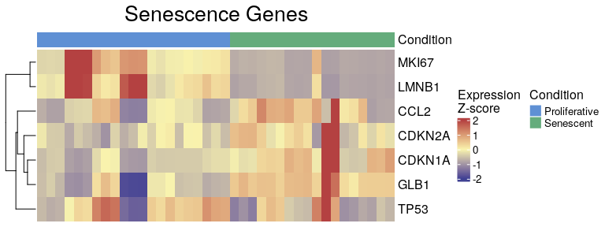

#### Expression Violins

``` r
senescence_triggers_colors <- c(
  "none" = "#E57373",  # Soft red   
  "Telomere shortening" = "#4FC3F7"  # Vivid sky blue  
)


IndividualGenes_Violins(data = counts_example, 
                        metadata = metadata_example, 
                        genes = SimpleSenescenceSignature, 
                        GroupingVariable = "Condition", 
                        plot=T, 
                        ncol=NULL, 
                        nrow=1, 
                        divide=NULL, 
                        invert_divide=FALSE,
                        ColorValues=senescence_triggers_colors, 
                        pointSize=2, 
                        ColorVariable="SenescentType", 
                        title="Senescence Genes", 
                        widthTitle=16,
                        y_limits = NULL,
                        legend_nrow=1, 
                        xlab="Condition",
                        colorlab="") 
```

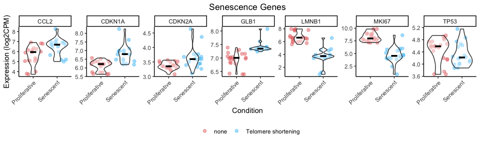

#### Correlation Heatmap

``` r
CorrelationHeatmap(data=counts_example, 
                   metadata = metadata_example, 
                   genes=SimpleSenescenceSignature, 
                   separate.by = "Condition", 
                   method = "spearman",  
                   colorlist = list(low = "#3F4193", mid = "#F9F4AE", high = "#B44141"),
                   limits_colorscale = c(-1,0,1), 
                   widthTitle = 16, 
                   title = "Senescence Genes", 
                   cluster_rows = TRUE, 
                   cluster_columns = TRUE,  
                   detailedresults = FALSE, 
                   legend_position="right",
                   titlesize=20)
```

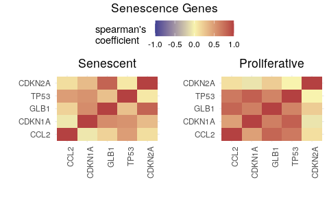

#### ROC and AUC

``` r
senescence_triggers_colors <- c(
  "none" = "#E57373",  # Soft red   
  "Telomere shortening" = "#4FC3F7"  # Vivid sky blue  
)

ROCandAUCplot(counts_example, 
              metadata_example, 
              condition_var = "Condition", 
              class = "Senescent", 
              group_var=NULL,
              genes=SimpleSenescenceSignature, 
              plot_type = "all",
              heatmap_params = list(col = list( "#F9F4AE" ,"#B44141"),
                                    limits = c(0.5,1),
                                    cluster_rows=T),
              roc_params = list(nrow=3,
                                ncol=3,
                                colors=senescence_triggers_colors),
              commomplot_params = list(widths=c(0.5,0.3)))
```

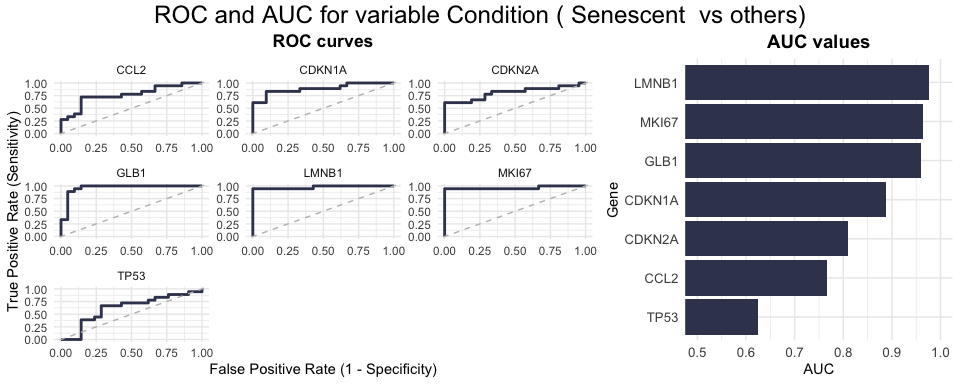

#### Cohen’s D

``` r
CohenD_IndividualGenes(counts_example, 
                       metadata_example, 
                       genes=SimpleSenescenceSignature,
                       condition_var = "Condition", 
                       class = "Senescent", 
                       group_var = NULL,  
                       heatmap_params = list(col = list( "#F9F4AE" ,"#B44141"),
                                             limits = NULL,
                                             cluster_rows=T))
```

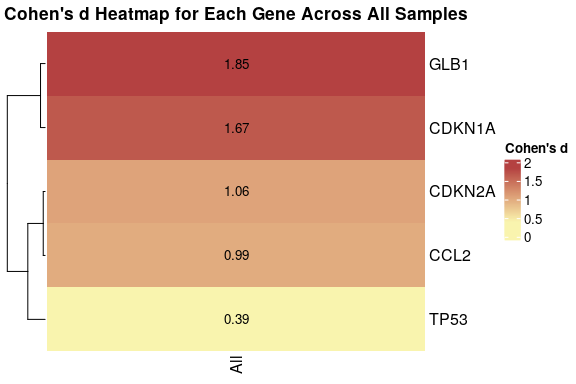

#### PCA with only genes of interest

``` r
annotation_colors <- c(  
  "Senescent"     = "#65AC7C",  # Example color: greenish
  "Proliferative" = "#5F90D4"  # Example color: blueish 
)


plotPCA(data = counts_example, 
        metadata = metadata_example, 
        genes=SimpleSenescenceSignature, 
        scale=FALSE, 
        center=TRUE, 
        PCs=list(c(1,2), c(2,3), c(3,4)), 
        ColorVariable="Condition",
        ColorValues=annotation_colors,
        pointSize=5,
        legend_nrow=1, 
        ncol=3, 
        nrow=NULL)
```

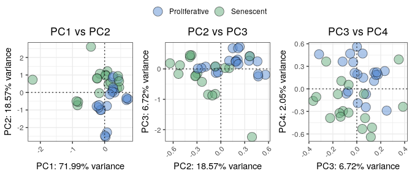

### Calculate Senescence Scores

#### logmedian method

The following example uses the **“logmedian”** method for score
calculation.

The user can chose to calculate the gene signature score for each sample
based on one or more predefined gene sets (signatures). If a single
method is chosen, a data frame containing the calculated scores for each
gene signature, including metadata if provided. If method = “all” (see
below for an example), a list is returned where each element corresponds
to a scoring method and contains the respective data frame of scores.

``` r
df_Scores <- CalculateScores(data = counts_example,
                             metadata = metadata_example,
                             method = "logmedian",
                             gene_sets = list(Senescence=SimpleSenescenceSignature))
#> Considering unidirectional gene signature mode for signature Senescence

head(df_Scores$Senescence)
#>       sample      score      DatasetID   CellType     Condition
#> 1 SRR1660534 -0.6894748 Marthandan2016 Fibroblast     Senescent
#> 2 SRR1660535 -0.4483299 Marthandan2016 Fibroblast     Senescent
#> 3 SRR1660536 -0.4596502 Marthandan2016 Fibroblast     Senescent
#> 4 SRR1660537 -0.2198753 Marthandan2016 Fibroblast Proliferative
#> 5 SRR1660538 -0.2672930 Marthandan2016 Fibroblast Proliferative
#> 6 SRR1660539 -0.2623188 Marthandan2016 Fibroblast Proliferative
#>         SenescentType                     Treatment
#> 1 Telomere shortening PD72 (Replicative senescence)
#> 2 Telomere shortening PD72 (Replicative senescence)
#> 3 Telomere shortening PD72 (Replicative senescence)
#> 4                none                         young
#> 5                none                         young
#> 6                none                         young
```

The user can also chose to directly plot the scores.

``` r
# df_Scores <- CalculateScores(data = counts_example, 
#                              metadata = metadata_example, 
#                              method = "logmedian", 
#                              gene_sets = list(Senescence=SimpleSenescenceSignature))

senescence_triggers_colors <- c(
  "none" = "#E57373",  # Soft red   
  "Telomere shortening" = "#4FC3F7"  # Vivid sky blue  
)

cond_cohend <- list(A=c("Senescent"),  
                    B=c("Proliferative"))

PlotScores(data = counts_example, 
           metadata = metadata_example, 
           gene_sets = list(Senescence=SimpleSenescenceSignature),
           ColorVariable = "SenescentType", 
           GroupingVariable="Condition",  
           method ="logmedian", 
           ColorValues = senescence_triggers_colors, 
           ConnectGroups=TRUE, 
           ncol = NULL, 
           nrow = NULL, 
           widthTitle=24, 
           limits = NULL, 
           legend_nrow = 1, 
           pointSize=4,
           cond_cohend=cond_cohend,
           title="Marthandan et al. 2016",
           labsize=7, 
           titlesize = 10)  
```

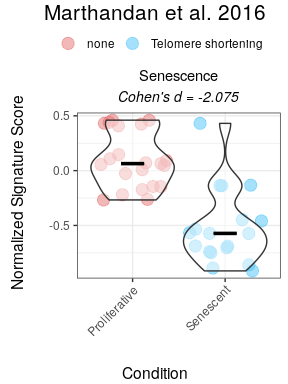

Given that some of the genes are expected to be upregulated, while
others to be downregulated in senescence, we can also consider a
*bidirectional signature*.

``` r
SimpleSenescenceSignature_bidirectional <- data.frame(gene=c("CDKN1A", "CDKN2A", "GLB1","TP53","CCL2", "LMNB1", "MKI67" ),
                                                      enrichment=c(1,1,1,1,1,-1,-1))
# 
# df_Scores <- CalculateScores(data = counts_example, 
#                              metadata = metadata_example, 
#                              method = "logmedian", 
#                              gene_sets = list(Senescence=SimpleSenescenceSignature_bidirectional))

PlotScores(data = counts_example, 
           metadata = metadata_example, 
           gene_sets = list(Senescence=SimpleSenescenceSignature_bidirectional),
           ColorVariable = "SenescentType", 
           GroupingVariable="Condition",  
           method ="logmedian", 
           ColorValues = senescence_triggers_colors, 
           ConnectGroups=TRUE, 
           ncol = NULL, 
           nrow = NULL, 
           widthTitle=24, 
           limits = NULL, 
           legend_nrow = 1, 
           pointSize=4,
           cond_cohend=cond_cohend,
           title="Marthandan et al. 2016",
           labsize=7, 
           titlesize = 10)  
```


For users interested in viewing the overall distribution of scores,
simply omit the `GroupingVariable` or `metadata` parameters. In this
case, the function will automatically generate a grid of density plots,
with each gene signature represented by its own plot.

``` r
PlotScores(data = counts_example, 
           metadata = metadata_example, 
           gene_sets = list(Senescence_Bidirectional = SimpleSenescenceSignature_bidirectional,
                            Senescence  = SimpleSenescenceSignature), 
           method ="logmedian", 
           ColorValues = NULL,  
           ncol = NULL, 
           nrow = NULL, 
           widthTitle=24, 
           limits = NULL,  
           title="Marthandan et al. 2016",
           labsize=8, 
           titlesize = 10)  
```

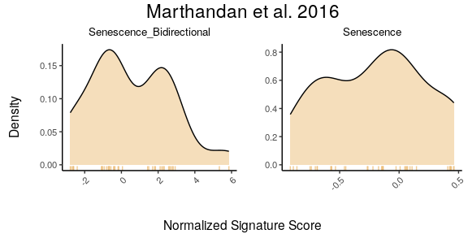

#### ssGSEA method

The following example uses the **“ssGSEA”** method for score
calculation, both for unidirectional and bidirectional signatures.

``` r
#  
# df_Scores <- CalculateScores(data = counts_example, 
#                              metadata = metadata_example, 
#                              method = "ssGSEA", 
#                              gene_sets = list(Senescence=SimpleSenescenceSignature))

senescence_triggers_colors <- c(
  "none" = "#E57373",  # Soft red   
  "Telomere shortening" = "#4FC3F7"  # Vivid sky blue  
)

cond_cohend <- list(A=c("Senescent"),  
                    B=c("Proliferative"))

PlotScores(data = counts_example, 
           metadata = metadata_example, 
           gene_sets = list(Senescence=SimpleSenescenceSignature),
           ColorVariable = "SenescentType", 
           GroupingVariable="Condition",  
           method ="ssGSEA", 
           ColorValues = senescence_triggers_colors, 
           ConnectGroups=TRUE, 
           ncol = NULL, 
           nrow = NULL, 
           widthTitle=24, 
           limits = NULL, 
           legend_nrow = 1, 
           pointSize=4,
           cond_cohend=cond_cohend,
           title="Marthandan et al. 2016",
           labsize=7, 
           titlesize = 10)  
```

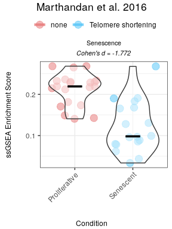

``` r
# df_Scores <- CalculateScores(data = counts_example, 
#                              metadata = metadata_example, 
#                              method = "ssGSEA", 
#                              gene_sets = list(Senescence=SimpleSenescenceSignature_bidirectional))

senescence_triggers_colors <- c(
  "none" = "#E57373",  # Soft red   
  "Telomere shortening" = "#4FC3F7"  # Vivid sky blue  
)

cond_cohend <- list(A=c("Senescent"),  
                    B=c("Proliferative"))

PlotScores(data = counts_example, 
           metadata = metadata_example, 
           gene_sets = list(Senescence=SimpleSenescenceSignature_bidirectional),
           ColorVariable = "SenescentType", 
           GroupingVariable="Condition",  
           method ="ssGSEA", 
           ColorValues = senescence_triggers_colors, 
           ConnectGroups=TRUE, 
           ncol = NULL, 
           nrow = NULL, 
           widthTitle=24, 
           limits = NULL, 
           legend_nrow = 1, 
           pointSize=4,
           cond_cohend=cond_cohend,
           title="Marthandan et al. 2016",
           labsize=7, 
           titlesize = 10)  
```

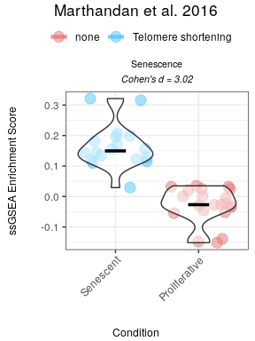

#### Ranking method

The following example uses the **“ranking”** method for score
calculation, both for unidirectional and bidirectional signatures.

``` r
# df_Scores <- CalculateScores(data = counts_example, 
#                              metadata = metadata_example, 
#                              method = "ranking", 
#                              gene_sets = list(Senescence=SimpleSenescenceSignature))

senescence_triggers_colors <- c(
  "none" = "#E57373",  # Soft red   
  "Telomere shortening" = "#4FC3F7"  # Vivid sky blue  
)

cond_cohend <- list(A=c("Senescent"),  
                    B=c("Proliferative"))

PlotScores(data = counts_example, 
           metadata = metadata_example, 
           gene_sets = list(Senescence=SimpleSenescenceSignature),
           ColorVariable = "SenescentType", 
           GroupingVariable="Condition",  
           method ="ranking", 
           ColorValues = senescence_triggers_colors, 
           ConnectGroups=TRUE, 
           ncol = NULL, 
           nrow = NULL, 
           widthTitle=24, 
           limits = NULL, 
           legend_nrow = 1, 
           pointSize=4,
           cond_cohend=cond_cohend,
           title="Marthandan et al. 2016",
           labsize=7, 
           titlesize = 10)  
```

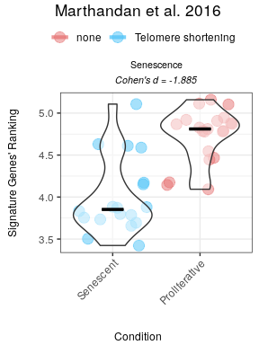

``` r
# df_Scores <- CalculateScores(data = counts_example, 
#                              metadata = metadata_example, 
#                              method = "ranking", 
#                              gene_sets = list(Senescence=SimpleSenescenceSignature_bidirectional))

senescence_triggers_colors <- c(
  "none" = "#E57373",  # Soft red   
  "Telomere shortening" = "#4FC3F7"  # Vivid sky blue  
)

cond_cohend <- list(A=c("Senescent"),  
                    B=c("Proliferative"))

PlotScores(data = counts_example, 
           metadata = metadata_example, 
           gene_sets = list(Senescence=SimpleSenescenceSignature_bidirectional),
           ColorVariable = "SenescentType", 
           GroupingVariable="Condition",  
           method ="ranking", 
           ColorValues = senescence_triggers_colors, 
           ConnectGroups=TRUE, 
           ncol = NULL, 
           nrow = NULL, 
           widthTitle=24, 
           limits = NULL, 
           legend_nrow = 1, 
           pointSize=4,
           cond_cohend=cond_cohend,
           title="Marthandan et al. 2016",
           labsize=7, 
           titlesize = 10)  
```

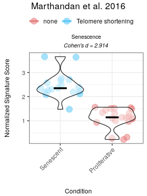

#### All methods

To compare various metrics across different condition combinations,
violin plots may not always be the best choice. In such cases, users can
set`method = "all"` to generate a summary heatmap. The function will
return one heatmap per gene set, with rows corresponding to all possible
combinations of values in the `GroupingVariable`.

``` r
PlotScores(data = counts_example, 
           metadata = metadata_example,  
           gene_sets=list(Senescence_Bidirectional = SimpleSenescenceSignature_bidirectional,
                          Senescence  = SimpleSenescenceSignature), 
           GroupingVariable="Condition",  
           method ="all",   
           ncol = NULL, 
           nrow = NULL, 
           widthTitle=30, 
           limits = NULL,   
           title="Marthandan et al. 2016", 
           titlesize = 12,
           ColorValues = NULL)  
```

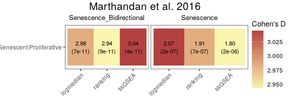

#### False Discovery Rate (FDR) Calculations

The user can assess the significance of gene signature scores by
comparing observed effect sizes against those originated by random
signatures. For each original gene signature, the function calculates
the observed Cohen’s d (and p‑value) using (`GroupingVariable`). It then
generates a number of simulated signatures (`number_of_sims`) by
randomly sampling genes from a user provided gene list (`gene_list`) and
computes their Cohen’s d values. The simulation results are visualised
as violin plots that display the distribution of Cohen’s d values for
each method, overlaid with the observed values of the original
signatures, and a 95th percentile threshold. Significance is indicated
by distinct point shapes based on the associated p‑value.

``` r
FDR_Simulation(data = counts_example,
               metadata = metadata_example,
               original_signatures = list(Senescence_Bidirectional = SimpleSenescenceSignature_bidirectional,
                                          Senescence  = SimpleSenescenceSignature),
               gene_list = row.names(counts_example),
               number_of_sims = 100,
               title_for_plot = "Marthandan et al. 2016",
               GroupingVariable = "Condition")
```

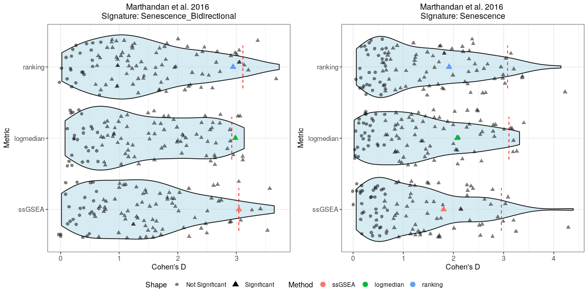

#### Score association with Chosen Variables

When analyzing data, it is often **unclear whether a given variable is
meaningfully associated with a target score**. To assist in this
exploratory process, the package provides **statistical tests and
visualizations to assess relationships between variables of different
types**.

-   Numeric variables are tested using correlation methods (Pearson,
    Spearman, or Kendall).
-   Binary categorical variables (two unique values) are analyzed using
    a t-test or Wilcoxon rank-sum test.
-   Multi-level categorical variables (more than two unique values) are
    examined using ANOVA or Kruskal-Wallis, followed by Tukey’s post-hoc
    test when applicable.

The results are returned as a structured list of statistical metrics and
p-values, along with plots for an intuitive interpretation of
associations. These plots include scatter plots for numeric variables
and density plots for categorical variables, with statistical
annotations. If categorical variables have more than 10 unique values, a
warning is issued to ensure meaningful interpretation.

This approach allows users to quickly **identify potential relationships
between scores and predictor variables**, guiding further analysis.

This approach requires that the user is analysing a specific method for
score calculation and gene signature. For illustration purposes, we will
go with the `logmedian` method and compare the two signatures for
Senescence.

``` r
df_Scores_logmedian <- CalculateScores(data = counts_example,
                             metadata = metadata_example,
                             method = "logmedian",
                             gene_sets = list(Senescence_Bidirectional = SimpleSenescenceSignature_bidirectional,
                          Senescence  = SimpleSenescenceSignature))
#> Considering bidirectional gene signature mode for signature Senescence_Bidirectional
#> Considering unidirectional gene signature mode for signature Senescence
 
df_Scores_logmedian_Sen <- df_Scores_logmedian$Senescence
df_Scores_logmedian_BidirectSen <- df_Scores_logmedian$Senescence_Bidirectional
```

For illustration purposes, let’s imagine we also had two more variables:
one defining the number of days that passed between sample preparation
and sequencing, and one defining the person that processed it.

``` r
set.seed("123456")

days <- sample(c(1:20),39, replace = T)
person <- sample(c("John","Ana","Francisca"),39, replace = T)

df_Scores_logmedian_Sen$person <- person
df_Scores_logmedian_Sen$days <- days

df_Scores_logmedian_BidirectSen$person <- person
df_Scores_logmedian_BidirectSen$days <- days
```

``` r
VariableAssociation(df=df_Scores_logmedian_Sen, c("Condition","person","days"), target_var="score", targetvar_lab ="Normalized Signature Score",
                            discrete_colors = NULL, continuous_color = "#8C6D03",
                            color_palette = "Set2",
                            sizeannot=3.5, ncol=NULL, nrow=1,
                            numeric = "pearson",
                            categorical_bin = "t.test",
                            categorical_multi = "anova",
                            legend.position=c("top","bottom","right","left"), title="Senescence Signature", titlesize = 12 )
```

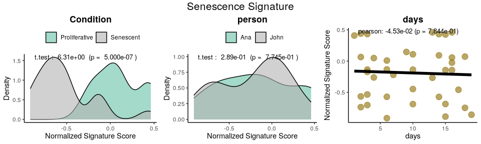

``` r
VariableAssociation(df=df_Scores_logmedian_BidirectSen, c("Condition","person","days"), target_var="score", targetvar_lab="Normalized Signature Score",
                            discrete_colors = NULL, continuous_color = "#8C6D03",
                            color_palette = "Set2",
                            sizeannot=3.5, ncol=NULL, nrow=1,
                            numeric = "pearson",
                            categorical_bin = "t.test",
                            categorical_multi = "anova",
                            legend.position=c("top","bottom","right","left"), title="Bidirectional Senescence Signature", titlesize = 12 )
```

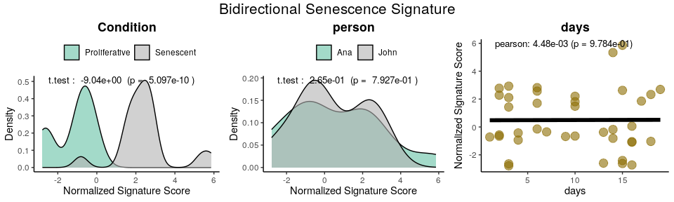

### Enrichment-Based Methods

#### Differentially Expressed Genes

The `calculateDE` function in the `markeR` package leverages the `limma`
framework to compute differential gene expression statistics from raw
count data. This function is highly flexible and supports several modes
of operation depending on the user’s experimental design. In the
examples below, we illustrate three common scenarios:

-   **Automatic Design Matrix with Contrasts:** In the first example,
    the design matrix is built automatically from the metadata using a
    specified variable (here, `"Condition"`). A contrast (in this case,
    "`Senescent - Proliferative"`) is then applied to extract the
    differential expression statistics between the two conditions. This
    is ideal when you have a simple design and want to quickly compute
    contrasts without manually creating the design matrix.
-   **Custom Model Formula with Coefficient Extraction:** The second
    example demonstrates how to supply a custom model formula (e.g.,
    `~Condition`) directly to the function. This allows you to have fine
    control over the design, and you can specify which coefficients you
    want to extract from the fitted model. This approach is particularly
    useful for more complex designs or when you wish to extract multiple
    statistics from a single model. You can leave the parameter
    `"Contrast"` as `NULL`, and the function will return all
    coefficients (i.e. not performing any contrasts).
-   **Providing an Externally Constructed Design Matrix:** In the third
    example, you create the design matrix externally
    using`model.matrix()` (for instance, with no intercept using
    `~0 + Condition`). By supplying this design matrix directly to
    `calculateDE`, you have full control over its construction. A
    contrast is then applied to obtain the desired differential
    expression results. This method is recommended when you require
    complete customization of the design matrix or when you have
    pre-processed your design externally. You can leave the parameter
    `"Contrast"` as `NULL`, and the function will return all possible
    coefficients based on your design matrix alone.

Below are the corresponding code snippets demonstrating each scenario,
by answering the same question: **What are the genes differentially
expressed between senescence and proliferative cells?**

``` r
# Example 1: Build design matrix from variables (Condition) and apply a contrast.
# In this case, the design matrix is constructed automatically using the variable "Condition".
DEGs <- calculateDE(data = counts_example,
                    metadata = metadata_example,
                    variables = "Condition",
                    contrasts = c("Senescent - Proliferative"))
DEGs$`Senescent - Proliferative`[1:5,]
#>            logFC  AveExpr         t      P.Value    adj.P.Val        B
#> CCND2   3.816674 4.406721 12.393130 2.747202e-15 2.435712e-12 24.70982
#> MKI67  -3.581174 6.605339 -9.197510 2.007135e-11 4.992097e-10 15.96203
#> PTCHD4  3.398914 3.556007 10.740867 2.318137e-13 3.002118e-11 20.35906
#> KIF20A -3.365481 5.934893 -9.728709 4.176398e-12 1.844336e-10 17.51106
#> CDC20  -3.304602 6.104079 -9.801724 3.375212e-12 1.657492e-10 17.72110

# Example 2: Use a custom model formula.
# Here, a model formula is provided (as a string that will be converted to a formula).
# Specific coefficients are extracted.
# because we are using one of the conditions as the baseline, the other one will give the difference between the two
DEGs2 <- calculateDE(data = counts_example,
                     metadata = metadata_example,
                     variables = NULL,
                     lmexpression = "~Condition",
                     contrasts = c("Senescent")) 
DEGs2$`Senescent`[1:5,]
#>            logFC  AveExpr         t      P.Value    adj.P.Val        B
#> CCND2   3.816674 4.406721 12.393130 2.747202e-15 2.435712e-12 24.70982
#> MKI67  -3.581174 6.605339 -9.197510 2.007135e-11 4.992097e-10 15.96203
#> PTCHD4  3.398914 3.556007 10.740867 2.318137e-13 3.002118e-11 20.35906
#> KIF20A -3.365481 5.934893 -9.728709 4.176398e-12 1.844336e-10 17.51106
#> CDC20  -3.304602 6.104079 -9.801724 3.375212e-12 1.657492e-10 17.72110

# Example 3: Supply a custom design matrix directly.
# Here, the design matrix is created externally (using no intercept, for instance).
design <- model.matrix(~0 + Condition, data = metadata_example)
colnames(design) <- c("Proliferative","Senescent")
DEGs3 <- calculateDE(data = counts_example,
                     metadata = NULL,
                     variables = NULL,
                     modelmat = design,
                     contrasts = c("Senescent - Proliferative"))
DEGs3$`Senescent - Proliferative`[1:5,]
#>            logFC  AveExpr         t      P.Value    adj.P.Val        B
#> CCND2   3.816674 4.406721 12.393130 2.747202e-15 2.435712e-12 24.70982
#> MKI67  -3.581174 6.605339 -9.197510 2.007135e-11 4.992097e-10 15.96203
#> PTCHD4  3.398914 3.556007 10.740867 2.318137e-13 3.002118e-11 20.35906
#> KIF20A -3.365481 5.934893 -9.728709 4.176398e-12 1.844336e-10 17.51106
#> CDC20  -3.304602 6.104079 -9.801724 3.375212e-12 1.657492e-10 17.72110
```

After running your differential expression analysis (for example, using
the `calculateDE` function), you can visualize your results with the
`plotVolcano` function. This function provides a flexible interface for
exploring your data by allowing you to:

-   **Plot Differentially Expressed Genes:**  
    Display a volcano plot with your chosen statistics (e.g., log
    fold-change on the x-axis and –log₁₀ adjusted p-value on the
    y-axis).
-   **Color Interesting Genes:**  
    Highlight genes that pass user-specified thresholds by adjusting
    `threshold_y` and/or `threshold_x`.
-   **Annotate Top and Bottom N Genes:**  
    Optionally, label the top (and bottom) N genes based on the chosen
    statistic to quickly identify the most significant genes.
-   **Highlight Gene Signatures:** If the user provide a list of gene
    signatures using the `genes` argument, the function can highlight
    these genes in the plot. The user can also specify distinct colors
    for upregulated and downregulated if their direction is known, or a
    color for genes that don’t have a defined direction.

Below is an example usage that simply plots the differential expression
results (with default settings). In this example, no thresholds or gene
signatures are specified, so the function produces a basic volcano plot
based on the `DEResultsList`.

``` r
# Plot Differentially Expressed Genes:
plotVolcano(DEGs, genes = NULL, N = NULL,
            x = "logFC", y = "-log10(adj.P.Val)", pointSize = 2,
            color = "#6489B4", highlightcolor = "#05254A", nointerestcolor = "#B7B7B7",
            threshold_y = NULL, threshold_x = NULL,
            xlab = NULL, ylab = NULL, ncol = NULL, nrow = NULL, title = "Marthandan et al. 2016",
            labsize = 8, widthlabs = 25, invert = FALSE)
```

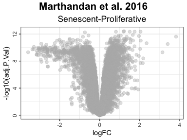

``` r
# Color Interesting Genes:
plotVolcano(DEGs, genes = NULL, N = NULL,
            x = "logFC", y = "-log10(adj.P.Val)", pointSize = 2,
            color = "#6489B4", highlightcolor = "#05254A", nointerestcolor = "#B7B7B7",
            threshold_y = 0.0001, threshold_x = 1,
            xlab = NULL, ylab = NULL, ncol = NULL, nrow = NULL, title = "Marthandan et al. 2016",
            labsize = 8, widthlabs = 25, invert = FALSE)
```

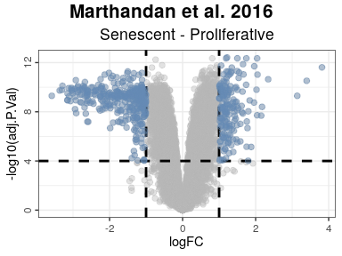

``` r
# Annotate Top and Bottom N Genes:
plotVolcano(DEGs, genes = NULL, N = 5,
            x = "logFC", y = "-log10(adj.P.Val)", pointSize = 2,
            color = "pink", highlightcolor = "#05254A", nointerestcolor = "#B7B7B7",
            threshold_y = NULL, threshold_x = NULL,
            xlab = NULL, ylab = NULL, ncol = NULL, nrow = NULL, title = "Marthandan et al. 2016",
            labsize = 8, widthlabs = 25, invert = FALSE)
```

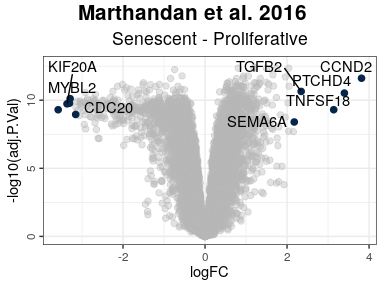

``` r
# Change order: signatures in columns, contrast in rows
plotVolcano(DEGs, genes = list(Senescence_Bidirectional = SimpleSenescenceSignature_bidirectional,
                               Senescence  = SimpleSenescenceSignature), 
            N = NULL,
            x = "logFC", y = "-log10(adj.P.Val)", pointSize = 2,
            color = "#6489B4", highlightcolor = "#05254A", highlightcolor_upreg = "#038C65", highlightcolor_downreg = "#8C0303",nointerestcolor = "#B7B7B7",
            threshold_y = NULL, threshold_x = NULL,
            xlab = NULL, ylab = NULL, ncol = NULL, nrow = NULL, title = "Marthandan et al. 2016",
            labsize = 10, widthlabs = 24, invert = TRUE)
```

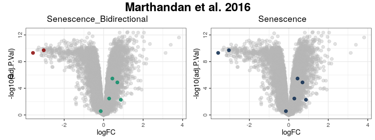

#### Gene Set Enrichment Analyses

To perform GSEA, use the `runGSEA()` function. This function takes a
named list of differential expression results (one per contrast) and a
set of gene signatures to compute enrichment scores.

-   `DEGList`: A list of differentially expressed genes (DEGs) for each
    contrast.

-   `gene_sets`: A list of gene sets, where each entry can be:

    -   A vector of genes (unidirectional analysis).
    -   A data frame where the first column is the gene name and the
        second column indicates the expected direction (+1 or -1,
        bidirectional analysis).

-   `stat`: The ranking statistic. If NULL, the ranking statistic is
    automatically selected unless manually specified:

    -   `"B"` for gene sets with **no known direction** (vectors).
    -   `"t"` for **unidirectional** or **bidirectional** gene sets
        (data frames).
    -   If provided, this argument overrides the automatic selection.

``` r
GSEAresults <- runGSEA(DEGList = DEGs, 
                       gene_sets = list(Senescence_Bidirectional = SimpleSenescenceSignature_bidirectional,
                                        Senescence  = SimpleSenescenceSignature),
                       stat = NULL)

GSEAresults
#> $`Senescent - Proliferative`
#>                     pathway       pval       padj   log2err        ES      NES
#>                      <char>      <num>      <num>     <num>     <num>    <num>
#> 1: Senescence_Bidirectional 0.01582105 0.01582105 0.3524879 0.7068136 1.642473
#> 2:               Senescence 0.14797508 0.14797508 0.1412251 0.5844505 1.333081
#>     size                         leadingEdge stat_used
#>    <int>                              <list>    <char>
#> 1:     7 LMNB1,MKI67,GLB1,CDKN1A,CDKN2A,CCL2         t
#> 2:     7                         LMNB1,MKI67         B
```

After running GSEA, you can visualize enrichment plots using
`plotGSEAenrichment()`. This function generates enrichment plots for
each gene signature and contrast, displaying also the **Normalized
Enrichment Scores (NES)** and **adjusted p-value** for each enrichment
result.

-   `grid = TRUE`: Arranges the plots in a grid for better
    visualization.
-   `titlesize`: Adjusts title font size.
-   `nrow`/`ncol`: Specifies the grid layout for arranging plots.

``` r
plotGSEAenrichment(GSEA_results=GSEAresults, 
                   DEGList=DEGs, 
                   gene_sets=list(Senescence_Bidirectional = SimpleSenescenceSignature_bidirectional,
                                  Senescence  = SimpleSenescenceSignature), 
                   widthTitle=40, grid = T, titlesize = 10, nrow=1, ncol=2) 
```

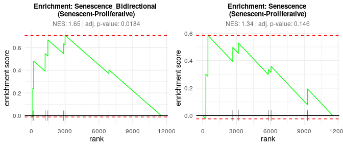

The `plotNESlollipop()` function creates lollipop plots for visualizing
Gene Set Enrichment Analysis (GSEA) results. Each plot displays pathways
on the y-axis and Normalized Enrichment Scores (NES) on the x-axis, with
color representing the adjusted p-value (padj; Note: if the padj exceeds
the maximum of `padj_limit`, it will be assigned to the `high_color`).
The function supports multiple contrasts and includes options for
customizing the color gradient, significance threshold, and plot layout.
It can also arrange individual plots into a grid layout for comparative
visualization.

``` r
plotNESlollipop(GSEA_results=GSEAresults, 
                padj_limit = c(0, 0.1), 
                low_color = "blue", 
                mid_color = "white", 
                high_color = "red", 
                sig_threshold = 0.05, 
                grid = FALSE, 
                nrow = NULL, ncol = NULL, 
                widthlabels=13, 
                title=NULL, titlesize=12) 
#> $`Senescent - Proliferative`
```

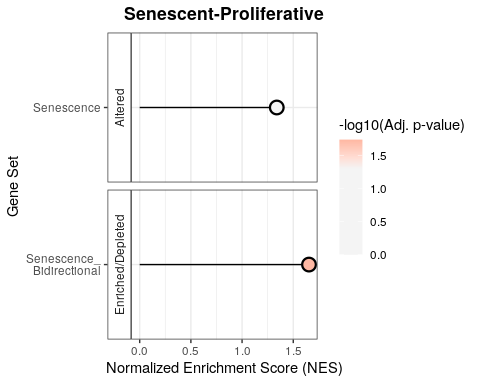

The `plotCombinedGSEA()` function generates a scatter plot to visualize
the results of Gene Set Enrichment Analysis (GSEA) across multiple
contrasts. Each point represents a pathway, with:

-   X-axis: Normalized Enrichment Score (NES)
-   Y-axis: -log10 adjusted p-value (significance)
-   Color: Pathways
-   Shape: Different contrasts
-   Dashed line: Significance threshold

This function helps compare enrichment results when the number of
contrasts and the number of pathways is high.

``` r
plotCombinedGSEA(GSEAresults, sig_threshold = 0.05, PointSize=9, widthlegend = 26 )
```


