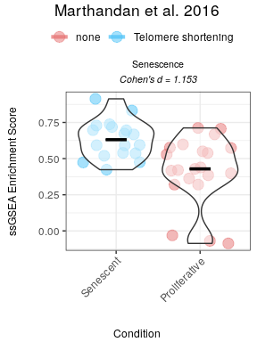

<!-- README.md is generated from README.Rmd. Please edit that file -->

# markeR

<!-- badges: start -->


<!-- badges: end -->

**markeR** provides a suite of methods for using gene sets (signatures)
to quantify and evaluate the extent to which a given gene signature
marks a specific phenotype. The package implements various scoring,
enrichment and classification approaches, along with tools to compute
performance metrics and visualize results, making it a valuable resource
for transcriptomics research (bulk RNA-seq).

## Installation

You can install the development version of markeR from
[GitHub](https://github.com/) with:

``` r
# install.packages("devtools")
devtools::install_github("DiseaseTranscriptomicsLab/markeR")
```

<!-- ## Methods -->
<!-- The package implements three main approaches for gene signature analysis: -->
<!-- **1. Score-based Methods:**   -->
<!-- These approaches compute a numerical score representing the expression of a gene signature per sample. -->
<!-- - **Log2 Median-Centered Scoring:** Measures signature expression by centering expression values relative to their median. -->
<!-- - **Single-Sample Gene Set Enrichment Analysis (ssGSEA):** Calculates an enrichment score for a given gene set in each sample. -->
<!-- **2. Enrichment-based Methods:**   -->
<!-- These methods evaluate whether a gene signature is significantly enriched in a ranked gene list. -->
<!-- - **Gene Set Enrichment Analysis (GSEA):** A rank-based method for testing enrichment significance in predefined gene sets. -->
<!-- **3. Classification-based Methods:**   -->
<!-- These approaches classify samples into phenotypic groups based on gene signature expression. -->
<!-- - **Random Forest Classification:** Uses decision trees to predict sample labels based on gene signature scores. -->

## Main Functions and Future Modules

The current release of **markeR** includes two primary functions for
score-based analysis:

-   **CalculateScores:** Calculates gene signature scores for each
    sample using either the ssGSEA, log2 median-centered or ranking
    method.
-   **PlotScores:** Visualizes the calculated scores across conditions
    using violin plots.

It also includes some functions for visualising individual genes from a
gene signature:

-   **IndividualGenes\_Violins:** creates violin plots of gene
    expression data with jittered points and optional faceting, allowing
    for visualization of individual gene expression distributions across
    sample groups.
-   **CorrelationHeatmap:** computes and visualizes a correlation
    heatmap for a given set of genes. Optionally, the heatmap can be
    generated separately for different conditions based on metadata.
-   **ExpressionHeatmap:** generates an expression heatmap with
    customizable sample annotations for a given set of genes.
-   **ROCandAUCplot:** computes ROC curves and AUC values for each gene
    based on gene expression data and sample metadata. It can generate
    ROC plots, an AUC heatmap, or both arranged side‐by‐side.
-   **CohenDHeatmap:** computes Cohen’s d for each gene based on gene
    expression data and sample metadata. The resulting effect sizes are
    then visualized as a heatmap.
-   **plotPCA:** performs PCA on a given dataset and visualizes the
    results using ggplot2. It allows users to specify genes of interest
    (to understand if they are sufficient to explain the main variance
    in the data), customize scaling and centering, and color points
    based on a metadata variable.

Future updates will expand the package with additional pairs of
functions to:

-   Perform enrichment-based analysis (to calculate and visualize GSEA
    statistics).
-   Conduct classification-based analysis (to train classifiers, e.g.,
    using Random Forests, and to evaluate performance via ROC curves).
-   Provide additional gene-level visualization modules to display
    expression patterns of individual genes within signatures.

## Example

This example demonstrates the calculation of a log2-median-centered
score using mock RNA-seq expression data. The dataset is derived from
the Marthandan et al. (2016) study (GSE63577) and includes fibroblast
samples under replicative senescent and proliferative conditions. (see
`?counts_example` and `?metadata_example` for more details).This example
showcases how to compute gene expression scores by applying the
log2-median-centered transformation.

We are using as an example a very simple senescence gene signature,
composed of the genes usually associated with senescence.

``` r
library(markeR)
```

``` r
# Define simple Senescence Signature
SimpleSenescenceSignature <- c("CDKN1A", "CDKN2A", "GLB1","TP53","CCL2", "LMNB1", "MKI67" )
```

``` r
data(metadata_example)
data(counts_example)

# Load example data
head(metadata_example)
#>       sampleID      DatasetID   CellType     Condition       SenescentType
#> 252 SRR1660534 Marthandan2016 Fibroblast     Senescent Telomere shortening
#> 253 SRR1660535 Marthandan2016 Fibroblast     Senescent Telomere shortening
#> 254 SRR1660536 Marthandan2016 Fibroblast     Senescent Telomere shortening
#> 255 SRR1660537 Marthandan2016 Fibroblast Proliferative                none
#> 256 SRR1660538 Marthandan2016 Fibroblast Proliferative                none
#> 257 SRR1660539 Marthandan2016 Fibroblast Proliferative                none
#>                         Treatment
#> 252 PD72 (Replicative senescence)
#> 253 PD72 (Replicative senescence)
#> 254 PD72 (Replicative senescence)
#> 255                         young
#> 256                         young
#> 257                         young
counts_example[1:5,1:5]
#>          SRR1660534 SRR1660535 SRR1660536 SRR1660537 SRR1660538
#> A1BG        9.94566   9.476768   8.229231   8.515083   7.806479
#> A1BG-AS1   12.08655  11.550303  12.283976   7.580694   7.312666
#> A2M        77.50289  56.612839  58.860268   8.997624   6.981857
#> A4GALT     14.74183  15.226083  14.815891  14.675780  15.222488
#> AAAS       47.92755  46.292377  43.965972  47.109493  47.213739
```

### Visualise Individual Genes from Senescence Signature

``` r
annotation_colors <- list( 
  Condition = c(
    "Senescent"     = "#65AC7C",  # Example color: greenish
    "Proliferative" = "#5F90D4"  # Example color: blueish 
  )
)

ExpressionHeatmap(data=counts_example, 
                  metadata = metadata_example, 
                  genes=SimpleSenescenceSignature,  
                  annotate.by = c("Condition"),
                  annotation_colors = annotation_colors,
                  colorlist = list(low = "#3F4193", mid = "#F9F4AE", high = "#B44141"),
                  cluster_rows = TRUE, 
                  cluster_columns = FALSE,
                  title = "Senescence Genes", 
                  titlesize = 20,
                  legend_position = "right",
                  scale_position="right")
```


``` r
senescence_triggers_colors <- c(
  "none" = "#E57373",  # Soft red   
  "Telomere shortening" = "#4FC3F7"  # Vivid sky blue  
)


IndividualGenes_Violins(data = counts_example, 
                        metadata = metadata_example, 
                        genes = SimpleSenescenceSignature, 
                        GroupingVariable = "Condition", 
                        plot=T, 
                        ncol=NULL, 
                        nrow=1, 
                        divide=NULL, 
                        invert_divide=FALSE,
                        ColorValues=senescence_triggers_colors, 
                        pointSize=2, 
                        ColorVariable="SenescentType", 
                        title="Senescence Genes", 
                        widthTitle=16,
                        y_limits = NULL,
                        legend_nrow=1, 
                        xlab="Condition",
                        colorlab="") 
```


``` r
CorrelationHeatmap(data=counts_example, 
                   metadata = metadata_example, 
                   genes=SimpleSenescenceSignature, 
                   separate.by = "Condition", 
                   method = "spearman",  
                   colorlist = list(low = "#3F4193", mid = "#F9F4AE", high = "#B44141"),
                   limits_colorscale = c(-1,0,1), 
                   widthTitle = 16, 
                   title = "Senescence Genes", 
                   cluster_rows = TRUE, 
                   cluster_columns = TRUE,  
                   detailedresults = FALSE, 
                   legend_position="right",
                   titlesize=20)
```


``` r
senescence_triggers_colors <- c(
  "none" = "#E57373",  # Soft red   
  "Telomere shortening" = "#4FC3F7"  # Vivid sky blue  
)
 
ROCandAUCplot(counts_example, 
              metadata_example, 
              condition_var = "Condition", 
              class = "Senescent", 
              group_var=NULL,
              genes=SimpleSenescenceSignature, 
              plot_type = "all",
              heatmap_params = list(col = list( "#F9F4AE" ,"#B44141"),
                                    limits = c(0.5,1),
                                    cluster_rows=T),
              roc_params = list(nrow=3,
                                ncol=3,
                                colors=senescence_triggers_colors),
              commomplot_params = list(widths=c(0.5,0.3)))
```


``` r
CohenDHeatmap(counts_example, 
              metadata_example, 
              genes=SimpleSenescenceSignature,
              condition_var = "Condition", 
              class = "Senescent", 
              group_var = NULL,  
              heatmap_params = list(col = list( "#F9F4AE" ,"#B44141"),
                                    limits = NULL,
                                    cluster_rows=T))
```


``` r
annotation_colors <- c(  
    "Senescent"     = "#65AC7C",  # Example color: greenish
    "Proliferative" = "#5F90D4"  # Example color: blueish 
)

 
plotPCA(data = counts_example, 
        metadata = metadata_example, 
        genes=SimpleSenescenceSignature, 
        scale=FALSE, 
        center=TRUE, 
        PCs=list(c(1,2), c(2,3), c(3,4)), 
        ColorVariable="Condition",
        ColorValues=annotation_colors,
        pointSize=5,
        legend_nrow=1, 
        ncol=3, 
        nrow=NULL)
```


### Calculate Senescence Scores

The following example uses the **“logmedian”** method for score
calculation.

``` r
df_Scores <- CalculateScores(data = counts_example, 
                             metadata = metadata_example, 
                             method = "logmedian", 
                             gene_sets = list(Senescence=SimpleSenescenceSignature))

senescence_triggers_colors <- c(
  "none" = "#E57373",  # Soft red   
  "Telomere shortening" = "#4FC3F7"  # Vivid sky blue  
)

cond_cohend <- list(A=c("Senescent"),  
                    B=c("Proliferative"))

PlotScores(ResultsList = df_Scores, 
           ColorVariable = "SenescentType", 
           GroupingVariable="Condition",  
           method ="logmedian", 
           ColorValues = senescence_triggers_colors, 
           ConnectGroups=TRUE, 
           ncol = NULL, 
           nrow = NULL, 
           widthTitle=24, 
           y_limits = NULL, 
           legend_nrow = 1, 
           pointSize=4,
           cond_cohend=cond_cohend,
           title="Marthandan et al. 2016",
           labsize=7, 
           titlesize = 10)  
```


Given that some of the genes are expected to be upregulated, while
others to be downregulated in senescence, we can also consider a
*bidirectional signature*.

``` r
SimpleSenescenceSignature_bidirectional <- data.frame(gene=c("CDKN1A", "CDKN2A", "GLB1","TP53","CCL2", "LMNB1", "MKI67" ),
                                                      enrichment=c(1,1,1,1,1,-1,-1))

df_Scores <- CalculateScores(data = counts_example, 
                             metadata = metadata_example, 
                             method = "logmedian", 
                             gene_sets = list(Senescence=SimpleSenescenceSignature_bidirectional))

PlotScores(ResultsList = df_Scores, 
           ColorVariable = "SenescentType", 
           GroupingVariable="Condition",  
           method ="logmedian", 
           ColorValues = senescence_triggers_colors, 
           ConnectGroups=TRUE, 
           ncol = NULL, 
           nrow = NULL, 
           widthTitle=24, 
           y_limits = NULL, 
           legend_nrow = 1, 
           pointSize=4,
           cond_cohend=cond_cohend,
           title="Marthandan et al. 2016",
           labsize=7, 
           titlesize = 10)  
```


The following example uses the **“ssGSEA”** method for score
calculation.

``` r
df_Scores <- CalculateScores(data = counts_example, 
                             metadata = metadata_example, 
                             method = "ssGSEA", 
                             gene_sets = list(Senescence=SimpleSenescenceSignature))

senescence_triggers_colors <- c(
  "none" = "#E57373",  # Soft red   
  "Telomere shortening" = "#4FC3F7"  # Vivid sky blue  
)

cond_cohend <- list(A=c("Senescent"),  
                    B=c("Proliferative"))

PlotScores(ResultsList = df_Scores, 
           ColorVariable = "SenescentType", 
           GroupingVariable="Condition",  
           method ="ssGSEA", 
           ColorValues = senescence_triggers_colors, 
           ConnectGroups=TRUE, 
           ncol = NULL, 
           nrow = NULL, 
           widthTitle=24, 
           y_limits = NULL, 
           legend_nrow = 1, 
           pointSize=4,
           cond_cohend=cond_cohend,
           title="Marthandan et al. 2016",
           labsize=7, 
           titlesize = 10)  
```



The following example uses the **“ranking”** method for score
calculation.

``` r
SimpleSenescenceSignature_bidirectional <- data.frame(gene=c("CDKN1A", "CDKN2A", "GLB1","TP53","CCL2", "LMNB1", "MKI67" ),
                                                      enrichment=c(1,1,1,1,1,-1,-1))

df_Scores <- CalculateScores(data = counts_example, 
                             metadata = metadata_example, 
                             method = "ranking", 
                             gene_sets = list(Senescence=SimpleSenescenceSignature_bidirectional))

senescence_triggers_colors <- c(
  "none" = "#E57373",  # Soft red   
  "Telomere shortening" = "#4FC3F7"  # Vivid sky blue  
)

cond_cohend <- list(A=c("Senescent"),  
                    B=c("Proliferative"))

PlotScores(ResultsList = df_Scores, 
           ColorVariable = "SenescentType", 
           GroupingVariable="Condition",  
           method ="ranking", 
           ColorValues = senescence_triggers_colors, 
           ConnectGroups=TRUE, 
           ncol = NULL, 
           nrow = NULL, 
           widthTitle=24, 
           y_limits = NULL, 
           legend_nrow = 1, 
           pointSize=4,
           cond_cohend=cond_cohend,
           title="Marthandan et al. 2016",
           labsize=7, 
           titlesize = 10)  
```


