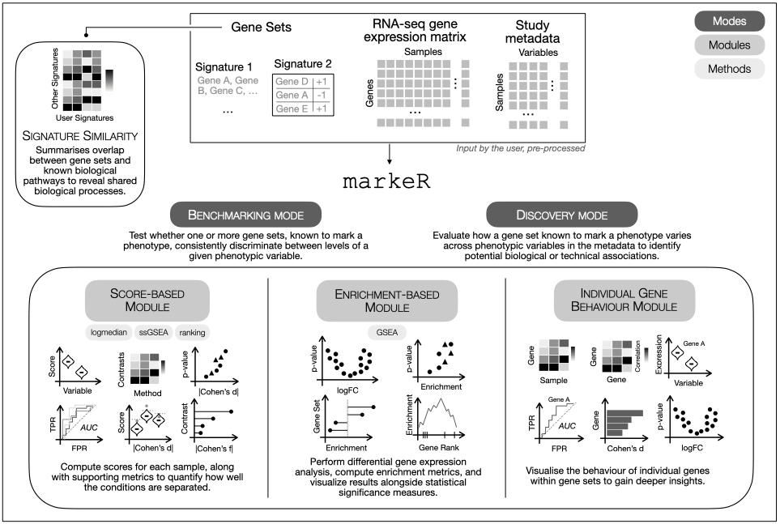

<!-- README.md is generated from README.Rmd. Please edit that file -->

# markeR <a href="https://diseasetranscriptomicslab.github.io/markeR/"></a>

<!-- badges: start -->


[](https://github.com/DiseaseTranscriptomicsLab/markeR/actions/workflows/R-CMD-check.yaml)
[](https://diseasetranscriptomicslab.github.io/markeR/)
<!-- badges: end -->

> **To cite markeR please use:**
>
> Martins-Silva R, Kaizeler A, Barbosa-Morais N (2025). *markeR: an R
> Toolkit for Evaluating Gene Sets as Phenotypic Markers*. Gulbenkian
> Institute for Molecular Medicine, Faculdade de Medicina, Universidade
> de Lisboa, Lisbon, Portugal. R package version 0.9.1,
> <https://github.com/DiseaseTranscriptomicsLab/markeR>.

**markeR** provides a suite of methods for using gene sets (signatures)
to quantify and evaluate the extent to which a given gene signature
marks a specific phenotype from gene expression data. The package
implements various scoring, enrichment and classification approaches,
along with tools to compute performance metrics and visualize results.



## Table of Contents

- [Installation](#installation)  
- [Tutorials](#tutorials)  
- [Common Workflow](#common-workflow)
  - [1. Input Requirements](#1-input-requirements)  
  - [2. Select Mode of Analysis](#2-select-mode-of-analysis)  
  - [3. Choose a Quantification
    Approach](#3-choose-a-quantification-approach)
    - [3.1 Score-Based Approach](#31-score-based-approach)  
    - [3.2 Enrichment-Based Approach](#32-enrichment-based-approach)  
  - [4. Visualisation and Evaluation](#4-visualisation-and-evaluation)  
  - [5. Individual Gene Exploration
    (Optional)](#5-individual-gene-exploration-optional-but-recommended)  
  - [6. Compare with Reference Gene Sets
    (Optional)](#6-optional-compare-with-reference-gene-sets)  
- [Contact](#contact)

## Installation

The user can install the development version of markeR from
[GitHub](https://github.com/) with:

``` r
# install.packages("devtools")
devtools::install_github("DiseaseTranscriptomicsLab/markeR")
```

## Tutorials

The following tutorials are available:

- [Benchmarking
  Mode](https://diseasetranscriptomicslab.github.io/markeR/articles/benchmarking_tutorial.html)
- [Discovery
  Mode](https://diseasetranscriptomicslab.github.io/markeR/articles/discovery_tutorial.html)
- [Signature
  Similarity](https://diseasetranscriptomicslab.github.io/markeR/articles/signaturesimilarity_tutorial.html)

## Common Workflow

`markeR` provides a modular pipeline to quantify transcriptomic
signatures and assess their association with phenotypic or clinical
variables. The typical workflow includes the following steps:

### 1. Input Requirements

Depending on the analysis mode, inputs vary slightly.

- **Gene Set(s)**:  
  A named list where each element represents one gene set:

  - Use a **character vector** for gene sets where direction of
    enrichment is not known.
  - Use a **data frame** with gene names and a directionality column
    (`-1` for down-regulated, `+1` for up-regulated)

This structure supports both **Discovery Mode** (single gene set) and
**Benchmarking Mode** (multiple gene sets).

``` r
# Example 
gene_sets
#> $Set1
#> [1] "GeneA" "GeneB" "GeneC" "GeneD"
#> 
#> $Set2
#>    gene direction
#> 1 GeneX         1
#> 2 GeneY        -1
#> 3 GeneZ         1
```

- **Expression Data Frame**:  
  A filtered and normalised gene expression data frame (genes ×
  samples). Row names must be gene identifiers, and column names must
  match the sample IDs in the metadata.

``` r
head(expr_df)
#>        Sample1  Sample2  Sample3  Sample4  Sample5
#> GeneA 3.879049 7.448164 2.864353 5.852928 3.610586
#> GeneB 4.539645 5.719628 4.564050 4.409857 4.584165
#> GeneC 8.117417 5.801543 2.947991 6.790251 2.469207
#> GeneD 5.141017 5.221365 3.542218 6.756267 9.337912
#> GeneX 5.258575 3.888318 3.749921 6.643162 7.415924
#> GeneY 8.430130 8.573826 1.626613 6.377281 2.753783
```

- **Sample Metadata**:  
  A data frame with annotations for each sample, with the sample ID in
  the first column. The row names must match the column names of the
  expression matrix.

``` r
metadata
#>   SampleID Condition Age
#> 1  Sample1   Control  49
#> 2  Sample2 Treatment  44
#> 3  Sample3   Control  46
#> 4  Sample4 Treatment  49
#> 5  Sample5   Control  38
```

### 2. Select Mode of Analysis

- **Discovery Mode**: Explore how a single, well-characterised gene set
  relates to a specific variable of interest. Suitable for hypothesis
  generation or signature projection.

- **Benchmarking Mode**: Evaluate one or more gene sets against multiple
  metadata variables using a standardised scoring and effect size
  framework. This mode provides comprehensive visualisations and
  comparisons across methods.

### 3. Choose a Quantification Approach

`markeR` supports two complementary strategies for quantifying the
association between gene sets and phenotypes:

#### 3.1 Score-Based Approach

This strategy generates a **single numeric score per sample**,
reflecting the activity of a gene set. It enables flexible downstream
analyses, including comparisons across phenotypic groups.

Three scoring methods are available:

- **Log2-median**: Calculates the median log2 expression of the genes in
  the set. Sensitive to absolute shifts in expression.

- **Ranking**: Ranks all genes within each sample and averages the ranks
  of gene set members. Captures relative ordering rather than magnitude.

- **ssGSEA**: Computes a single-sample gene set enrichment score using
  the ssGSEA algorithm. Reflects the coordinated up- or down-regulation
  of the set in each sample.

These methods vary in assumptions and sensitivity. Robust gene sets are
expected to perform consistently across all three.

#### 3.2 Enrichment-Based Approach

This approach uses a classical **gene set enrichment analysis (GSEA)**
framework to evaluate whether the gene set is significantly
overrepresented at the top or bottom of a ranked list of genes (e.g.,
ranked by fold change or correlation with phenotype).

- **GSEA**: Computes a Normalised Enrichment Score (NES) for each
  contrast or variable of interest, adjusting for gene set size and
  multiple testing.

Use this approach when interested in collective behaviour of gene sets
in relation to ranked differential signals.

### 4. Visualisation and Evaluation

In **Benchmarking Mode**, `markeR` offers a range of visual summaries:

- Violin or scatter plots showing score distributions by phenotype
- Volcano plots and heatmaps based on effect sizes (Cohen’s *d* or *f*)
- ROC curves and AUC values
- Null distribution testing using random gene sets matched for size and
  directionality

In **Discovery Mode**, the output focuses on a single gene set:

- Score distributions by phenotype
- Pairwise contrasts (Cohen’s *d*) and overall effect sizes (Cohen’s
  *f*)
- Enrichment score summaries (NES) with adjusted p-values (e.g.,
  lollipop plots)

Benchmarking mode offers the most comprehensive set of features and
allows users to seamlessly move from discovery to benchmarking mode once
a variable of interest has been identified and further testing is
required. The main difference from Discovery mode is that Benchmarking
is designed to evaluate multiple gene sets simultaneously, whereas
Discovery mode focuses on quantifying a single, robust gene set.

### 5. Individual Gene Exploration (Optional)

To better understand the contribution of individual genes within a gene
set and identify whether specific genes drive the overall signal,
`markeR` offers a suite of gene-level exploratory analyses, including:

- Expression heatmaps of genes across samples and groups
- Violin plots showing expression distributions of individual genes
- Correlation heatmaps to reveal co-expression patterns among genes in
  the set
- ROC curves and AUC values for individual genes to evaluate their
  discriminatory power
- Effect size calculations (Cohen’s *d*) per gene to quantify
  differential expression
- Principal Component Analysis (PCA) on gene set genes to assess
  variance explained and sample clustering

### 6. Compare with Reference Gene Sets (Optional)

`markeR` allows comparison of user-defined gene sets to reference sets
(e.g., from MSigDB) using:

- **Jaccard Index**: Measures gene overlap relative to union size.

- **Log Odds Ratio (logOR)**: Computes enrichment using a user-defined
  gene universe and Fisher’s exact test.

Filters can be applied based on similarity thresholds (e.g., minimum
Jaccard, OR, or p-value).

------------------------------------------------------------------------

📩 For any questions or concerns, feel free to reach out:

**Rita Martins-Silva**  
Email: <rita.silva@gimm.pt>
