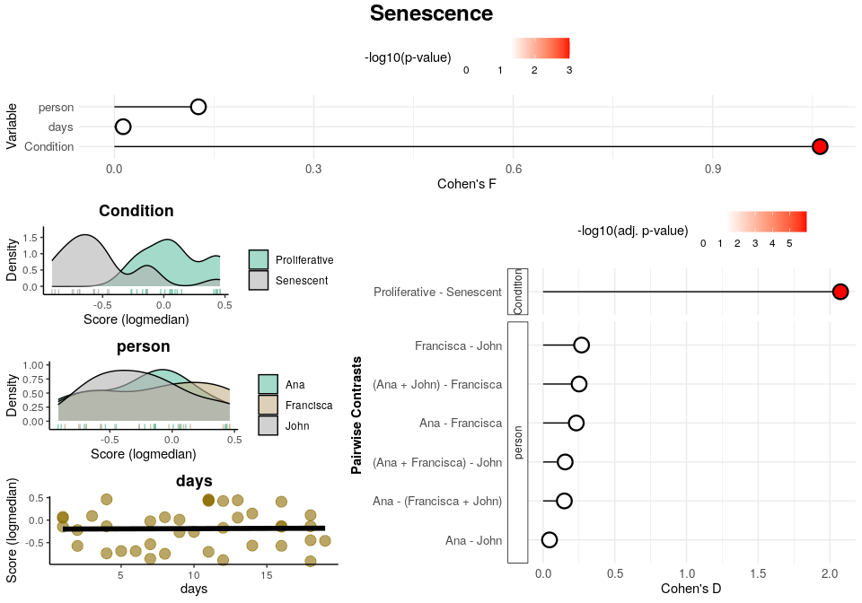
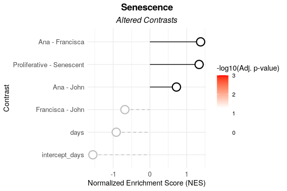
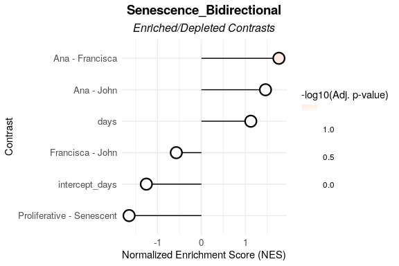
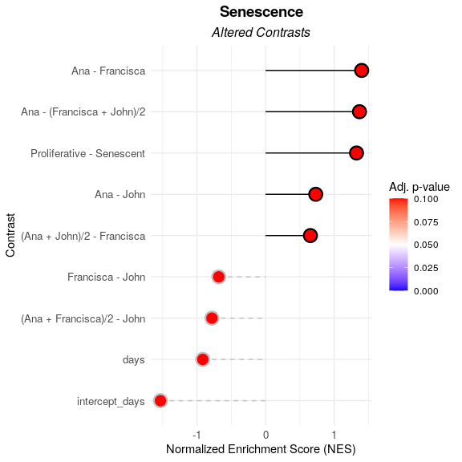
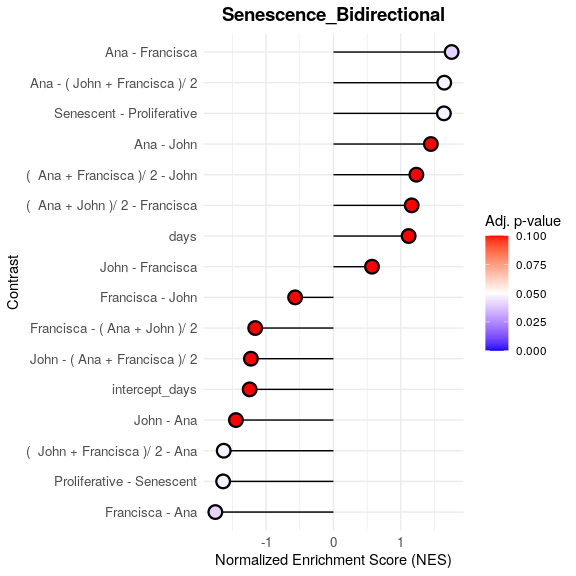

<!-- README.md is generated from README.Rmd. Please edit that file -->

# markeR

<!-- badges: start -->


<!-- badges: end -->

**markeR** provides a suite of methods for using gene sets (signatures)
to quantify and evaluate the extent to which a given gene signature
marks a specific phenotype. The package implements various scoring,
enrichment and classification approaches, along with tools to compute
performance metrics and visualize results.

## Table of Contents

-   [Installation](#installation)
-   [Main Functions and Future
    Modules](#main-functions-and-future-modules)
-   [Example](#example)
-   [Visualise Individual Genes from Senescence
    Signature](#visualise-individual-genes-from-senescence-signature)
    -   [Expression Heatmap](#expression-heatmap)
    -   [Expression Violins](#expression-violins)
    -   [Correlation Heatmap](#correlation-heatmap)
    -   [ROC and AUC](#roc-and-auc)
    -   [Cohen’s D](#cohens-d)
    -   [PCA with Only Genes of
        Interest](#pca-with-only-genes-of-interest)
-   [Calculate Senescence Scores](#calculate-senescence-scores)
    -   [logmedian Method](#logmedian-method)
    -   [ssGSEA Method](#ssgsea-method)
    -   [Ranking Method](#ranking-method)
    -   [All Methods](#all-methods)
    -   [Classification Potential of Gene
        Signatures](#classification-potentia-of-gene-signatures)
    -   [False Discovery Rate (FDR)
        Calculations](#false-discovery-rate-fdr-calculations)
    -   [Score association with Chosen
        Variables](#score-association-with-chosen-variables)
-   [Enrichment-Based Methods](#enrichment-based-methods)
    -   [Differentially Expressed
        Genes](#differentially-expressed-genes)
        -   [Note on Continuous
            Variables](#note-on-continuous-variables)
    -   [Gene Set Enrichment Analyses](#gene-set-enrichment-analyses)
    -   [GSEA Association with Chosen
        Variables](#gsea-association-with-chosen-variables)

## Installation

The user can install the development version of markeR from
[GitHub](https://github.com/) with:

``` r
# install.packages("devtools")
devtools::install_github("DiseaseTranscriptomicsLab/markeR")
```

## Main Functions and Future Modules

The current release of **`markeR`** includes four primary functions for
**score-based analysis**:

-   **`CalculateScores`:** Calculates gene signature scores for each
    sample using either the ssGSEA, log2 median-centered or ranking
    method.
-   **`PlotScores`:** Calculates and displays the calculated scores
    across conditions using violin plots, density plots, heatmaps or
    volcano-like plots, depending on the chosen parameters.
-   **`ROC_Scores`:** Generates ROC curves for different scoring methods
    across contrasts, allowing users to visualize performance
    differences.
-   **`AUC_Scores`:** Generates heatmaps for each gene signature, with
    methods as columns and contrasts as rows, summarizing AUC values in
    a heatmap format.

Additionally, it includes a function for FDR calculation based on random
sets of genes for each signature:

-   **`FDR_Simulation`:** Computes false discovery rates using random
    gene sets.

Tthe package also includes several functions for **enrichment-based
analysis**:

-   **`calculateDE`:** Performs differential expression analysis.
-   **`plotVolcano`:** Generates volcano plots to visualize
    differentially expressed genes.
-   **`runGSEA`:** Performs GSEA using `fgsea` for each contrast in a
    list of differential expression results.  
-   **`plotGSEAenrichment`:** Generates enrichment plots for gene sets
    using the `fgsea::plotEnrichment()` function
-   **`plotNESlollipop`:** Generates a lollipop plot to visualize Gene
    Set Enrichment Analysis (GSEA) results.
-   **`plotCombinedGSEA`:** Creates a scatter plot visualizing multiple
    GSEA (Gene Set Enrichment Analysis) results across different
    contrasts.

When analyzing data, it is often **unclear whether a given variable is
meaningfully associated with a target score**. To assist in this
exploratory process, the package also provides **statistical tests and
visualizations to assess relationships between variables of different
types** (called the `Variable Association` module):

-   **`VariableAssociation_Scores`**: Assesses the relationship between
    metadata variables and computed scores using effect size estimation,
    statistical tests, and visualizations.
-   **`VariableAssociation_GSEA`**: Evaluates how metadata variables
    influence gene set enrichment results, identifying significant
    associations with enrichment scores.

`markeR` also includes some functions for visualising individual genes
from a gene signature:

-   **`IndividualGenes_Violins`:** creates violin plots of gene
    expression data with jittered points and optional faceting, allowing
    for visualization of individual gene expression distributions across
    sample groups.
-   **`CorrelationHeatmap`:** computes and visualizes a correlation
    heatmap for a given set of genes. Optionally, the heatmap can be
    generated separately for different conditions based on metadata.
-   **`ExpressionHeatmap`:** generates an expression heatmap with
    customizable sample annotations for a given set of genes.
-   **`ROCandAUCplot`:** computes ROC curves and AUC values for each
    gene based on gene expression data and sample metadata. It can
    generate ROC plots, an AUC heatmap, or both arranged side‐by‐side.
-   **`CohenDH_IndividualGenes`:** computes Cohen’s d for each gene
    based on gene expression data and sample metadata. The resulting
    effect sizes are then visualized as a heatmap.
-   **`plotPCA`:** performs PCA on a given dataset and visualizes the
    results using ggplot2. It allows users to specify genes of interest
    (to understand if they are sufficient to explain the main variance
    in the data), customize scaling and centering, and color points
    based on a metadata variable.

## Example

We will be using an already pre-processed gene expression dataset,
derived from the Marthandan et al. (2016) study (GSE63577), that
includes human fibroblast samples cultured under two different
conditions: replicative senescence and proliferative control. The
dataset has already been filtered and normalized using the `edgeR`
package, and corrected for batch effect as described in Schneider et
al. (2024). For more information about the dataset structure, see the
help pages for `?counts_example` and `?metadata_example`.

This dataset serves as a working example to demonstrate the main
functionalities of the markeR package. In particular, it will be used to
showcase the two primary modules designed for benchmarking gene
signatures:

-   **Score**: calculates expression-based signature scores for each
    sample, and
-   **Enrichment**: evaluates the over-representation of gene signatures
    within ranked gene lists.

To keep things simple and illustrative, we use a basic senescence gene
signature consisting of a small set of well-established
senescence-associated genes commonly reported in the literature.

``` r
library(markeR)
```

``` r
# Define simple Senescence Signature
SimpleSenescenceSignature <- c("CDKN1A", "CDKN2A", "GLB1","TP53","CCL2", "LMNB1", "MKI67" )
```

``` r
data(metadata_example)
data(counts_example)

# Load example data
head(metadata_example)
#>       sampleID      DatasetID   CellType     Condition       SenescentType
#> 252 SRR1660534 Marthandan2016 Fibroblast     Senescent Telomere shortening
#> 253 SRR1660535 Marthandan2016 Fibroblast     Senescent Telomere shortening
#> 254 SRR1660536 Marthandan2016 Fibroblast     Senescent Telomere shortening
#> 255 SRR1660537 Marthandan2016 Fibroblast Proliferative                none
#> 256 SRR1660538 Marthandan2016 Fibroblast Proliferative                none
#> 257 SRR1660539 Marthandan2016 Fibroblast Proliferative                none
#>                         Treatment
#> 252 PD72 (Replicative senescence)
#> 253 PD72 (Replicative senescence)
#> 254 PD72 (Replicative senescence)
#> 255                         young
#> 256                         young
#> 257                         young
counts_example[1:5,1:5]
#>          SRR1660534 SRR1660535 SRR1660536 SRR1660537 SRR1660538
#> A1BG        9.94566   9.476768   8.229231   8.515083   7.806479
#> A1BG-AS1   12.08655  11.550303  12.283976   7.580694   7.312666
#> A2M        77.50289  56.612839  58.860268   8.997624   6.981857
#> A4GALT     14.74183  15.226083  14.815891  14.675780  15.222488
#> AAAS       47.92755  46.292377  43.965972  47.109493  47.213739
```

### Visualise Individual Genes from Senescence Signature

`markeR` provides a suite of functions to explore the expression and
behavior of individual genes within a signature. These tools are
especially useful when the user want to inspect how specific genes
contribute to a signature’s overall behavior.

#### Expression Heatmap

The `ExpressionHeatmap` function generates a heatmap to display the
expression levels of selected senescence genes across samples. Samples
are annotated by a chosen condition, and expression values are
color-scaled for easy visual comparison. Clustering options and
customizable color palettes allow for flexible and informative
visualization.

``` r
annotation_colors <- list( 
  Condition = c(
    "Senescent"     = "#65AC7C",  # Example color: greenish
    "Proliferative" = "#5F90D4"  # Example color: blueish 
  )
)

ExpressionHeatmap(data=counts_example, 
                  metadata = metadata_example, 
                  genes=SimpleSenescenceSignature,  
                  annotate.by = c("Condition"),
                  annotation_colors = annotation_colors,
                  colorlist = list(low = "#3F4193", mid = "#F9F4AE", high = "#B44141"),
                  cluster_rows = TRUE, 
                  cluster_columns = FALSE,
                  title = "Senescence Genes", 
                  titlesize = 20,
                  legend_position = "right",
                  scale_position="right")
```


#### Expression Violins

The `IndividualGenes_Violins` function creates violin plots to visualize
the expression distributions of selected senescence genes across
conditions. Jittered points represent individual samples, and grouping
(x axis, `GroupingVariable`) and color variables (`ColorVariable` and
`ColorValues`) from the metadata allow for additional stratification and
insight. Customization options include layout, point size, colors, and
axis labeling.

``` r
senescence_triggers_colors <- c(
  "none" = "#E57373",  # Soft red   
  "Telomere shortening" = "#4FC3F7"  # Vivid sky blue  
)


IndividualGenes_Violins(data = counts_example, 
                        metadata = metadata_example, 
                        genes = SimpleSenescenceSignature, 
                        GroupingVariable = "Condition", 
                        plot=T, 
                        ncol=NULL, 
                        nrow=1, 
                        divide=NULL, 
                        invert_divide=FALSE,
                        ColorValues=senescence_triggers_colors, 
                        pointSize=2, 
                        ColorVariable="SenescentType", 
                        title="Senescence Genes", 
                        widthTitle=16,
                        y_limits = NULL,
                        legend_nrow=1, 
                        xlab="Condition",
                        colorlab="") 
```


#### Correlation Heatmap

The `CorrelationHeatmap` function displays pairwise correlations between
selected genes, helping to reveal co-expression patterns within the
senescence signature. Correlations can be computed separately for
different conditions, and the heatmap is fully customizable with options
for clustering, color scaling, and correlation method (e.g., Spearman or
Pearson).

``` r
CorrelationHeatmap(data=counts_example, 
                   metadata = metadata_example, 
                   genes=SimpleSenescenceSignature, 
                   separate.by = "Condition", 
                   method = "spearman",  
                   colorlist = list(low = "#3F4193", mid = "#F9F4AE", high = "#B44141"),
                   limits_colorscale = c(-1,0,1), 
                   widthTitle = 16, 
                   title = "Senescence Genes", 
                   cluster_rows = TRUE, 
                   cluster_columns = TRUE,  
                   detailedresults = FALSE, 
                   legend_position="right",
                   titlesize=20)
```


#### ROC and AUC

The `ROCandAUCplot` function evaluates the predictive power of
individual genes in the signature by computing ROC curves and AUC values
based on a binary classification (e.g., senescent vs. proliferative). If
the selected grouping variable has more than two levels, the user can
specify the reference group using the class parameter — for example, if
I am interested in a variable with levels `A`, `B`, `C` and `D`, setting
`class = c("A", "B")` will compare group `A/B` versus the remaining
groups (`C/D`). Additionally, the user can use the `group_var` parameter
to split and display results separately for each level of another
metadata variable — allowing for subgroup-specific ROC analyses. Outputs
include individual ROC plots and an AUC heatmap, with customizable
layout, color schemes, and clustering options—ideal for identifying
genes with strong discriminative ability.

``` r
senescence_triggers_colors <- c(
  "none" = "#E57373",  # Soft red   
  "Telomere shortening" = "#4FC3F7"  # Vivid sky blue  
)

ROCandAUCplot(counts_example, 
              metadata_example, 
              condition_var = "Condition", 
              class = "Senescent", 
              group_var=NULL,
              genes=SimpleSenescenceSignature, 
              plot_type = "all",
              heatmap_params = list(col = list( "#F9F4AE" ,"#B44141"),
                                    limits = c(0.5,1),
                                    cluster_rows=T),
              roc_params = list(nrow=3,
                                ncol=3,
                                colors=senescence_triggers_colors),
              commomplot_params = list(widths=c(0.5,0.3)))
```


#### Cohen’s D

The `CohenD_IndividualGenes` function computes the effect size (Cohen’s
d) for each gene, quantifying the magnitude of expression differences
between two conditions, given by the variable `condition_var`. If the
selected condition variable has more than two levels, the `class`
parameter specifies which condition will be compared to the rest.
Additionally, the user can use the `group_var` parameter to split and
display results separately for each level of another metadata variable.
Results are visualized as a heatmap, with customizable color scales and
clustering options for easy interpretation of effect sizes across genes.

``` r
CohenD_IndividualGenes(counts_example, 
                       metadata_example, 
                       genes=SimpleSenescenceSignature,
                       condition_var = "Condition", 
                       class = "Senescent", 
                       group_var = NULL,  
                       heatmap_params = list(col = list( "#F9F4AE" ,"#B44141"),
                                             limits = NULL,
                                             cluster_rows=T))
```


#### PCA with only genes of interest

The `plotPCA` function performs principal component analysis (PCA) on a
selected set of genes to explore how they contribute to the variance in
the dataset, allowing to test if the genes in the signature are
sufficient to separate the groups of interest (given by the parameter
`ColorVariable`). This function allows you to focus on specific genes
(e.g., senescence signature genes) and visualize their impact on a
specific set of principal components. The PCs parameter enables you to
specify which principal component pairs to plot, and the results are
customizable with color annotations, point sizes, and layout options for
comparing conditions or groups.

``` r
annotation_colors <- c(  
  "Senescent"     = "#65AC7C",  # Example color: greenish
  "Proliferative" = "#5F90D4"  # Example color: blueish 
)


plotPCA(data = counts_example, 
        metadata = metadata_example, 
        genes=SimpleSenescenceSignature, 
        scale=FALSE, 
        center=TRUE, 
        PCs=list(c(1,2), c(2,3), c(3,4)), 
        ColorVariable="Condition",
        ColorValues=annotation_colors,
        pointSize=5,
        legend_nrow=1, 
        ncol=3, 
        nrow=NULL)
```


### Calculate Senescence Scores

The `CalculateScores` function computes the signature scores for each
sample based on predefined gene sets, such as a senescence signature. It
returns a named list where each entry corresponds to a specific
signature and includes the calculated scores, along with metadata (if
available). When setting `method = "all"`, the function returns a list,
where each element corresponds to a scoring method and contains the
respective data frame of scores, allowing comparison between methods.
The function allows users to select from three different scoring
methods:

-   **ssGSEA**: Computes an enrichment score for each signature in each
    sample.
-   **logmedian**: Calculates the score as the sum of the normalized
    (log2-median-centered) expression values of the signature genes,
    divided by the number of genes.
-   **ranking**: Determines the score by ranking the expression of
    signature genes and normalizing the result.

These methods are very similar and, when applied to a robust gene
signature, will yield similar results across all three methods.
Empirically, a good signature will be one that shows consistent results,
both in the calculated scores and in Cohen’s d or F statistics, across
different methods. If the signature is not robust, or if there is
considerable noise, the results across methods may differ significantly.
Consistent scores across methods typically indicate a more reliable and
meaningful signature. These methods are explained in more detail below,
allowing the user to select the most appropriate one for their analysis.

The `PlotScores` function can be used to compute and visualize the
scores in various ways, depending on the method and variable chosen.

-   If `method = "all"` and the variable is categorical, it will return
    a heatmap of Cohen’s d or F statistics and a volcano plot showing
    contrasts between all groups of that variable.
-   If `method = "all"` and the variable is numeric, a heatmap of
    Cohen’s F and a volcano plot will be produced.
-   If `method != "all"` and the variable is categorical, it will
    generate a violin plot for each signature.
-   If `method != "all"` and the variable is `NULL`, a density plot of
    the score distribution will be displayed.
-   If `method != "all"` and the variable is numeric, a scatter plot
    will be created to show the relationship between the scores and the
    numeric variable.

#### logmedian method

The following example uses the **`logmedian`** method to calculate a
gene signature score. This method computes a score for each sample by
normalizing the expression values of the signature genes, summing them
up, and then dividing by the number of genes in the signature. The
result is a score that represents the overall expression of the
signature genes in that sample. The user can chose to calculate the gene
signature score for each sample based on one or more predefined gene
sets (signatures).

Here’s an example where we calculate the signature score using the
“logmedian” method:

``` r
df_Scores <- CalculateScores(data = counts_example,
                             metadata = metadata_example,
                             method = "logmedian",
                             gene_sets = list(Senescence=SimpleSenescenceSignature))
#> Considering unidirectional gene signature mode for signature Senescence

head(df_Scores$Senescence)
#>       sample      score      DatasetID   CellType     Condition
#> 1 SRR1660534 -0.6894748 Marthandan2016 Fibroblast     Senescent
#> 2 SRR1660535 -0.4483299 Marthandan2016 Fibroblast     Senescent
#> 3 SRR1660536 -0.4596502 Marthandan2016 Fibroblast     Senescent
#> 4 SRR1660537 -0.2198753 Marthandan2016 Fibroblast Proliferative
#> 5 SRR1660538 -0.2672930 Marthandan2016 Fibroblast Proliferative
#> 6 SRR1660539 -0.2623188 Marthandan2016 Fibroblast Proliferative
#>         SenescentType                     Treatment
#> 1 Telomere shortening PD72 (Replicative senescence)
#> 2 Telomere shortening PD72 (Replicative senescence)
#> 3 Telomere shortening PD72 (Replicative senescence)
#> 4                none                         young
#> 5                none                         young
#> 6                none                         young
```

The user can also chose to directly plot the scores.

Effect sizes can be computed using the `compute_cohen` parameter
(default = `T`): when the grouping variable has only two levels, Cohen’s
d is calculated by default. If there are more than two levels, Cohen’s f
is used unless a specific pairwise comparison is defined via
`cond_cohend`, in which case Cohen’s d is reported for that comparison.
If `pvalcalc==TRUE` (default = `F`), then the associated p-value (not
corrected for multiple testing) is reported.

``` r
senescence_triggers_colors <- c(
  "none" = "#E57373",  # Soft red   
  "Telomere shortening" = "#4FC3F7"  # Vivid sky blue  
)

cond_cohend <- list(A=c("Senescent"),  
                    B=c("Proliferative"))

PlotScores(data = counts_example, 
           metadata = metadata_example, 
           gene_sets = list(Senescence=SimpleSenescenceSignature),
           ColorVariable = "SenescentType", 
           GroupingVariable="Condition",  
           method ="logmedian", 
           ColorValues = senescence_triggers_colors, 
           ConnectGroups=TRUE, 
           ncol = NULL, 
           nrow = NULL, 
           widthTitle=24, 
           limits = NULL, 
           legend_nrow = 1, 
           pointSize=4,
           compute_cohen=T,
           cond_cohend=cond_cohend,
           title="Marthandan et al. 2016",
           labsize=9, 
           titlesize = 12)  
```


<!-- ```{r} -->
<!-- PlotScores_Numeric(data = counts_example,  -->
<!--            metadata = metadata_example_illustration,  -->
<!--            gene_sets =list(Senescence_Bidirectional = SimpleSenescenceSignature_bidirectional, -->
<!--                             Senescence  = SimpleSenescenceSignature), -->
<!--            ColorVariable = NULL,  -->
<!--            GroupingVariable="days",   -->
<!--            method ="logmedian",  -->
<!--            ColorValues = NULL,  -->
<!--            ConnectGroups=TRUE,  -->
<!--            ncol = NULL,  -->
<!--            nrow = NULL,  -->
<!--            widthTitle=24,  -->
<!--            limits = NULL,  -->
<!--            legend_nrow = 1,  -->
<!--            pointSize=8, -->
<!--            compute_cohen=T,  -->
<!--            pvalcalc = T, -->
<!--            title="Marthandan et al. 2016", -->
<!--            labsize=10,  -->
<!--            titlesize = 14)   -->
<!-- ``` -->

Given that some genes are expected to be upregulated while others are
expected to be downregulated in senescence, it is useful to consider a
**bidirectional signature**. In a bidirectional signature, the direction
of gene regulation (either up or down) is explicitly accounted for,
offering more nuanced insights into gene expression changes in different
conditions.

-   **Unidirectional gene sets**: These are gene sets where all genes
    are assumed to have the same expected direction of regulation
    (either all upregulated or all downregulated). To provide a
    unidirectional signature, the user would submit a named list where
    each element is a vector of gene names representing the gene set.
-   **Bidirectional gene sets**: In a bidirectional signature, genes may
    be expected to be either upregulated or downregulated. For this, the
    user provides a named list where each element is a data frame with
    two columns:
    1.  The first column contains the gene names.
    2.  The second column indicates the expected direction of enrichment
        for each gene (with 1 representing upregulated genes and -1
        representing downregulated genes).

For example, if the user provides a bidirectional signature and does not
specify the direction of regulation, the results may differ
significantly, given that, without specifying the direction, both
upregulated and downregulated genes are treated as if they all
contribute equally to the overall score. In the case of the current
example, the senescent samples show a lower score than the proliferative
ones, which could dramatically affect the interpretation of the results.
If specifying the direction, the senescent samples show a higher score
than proliferative ones.

Therefore, it is **strongly advised** that, whenever possible, the user
state the direction of the genes in the signature (if that information
is known). This helps ensure more accurate and meaningful
interpretations of the data.

``` r
SimpleSenescenceSignature_bidirectional <- data.frame(gene=c("CDKN1A", "CDKN2A", "GLB1","TP53","CCL2", "LMNB1", "MKI67" ),
                                                      enrichment=c(1,1,1,1,1,-1,-1))

print(SimpleSenescenceSignature_bidirectional)
#>     gene enrichment
#> 1 CDKN1A          1
#> 2 CDKN2A          1
#> 3   GLB1          1
#> 4   TP53          1
#> 5   CCL2          1
#> 6  LMNB1         -1
#> 7  MKI67         -1

PlotScores(data = counts_example, 
           metadata = metadata_example, 
           gene_sets = list(Senescence=SimpleSenescenceSignature_bidirectional),
           ColorVariable = "SenescentType", 
           GroupingVariable="Condition",  
           method ="logmedian", 
           ColorValues = senescence_triggers_colors, 
           ConnectGroups=TRUE, 
           ncol = NULL, 
           nrow = NULL, 
           widthTitle=24, 
           limits = NULL, 
           legend_nrow = 1, 
           pointSize=4,
           compute_cohen=T,
           cond_cohend=cond_cohend,
           title="Marthandan et al. 2016",
           labsize=9, 
           titlesize = 12)  
```


For users interested in viewing the overall distribution of scores
across gene signatures, the `PlotScores` function can be used without
specifying the `GroupingVariable` parameter. In this case, the function
will automatically generate a grid of density plots, with each plot
representing the distribution of scores for a specific gene signature.
This provides a quick way to visualize how each gene signature is
distributed across all samples, allowing users to assess the overall
spread of the scores without grouping them by any metadata variable.

``` r
PlotScores(data = counts_example, 
           metadata = metadata_example, 
           gene_sets = list(Senescence_Bidirectional = SimpleSenescenceSignature_bidirectional,
                            Senescence  = SimpleSenescenceSignature), 
           method ="logmedian", 
           ColorValues = NULL,  
           ncol = NULL, 
           nrow = NULL, 
           widthTitle=24, 
           limits = NULL,  
           title="Marthandan et al. 2016",
           labsize=9, 
           titlesize = 12)  
```


#### ssGSEA method

Likewise, the same approach can be applied for the **ssGSEA** method for
score calculation, both for unidirectional and bidirectional signatures.
The following example demonstrates how to calculate and visualize the
scores using the ssGSEA method for both unidirectional and bidirectional
signatures. The ssGSEA (single-sample Gene Set Enrichment Analysis)
method (Barbie et al. (2009)) computes an enrichment score for each gene
signature in each sample. It uses an adaptation of the `gsva()` function
from the GSVA package to calculate these scores, representing the
absolute enrichment of each gene set in individual samples. This method
is useful for evaluating gene set enrichment when working with
individual samples rather than groups, as described in the sections
below.

``` r
senescence_triggers_colors <- c(
  "none" = "#E57373",  # Soft red   
  "Telomere shortening" = "#4FC3F7"  # Vivid sky blue  
)

cond_cohend <- list(A=c("Senescent"),  
                    B=c("Proliferative"))

PlotScores(data = counts_example, 
           metadata = metadata_example, 
           gene_sets = list(Senescence_Bidirectional = SimpleSenescenceSignature_bidirectional,
                          Senescence  = SimpleSenescenceSignature),
           ColorVariable = "SenescentType", 
           GroupingVariable="Condition",  
           method ="ssGSEA", 
           ColorValues = senescence_triggers_colors, 
           ConnectGroups=TRUE, 
           ncol = NULL, 
           nrow = NULL, 
           widthTitle=24, 
           limits = NULL, 
           legend_nrow = 1, 
           pointSize=4,
           compute_cohen=T,
           cond_cohend=cond_cohend,
           title="Marthandan et al. 2016",
           labsize=9, 
           titlesize = 12)  
```


#### Ranking method

The **ranking** method computes gene signature scores for each sample by
ranking the expression of signature genes in the dataset and normalizing
the score based on the total number of genes. This method evaluates the
relative expression of genes within each signature, providing a score
based on the rank of gene expression in each sample.

The following example demonstrates the use of the “ranking” method for
both unidirectional and bidirectional signatures:

``` r
 
senescence_triggers_colors <- c(
  "none" = "#E57373",  # Soft red   
  "Telomere shortening" = "#4FC3F7"  # Vivid sky blue  
)

cond_cohend <- list(A=c("Senescent"),  
                    B=c("Proliferative"))

PlotScores(data = counts_example, 
           metadata = metadata_example, 
           gene_sets = list(Senescence_Bidirectional = SimpleSenescenceSignature_bidirectional,
                          Senescence  = SimpleSenescenceSignature),
           ColorVariable = "SenescentType", 
           GroupingVariable="Condition",  
           method ="ranking", 
           ColorValues = senescence_triggers_colors, 
           ConnectGroups=TRUE, 
           ncol = NULL, 
           nrow = NULL, 
           widthTitle=24, 
           limits = NULL, 
           legend_nrow = 1, 
           pointSize=4,
           compute_cohen=T,
           cond_cohend=cond_cohend,
           title="Marthandan et al. 2016",
           labsize=9, 
           titlesize = 12)  
```


#### All methods

To compare various metrics across different condition combinations,
violin plots may not always be the best choice. In such cases, users can
set`method = "all"` to generate a summary heatmap and volcano-like plot.
The function will return one heatmap per gene set, with rows
corresponding to all possible combinations of values in the
`GroupingVariable`. In parenthesis is represented the p-value, adjusted
using the `BH` method, and corrected by contrast and signature. It will
also return a volcano-like plot (Cohen’s d effect sizes vs
-log10(adjusted p-values)), where each dot represents a method-signature
pair, faceted by contrast. The dashed lines represent user-defined
thresholds for significance and effect size.

The `mode` parameter controls how contrasts are generated for
categorical variables, allowing users to adjust the complexity of the
analysis:

-   **“simple”**: Performs the minimal number of contrasts, typically
    comparing each category to a baseline (e.g., for a factor with
    levels A, B, C and D, it may generate A - B, A - C, A - D, B - C,
    B - D, C - D).
-   **“medium”**: Expands on the simple mode by including additional
    pairwise comparisons between groups (e.g., A - (B + C + D), B - (A +
    C + D), etc).
-   **“extensive”**: Conducts all possible comparisons, including
    complex interactions if applicable, providing the most comprehensive
    analysis. (e.g., (A + B) - (C + D)).

``` r
Overall_Scores <- PlotScores(data = counts_example, 
                             metadata = metadata_example,  
                             gene_sets=list(Senescence_Bidirectional = SimpleSenescenceSignature_bidirectional,
                                            Senescence  = SimpleSenescenceSignature), 
                             GroupingVariable="Condition",  
                             method ="all",   
                             ncol = NULL, 
                             nrow = NULL, 
                             widthTitle=30, 
                             limits = NULL,   
                             title="Marthandan et al. 2016", 
                             titlesize = 10,
                             ColorValues = NULL,
                             mode="simple",
                             widthlegend=30, 
                             sig_threshold=0.05, 
                             cohend_threshold=0.6,
                             PointSize=6,
                             colorPalette="Set3")  
```

``` r
Overall_Scores$heatmap
```


``` r
Overall_Scores$volcano
```


#### Classification Potential of Gene Signatures

The `ROC_Scores` and `AUC_Scores` functions allow users to evaluate the
classification potential of gene set scores based on ROC curves and AUC
values, respectively. These functions help assess how well a given score
can differentiate between conditions, based on predefined contrasts.
Besides `method="all"`, these functions can also be used for each method
individually.

The `ROC_Scores` function generates ROC curves for different scoring
methods across contrasts, allowing users to visualize performance
differences.

``` r
 ROC_Scores(data = counts_example, 
           metadata = metadata_example, 
           gene_sets=list(Senescence_Bidirectional = SimpleSenescenceSignature_bidirectional,
                          Senescence  = SimpleSenescenceSignature), 
           method = "all", 
           variable ="Condition",
           colors = c(logmedian = "#3E5587", ssGSEA = "#B65285", ranking = "#B68C52"), 
           grid = TRUE, 
           spacing_annotation=0.3, 
           ncol=NULL, 
           nrow=1,
            mode = "simple",
            widthTitle = 28,
           titlesize = 10,  
           title="Marthandan et al. 2016") 
```


The `AUC_Scores` function generates heatmaps for each gene signature,
with methods as columns and contrasts as rows, summarizing AUC values in
a heatmap format.

``` r
AUC_Scores(data = counts_example, 
           metadata = metadata_example, 
           gene_sets=list(Senescence_Bidirectional = SimpleSenescenceSignature_bidirectional,
                          Senescence  = SimpleSenescenceSignature), 
           method = "all", 
           mode = "simple", 
           variable="Condition", 
           nrow = NULL, 
           ncol = NULL, 
           limits = NULL, 
           widthTitle = 28, 
           titlesize = 10, 
           ColorValues = c("#F9F4AE", "#B44141"),   
           title="Marthandan et al. 2016") 
```


#### False Discovery Rate (FDR) Calculations

The user can assess the significance of gene signature scores by
comparing observed effect sizes against those originated by random
signatures. For each original gene signature, the function calculates
the observed Cohen’s d (and p‑value) using (`GroupingVariable`). It then
generates a number of simulated signatures (`number_of_sims`) by
randomly sampling genes from a user provided gene list (`gene_list`) and
computes their Cohen’s d values. The simulation results are visualised
as violin plots that display the distribution of Cohen’s d values for
each method, overlaid with the observed values of the original
signatures, and a 95th percentile threshold. Significance is indicated
by distinct point shapes based on the associated p‑value.

``` r
FDR_Simulation(data = counts_example,
               metadata = metadata_example,
               original_signatures = list(Senescence_Bidirectional = SimpleSenescenceSignature_bidirectional,
                                          Senescence  = SimpleSenescenceSignature),
               gene_list = row.names(counts_example),
               number_of_sims = 100,
               title_for_plot = "Marthandan et al. 2016",
               GroupingVariable = "Condition")
```


#### Score association with Chosen Variables

When analyzing data, it is often **unclear whether a given variable is
meaningfully associated with a target score**. To assist in this
exploratory process, the package provides **statistical tests and
visualizations to assess relationships between variables of different
types**.

-   **Overall effects:** Linear models estimate effect sizes (Cohen’s f)
    for numeric and categorical variables.
-   **Pairwise contrasts:** Categorical variables are compared across
    all possible contrasts using Cohen’s d with adjusted p-values. If
    categorical variables have more than 10 unique values, a warning is
    issued to ensure meaningful interpretation.
-   **Visual insights:** Lollipop plots highlight effect sizes, contrast
    plots compare groups, and distribution plots reveal score patterns.

The function returns a structured list containing:

-   Overall: Effect sizes and p-values for each variable.
-   Contrasts: Pairwise comparisons for categorical variables.
-   plot: A combined visualization summarizing all results.
-   plot\_contrasts, plot\_overall, plot\_distributions: Individual
    plots for further exploration.

This approach allows users to quickly **identify potential relationships
between scores and predictor variables**, guiding further analysis.

This approach requires that the user is analysing a specific method for
score calculation and gene signature. For illustration purposes, we will
go with the `logmedian` method and compare the two signatures for
Senescence, using the `mode=extensive`.

For illustration purposes, let’s imagine we also had two more variables:
one defining the number of days that passed between sample preparation
and sequencing, and one defining the person that processed it.

``` r
set.seed("123456")

metadata_example_illustration <- metadata_example

metadata_example_illustration$person <- sample(c("John","Ana","Francisca"),39, replace = T)
metadata_example_illustration$days <- sample(c(1:20),39, replace = T)
 
```

``` r
options(error=recover)
results_scoreassoc_bidirect <- Score_VariableAssociation(data = counts_example, 
                          metadata = metadata_example_illustration, 
                          cols = c("Condition","person","days"), 
                          method="logmedian", 
                          gene_set = list(Senescence = SimpleSenescenceSignature ),
                          mode="extensive",
                          nonsignif_color = "white", signif_color = "red", saturation_value=NULL,sig_threshold = 0.05,
                          widthlabels=30, labsize=10, title=NULL, titlesize=14, pointSize=5, discrete_colors=NULL,
                          continuous_color = "#8C6D03", color_palette = "Set2")
```



``` r
results_scoreassoc_bidirect$Overall
#>    Variable    Cohen_f      P_Value
#> 1 Condition 1.06180763 1.506777e-07
#> 2    person 0.12648382 7.514973e-01
#> 3      days 0.01324252 9.362331e-01
results_scoreassoc_bidirect$Contrasts
#>    Variable                  Contrast          Group1           Group2
#> 1 Condition Proliferative - Senescent   Proliferative        Senescent
#> 2    person                Ana - John             Ana             John
#> 3    person           Ana - Francisca             Ana        Francisca
#> 4    person          Francisca - John       Francisca             John
#> 5    person  Ana - (Francisca + John)             Ana Francisca + John
#> 6    person  (Ana + Francisca) - John Ana + Francisca             John
#> 7    person  (Ana + John) - Francisca      Ana + John        Francisca
#>        CohenD       PValue         padj
#> 1  2.07459395 1.506777e-07 1.054744e-06
#> 2  0.04500138 9.210884e-01 9.210884e-01
#> 3 -0.23159722 5.182369e-01 8.332768e-01
#> 4  0.26842164 5.641611e-01 8.332768e-01
#> 5 -0.14831958 6.487018e-01 8.332768e-01
#> 6  0.15396594 7.142373e-01 8.332768e-01
#> 7 -0.25123032 4.501287e-01 8.332768e-01
```

``` r
results_scoreassoc_bidirect <- Score_VariableAssociation(data = counts_example, 
                          metadata = metadata_example_illustration, 
                          cols = c("Condition","person","days"), 
                          method="logmedian", 
                          gene_set = list(Senescence_Bidirectional = SimpleSenescenceSignature_bidirectional),
                          mode="extensive",
                          nonsignif_color = "white", signif_color = "red", saturation_value=NULL,sig_threshold = 0.05,
                          widthlabels=30, labsize=10, title=NULL, titlesize=14, pointSize=5, discrete_colors=NULL,
                          continuous_color = "#8C6D03", color_palette = "Set2")
```


``` r
results_scoreassoc_bidirect$Overall
#>    Variable    Cohen_f      P_Value
#> 1 Condition 1.52736028 3.278479e-11
#> 2    person 0.17329879 5.870614e-01
#> 3      days 0.04759144 7.738244e-01
results_scoreassoc_bidirect$Contrasts
#>    Variable                  Contrast          Group1           Group2
#> 1 Condition Proliferative - Senescent   Proliferative        Senescent
#> 2    person                Ana - John             Ana             John
#> 3    person           Ana - Francisca             Ana        Francisca
#> 4    person          Francisca - John       Francisca             John
#> 5    person  Ana - (Francisca + John)             Ana Francisca + John
#> 6    person  (Ana + Francisca) - John Ana + Francisca             John
#> 7    person  (Ana + John) - Francisca      Ana + John        Francisca
#>        CohenD       PValue         padj
#> 1 -2.98420572 3.278479e-11 2.294935e-10
#> 2  0.19639043 6.661502e-01 8.626076e-01
#> 3  0.39561859 2.729488e-01 6.132382e-01
#> 4 -0.15441156 7.393780e-01 8.626076e-01
#> 5  0.31910742 3.294782e-01 6.132382e-01
#> 6  0.03157417 9.400893e-01 9.400893e-01
#> 7  0.31127790 3.504218e-01 6.132382e-01
```

### Enrichment-Based Methods

#### Differentially Expressed Genes

The `calculateDE` function in the `markeR` package leverages the `limma`
framework to compute differential gene expression statistics from raw
count data. This function is highly flexible and supports several modes
of operation depending on the user’s experimental design. In the
examples below, we illustrate three common scenarios:

-   **Automatic Design Matrix with Contrasts:** In the first example,
    the design matrix is built automatically from the metadata using a
    specified variable (here, `"Condition"`). A contrast (in this case,
    "`Senescent - Proliferative"`) is then applied to extract the
    differential expression statistics between the two conditions. This
    is ideal when you have a simple design and want to quickly compute
    contrasts without manually creating the design matrix.
-   **Custom Model Formula with Coefficient Extraction:** The second
    example demonstrates how to supply a custom model formula (e.g.,
    `~Condition`) directly to the function. This allows you to have fine
    control over the design, and you can specify which coefficients you
    want to extract from the fitted model. This approach is particularly
    useful for more complex designs or when you wish to extract multiple
    statistics from a single model. You can leave the parameter
    `"Contrast"` as `NULL`, and the function will return all
    coefficients (i.e. not performing any contrasts).
-   **Providing an Externally Constructed Design Matrix:** In the third
    example, you create the design matrix externally
    using`model.matrix()` (for instance, with no intercept using
    `~0 + Condition`). By supplying this design matrix directly to
    `calculateDE`, you have full control over its construction. A
    contrast is then applied to obtain the desired differential
    expression results. This method is recommended when you require
    complete customization of the design matrix or when you have
    pre-processed your design externally. You can leave the parameter
    `"Contrast"` as `NULL`, and the function will return all possible
    coefficients based on your design matrix alone.

Below are the corresponding code snippets demonstrating each scenario,
by answering the same question: **What are the genes differentially
expressed between senescence and proliferative cells?**

``` r
# Example 1: Build design matrix from variables (Condition) and apply a contrast.
# In this case, the design matrix is constructed automatically using the variable "Condition".
DEGs <- calculateDE(data = counts_example,
                    metadata = metadata_example,
                    variables = "Condition",
                    contrasts = c("Senescent - Proliferative"))
DEGs$`Senescent - Proliferative`[1:5,]
#> NULL

# Example 2: Use a custom model formula.
# Here, a model formula is provided (as a string that will be converted to a formula).
# Specific coefficients are extracted.
# because we are using one of the conditions as the baseline, the other one will give the difference between the two
DEGs2 <- calculateDE(data = counts_example,
                     metadata = metadata_example,
                     variables = NULL,
                     lmexpression = "~Condition",
                     contrasts = c("Senescent")) 
DEGs2$`Senescent`[1:5,]
#>            logFC  AveExpr         t      P.Value    adj.P.Val        B
#> CCND2   3.816674 4.406721 12.393130 2.747202e-15 2.435712e-12 24.70982
#> MKI67  -3.581174 6.605339 -9.197510 2.007135e-11 4.992097e-10 15.96203
#> PTCHD4  3.398914 3.556007 10.740867 2.318137e-13 3.002118e-11 20.35906
#> KIF20A -3.365481 5.934893 -9.728709 4.176398e-12 1.844336e-10 17.51106
#> CDC20  -3.304602 6.104079 -9.801724 3.375212e-12 1.657492e-10 17.72110

# Example 3: Supply a custom design matrix directly.
# Here, the design matrix is created externally (using no intercept, for instance).
design <- model.matrix(~0 + Condition, data = metadata_example)
colnames(design) <- c("Proliferative","Senescent")
DEGs3 <- calculateDE(data = counts_example,
                     metadata = NULL,
                     variables = NULL,
                     modelmat = design,
                     contrasts = c("Senescent - Proliferative"))
DEGs3$`Senescent - Proliferative`[1:5,]
#> NULL
```

After running your differential expression analysis (for example, using
the `calculateDE` function), you can visualize your results with the
`plotVolcano` function. This function provides a flexible interface for
exploring your data by allowing you to:

-   **Plot Differentially Expressed Genes:**  
    Display a volcano plot with your chosen statistics (e.g., log
    fold-change on the x-axis and –log₁₀ adjusted p-value on the
    y-axis).
-   **Color Interesting Genes:**  
    Highlight genes that pass user-specified thresholds by adjusting
    `threshold_y` and/or `threshold_x`.
-   **Annotate Top and Bottom N Genes:**  
    Optionally, label the top (and bottom) N genes based on the chosen
    statistic to quickly identify the most significant genes.
-   **Highlight Gene Signatures:** If the user provide a list of gene
    signatures using the `genes` argument, the function can highlight
    these genes in the plot. The user can also specify distinct colors
    for upregulated and downregulated if their direction is known, or a
    color for genes that don’t have a defined direction.

Below is an example usage that simply plots the differential expression
results (with default settings). In this example, no thresholds or gene
signatures are specified, so the function produces a basic volcano plot
based on the `DEResultsList`.

``` r
# Plot Differentially Expressed Genes:
plotVolcano(DEGs, genes = NULL, N = NULL,
            x = "logFC", y = "-log10(adj.P.Val)", pointSize = 2,
            color = "#6489B4", highlightcolor = "#05254A", nointerestcolor = "#B7B7B7",
            threshold_y = NULL, threshold_x = NULL,
            xlab = NULL, ylab = NULL, ncol = NULL, nrow = NULL, title = "Marthandan et al. 2016",
            labsize = 8, widthlabs = 25, invert = FALSE)
```


``` r
# Color Interesting Genes:
plotVolcano(DEGs, genes = NULL, N = NULL,
            x = "logFC", y = "-log10(adj.P.Val)", pointSize = 2,
            color = "#6489B4", highlightcolor = "#05254A", nointerestcolor = "#B7B7B7",
            threshold_y = 0.0001, threshold_x = 1,
            xlab = NULL, ylab = NULL, ncol = NULL, nrow = NULL, title = "Marthandan et al. 2016",
            labsize = 8, widthlabs = 25, invert = FALSE)
```


``` r
# Annotate Top and Bottom N Genes:
plotVolcano(DEGs, genes = NULL, N = 5,
            x = "logFC", y = "-log10(adj.P.Val)", pointSize = 2,
            color = "pink", highlightcolor = "#05254A", nointerestcolor = "#B7B7B7",
            threshold_y = NULL, threshold_x = NULL,
            xlab = NULL, ylab = NULL, ncol = NULL, nrow = NULL, title = "Marthandan et al. 2016",
            labsize = 8, widthlabs = 25, invert = FALSE)
```


``` r
# Change order: signatures in columns, contrast in rows
plotVolcano(DEGs, genes = list(Senescence_Bidirectional = SimpleSenescenceSignature_bidirectional,
                               Senescence  = SimpleSenescenceSignature), 
            N = NULL,
            x = "logFC", y = "-log10(adj.P.Val)", pointSize = 2,
            color = "#6489B4", highlightcolor = "#05254A", highlightcolor_upreg = "#038C65", highlightcolor_downreg = "#8C0303",nointerestcolor = "#B7B7B7",
            threshold_y = NULL, threshold_x = NULL,
            xlab = NULL, ylab = NULL, ncol = NULL, nrow = NULL, title = "Marthandan et al. 2016",
            labsize = 10, widthlabs = 24, invert = TRUE)
```


##### Note on Continuous Variables

If the user wants to analyze continuous variables (e.g., time points or
dosage), they should use the `lmexpression` argument, instead of the
`variables` argument. By using the `variables`argument:

-   It creates a **no-intercept model**, where each coefficient
    represents the mean expression at each unique time point.
-   This structure is intended for categorical variables and requires
    contrasts, making it unsuitable for continuous variables.

``` r
# First example, using the variables argument.
# NOT suitable for continuous variables
DEGs_continuous <- calculateDE(data = counts_example,
                               metadata = metadata_example_illustration,
                               variables = "days")
DEGs_continuous$days[1:3,]
#>            logFC  AveExpr        t      P.Value    adj.P.Val        B
#> FN1    1.0251594 13.21879 12.06817 1.182743e-15 1.802499e-14 25.49668
#> EEF1A1 0.9953702 12.85091 12.02784 1.326991e-15 1.802499e-14 25.38357
#> GAPDH  0.9711606 12.53188 12.03413 1.303370e-15 1.802499e-14 25.40122
```

By using the `lmexpression`, the user can treat continuous variables as
such, and get meaningful gene expression changes with their variables of
interest. By using the `lmexpression`argument: - It includes
automatically an `intercept`, representing the baseline expression
(i.e., the expected expression when days = 0). - The `days` coefficient
reflects how much expression changes per unit increase in days.

``` r
DEGs_continuous2 <- calculateDE(data = counts_example,
                                metadata = metadata_example_illustration,
                                lmexpression = "~days")
DEGs_continuous2$`(Intercept)`[1:3,]
#>           logFC  AveExpr         t      P.Value    adj.P.Val         B
#> FN1    13.19342 13.21879  76.83545 9.957323e-45 3.444421e-44  92.16135
#> EEF1A1 12.88033 12.85091 169.44074 2.735660e-58 1.885454e-56 120.69416
#> GAPDH  12.53905 12.53188 103.11616 9.157787e-50 6.880877e-49 103.27738
DEGs_continuous2$days[1:3,]
#>                logFC  AveExpr         t   P.Value adj.P.Val         B
#> RNA45SN2 -0.07628608 7.712585 -1.626674 0.1117361 0.9997685 -6.018805
#> RNA18SN2  0.06743439 9.577467  1.554171 0.1280974 0.9997685 -6.129426
#> RNA18SN3  0.06743439 9.577467  1.554171 0.1280974 0.9997685 -6.129426
```

This usage of the `lmexpression` parameter also allows the user to
combine categorical variables with numeric variables:

-   `Intercept`: Baseline expression when days = 0 and Condition =
    Control.
-   `days`: Change in expression per unit increase in days.
-   \`Senescent: Difference in expression between Senescent and Control
    conditions.

``` r
DEGs_continuous3 <- calculateDE(data = counts_example,
                                metadata = metadata_example_illustration,
                                lmexpression = "~days + Condition")
DEGs_continuous3$`(Intercept)`[1:3,]
#>           logFC  AveExpr         t      P.Value    adj.P.Val         B
#> FN1    13.23994 13.21879  74.04645 1.265799e-43 3.210740e-43  89.73456
#> EEF1A1 12.94192 12.85091 179.29631 1.402180e-58 9.033979e-57 121.69861
#> GAPDH  12.71139 12.53188 147.86006 2.586838e-55 5.583501e-54 115.21324
DEGs_continuous3$days[1:3,]
#>                logFC  AveExpr         t    P.Value adj.P.Val         B
#> RNA45SN2 -0.08056063 7.712585 -1.689209 0.09914647 0.9853746 -6.052523
#> RNA18SN2  0.06598991 9.577467  1.490666 0.14407989 0.9853746 -6.355482
#> RNA18SN3  0.06598991 9.577467  1.490666 0.14407989 0.9853746 -6.355482
DEGs_continuous3$Senescent[1:3,]
#>            logFC  AveExpr         t      P.Value    adj.P.Val        B
#> CCND2   3.863054 4.406721 12.344742 4.643461e-15 4.865503e-12 24.20437
#> MKI67  -3.655159 6.605339 -9.296026 1.907736e-11 5.010329e-10 16.02834
#> PTCHD4  3.453362 3.556007 10.774059 2.907380e-13 3.864144e-11 20.14942
```

#### Gene Set Enrichment Analyses

To perform GSEA, use the `runGSEA()` function. This function takes a
named list of differential expression results (one per contrast) and a
set of gene signatures to compute enrichment scores.

-   `DEGList`: A list of differentially expressed genes (DEGs) for each
    contrast.

-   `gene_sets`: A list of gene sets, where each entry can be:

    -   A vector of genes (unidirectional analysis).
    -   A data frame where the first column is the gene name and the
        second column indicates the expected direction (+1 or -1,
        bidirectional analysis).

-   `stat`: The ranking statistic. If NULL, the ranking statistic is
    automatically selected unless manually specified:

    -   `"B"` for gene sets with **no known direction** (vectors).
    -   `"t"` for **unidirectional** or **bidirectional** gene sets
        (data frames).
    -   If provided, this argument overrides the automatic selection.

It is important to note that the column corresponding to the **adjusted
p-value** (`padj`) reflects p-values corrected for multiple testing by
the Benjamini & Hochberg (BH) method, considering **all contrasts** in
the list of differentially expressed genes (`DEGs`in the example below).
This means that the same contrast will have a different adjusted p-value
if running with a different set of contrasts, given that the results
represent different research questions.

``` r
GSEAresults <- runGSEA(DEGList = DEGs, 
                       gene_sets = list(Senescence_Bidirectional = SimpleSenescenceSignature_bidirectional,
                                        Senescence  = SimpleSenescenceSignature),
                       stat = NULL)

GSEAresults
#> $`Senescent-Proliferative`
#>                     pathway       pval       padj    log2err        ES      NES
#>                      <char>      <num>      <num>      <num>     <num>    <num>
#> 1: Senescence_Bidirectional 0.01838843 0.03677686 0.15267586 0.7068136 1.653726
#> 2:               Senescence 0.14596611 0.14596611 0.04482895 0.5844505 1.338962
#>     size                         leadingEdge stat_used
#>    <int>                              <list>    <char>
#> 1:     7 LMNB1,MKI67,GLB1,CDKN1A,CDKN2A,CCL2         t
#> 2:     7                         LMNB1,MKI67         B
```

Depending on the statistic used, the interpretation of the plots
changes: when using the B statistic (by default, when the direction is
not specified), the interpretation of the plot differs from the T
statistic. This is because the B statistic focuses on whether genes are
altered or not altered, without considering whether they are enriched or
depleted.

1.  **B Statistic vs. T Statistic:**
    -   The B statistic does not specify the direction (enriched or
        depleted) of the gene set. It only indicates whether genes are
        altered or not altered.
    -   The t statistic orders genes based on their enrichment or
        depletion.
2.  **Indication on the graphs:**
    -   When using the B statistic, the plot will include “Altered
        Pathways” to reflect this focus on whether genes are altered.
    -   For the t statistic, the plot will include “Enriched/Depleted
        Pathways”, indicating that the plot focuses on the enrichment or
        depletion status of genes.

After running GSEA, you can visualize enrichment plots using
`plotGSEAenrichment()`. This function generates enrichment plots for
each gene signature and contrast, displaying also the **Normalized
Enrichment Scores (NES)** and **adjusted p-value** for each enrichment
result.

-   `grid = TRUE`: Arranges the plots in a grid for better
    visualization.
-   `titlesize`: Adjusts title font size.
-   `nrow`/`ncol`: Specifies the grid layout for arranging plots.

``` r
plotGSEAenrichment(GSEA_results=GSEAresults, 
                   DEGList=DEGs, 
                   gene_sets=list(Senescence_Bidirectional = SimpleSenescenceSignature_bidirectional,
                                  Senescence  = SimpleSenescenceSignature), 
                   widthTitle=40, grid = T, titlesize = 10, nrow=1, ncol=2) 
```


The `plotNESlollipop()` function creates lollipop plots for visualizing
Gene Set Enrichment Analysis (GSEA) results. Each plot displays pathways
on the y-axis and Normalized Enrichment Scores (NES) on the x-axis, with
color representing the adjusted p-value. The function supports multiple
contrasts and includes options for customizing the color gradient,
significance threshold, and plot layout. It can also arrange individual
plots into a grid layout for comparative visualization.

``` r
plotNESlollipop(GSEA_results=GSEAresults, 
                saturation_value=NULL, 
                nonsignif_color = "#F4F4F4", 
                signif_color = "red",
                sig_threshold = 0.05, 
                grid = FALSE, 
                nrow = NULL, ncol = NULL, 
                widthlabels=13, 
                title=NULL, titlesize=12) 
#> $`Senescent-Proliferative`
```


The `plotCombinedGSEA()` function generates a scatter plot to visualize
the results of Gene Set Enrichment Analysis (GSEA) across multiple
contrasts. Each point represents a pathway, with:

-   X-axis: Normalized Enrichment Score (NES)
-   Y-axis: -log10 adjusted p-value (significance)
-   Color: Pathways
-   Shape: Different contrasts
-   Dashed line: Significance threshold

This function helps compare enrichment results when the number of
contrasts and the number of pathways is high. For this example, might
not be too representative.

``` r
plotCombinedGSEA(GSEAresults, sig_threshold = 0.05, PointSize=6, widthlegend = 26 )
```


#### GSEA Association with Chosen Variables

Following the same rational presented in [Score association with Chosen
Variables](#score-association-with-chosen-variables), when analyzing
data, it is often unclear whether a given variable is meaningfully
associated with a target score. For the GSEA module, this can be
particularly relevant when assessing whether gene expression patterns
align with specific biological pathways or signatures.

The `GSEA_VariableAssociation` function automates this process by
performing differential expression (DE) analysis across all possible
contrasts for categorical variables or using linear modeling for
continuous variables. It then applies Gene Set Enrichment Analysis
(GSEA) to evaluate the enrichment of predefined gene sets, returning
both numerical results and an intuitive lollipop plot for visualization.
This approach helps users quickly identify significant associations
between metadata variables and gene expression patterns.

Depending on the statistic used (B- or t-statistic):

1.  **Negative NES:**
    -   t Statistic: A negative NES with the T statistic indicates that
        the gene set is depleted (i.e., the genes are under-expressed).
    -   B Statistic: A negative NES using the B statistic (with
        significant results) means that the genes are not altered,
        implying no significant change in their expression.
2.  **Dashed Lines:**
    -   The dashed lines in the plot represent B statistic results with
        negative NES, meaning gene sets putatively not altered.
3.  **Subtitle Differences:**
    -   When using the B statistic, the subtitle of the plot will read
        “Altered Contrasts” to reflect this focus on whether genes are
        altered.
    -   For the t statistic, the subtitle will read “Enriched/Depleted
        Contrasts”, indicating that the plot focuses on the enrichment
        or depletion status of genes.

``` r
options(error=recover)
GSEA_VariableAssociation(data=counts_example, 
                         metadata=metadata_example_illustration, 
                         cols=c("Condition","person","days"), 
                         mode="simple", 
                         gene_set=list(Senescence  = SimpleSenescenceSignature), 
                         saturation_value=NULL, nonsignif_color = "white", signif_color = "red",
                         sig_threshold = 0.05, widthlabels=30, labsize=10, titlesize=14, pointSize = 5) 
#> $plot
```



    #> 
    #> $data
    #>       pathway       pval      padj    log2err         ES        NES  size
    #>        <char>      <num>     <num>      <num>      <num>      <num> <int>
    #> 1: Senescence 0.14596611 0.4378983 0.04482895  0.5844505  1.3389622     7
    #> 2: Senescence 0.81534874 0.8596054 0.01825162  0.2197875  0.7218660     7
    #> 3: Senescence 0.12206168 0.7323701 0.05892753  0.4198163  1.3797736     7
    #> 4: Senescence 0.85960544 0.8596054 0.01599026 -0.2113031 -0.6810595     7
    #> 5: Senescence 0.06299541 0.4378983 0.11671125 -0.4779552 -1.5523084     7
    #> 6: Senescence 0.54673591 0.8201039 0.02231638 -0.2849369 -0.9161661     7
    #>                                leadingEdge stat_used                  Contrast
    #>                                     <list>    <char>                    <char>
    #> 1:                             LMNB1,MKI67         B Proliferative - Senescent
    #> 2:                        GLB1,TP53,CDKN1A         B                Ana - John
    #> 3:          LMNB1,CDKN1A,GLB1,CDKN2A,MKI67         B           Ana - Francisca
    #> 4: CCL2,CDKN1A,MKI67,GLB1,LMNB1,CDKN2A,...         B          Francisca - John
    #> 5:     LMNB1,MKI67,CCL2,CDKN2A,TP53,CDKN1A         B            intercept_days
    #> 6:     LMNB1,MKI67,CDKN2A,TP53,CCL2,CDKN1A         B                      days

    GSEA_VariableAssociation(data=counts_example, 
                             metadata=metadata_example_illustration, 
                             cols=c("Condition","person","days"), 
                             mode="simple", 
                             gene_set=list(Senescence_Bidirectional = SimpleSenescenceSignature_bidirectional), 
                             saturation_value=NULL, nonsignif_color = "white", signif_color = "red",
                             sig_threshold = 0.05, widthlabels=30, labsize=10, titlesize=14, pointSize = 5) 
    #> $plot



    #> 
    #> $data
    #>                     pathway        pval       padj    log2err         ES
    #>                      <char>       <num>      <num>      <num>      <num>
    #> 1: Senescence_Bidirectional 0.023760331 0.07128099 0.13405093 -0.7068136
    #> 2: Senescence_Bidirectional 0.077863457 0.23359037 0.06946518  0.6399995
    #> 3: Senescence_Bidirectional 0.006124402 0.07128099 0.25663502  0.7274186
    #> 4: Senescence_Bidirectional 0.949172812 0.94917281 0.01513268 -0.2471009
    #> 5: Senescence_Bidirectional 0.173793103 0.38632616 0.08982029 -0.4165066
    #> 6: Senescence_Bidirectional 0.321938468 0.38632616 0.03305031  0.4899121
    #>           NES  size                         leadingEdge stat_used
    #>         <num> <int>                              <list>    <char>
    #> 1: -1.6491022     7 LMNB1,MKI67,GLB1,CDKN1A,CDKN2A,CCL2         t
    #> 2:  1.4615936     7                    GLB1,TP53,CDKN1A         t
    #> 3:  1.7675900     7      LMNB1,CDKN1A,GLB1,CDKN2A,MKI67         t
    #> 4: -0.5727763     7                  CDKN2A,LMNB1,MKI67         t
    #> 5: -1.2553035     7 MKI67,LMNB1,CCL2,CDKN2A,TP53,CDKN1A         t
    #> 6:  1.1260283     7 GLB1,CDKN1A,CCL2,CDKN2A,MKI67,LMNB1         t
    #>                     Contrast
    #>                       <char>
    #> 1: Proliferative - Senescent
    #> 2:                Ana - John
    #> 3:           Ana - Francisca
    #> 4:          Francisca - John
    #> 5:            intercept_days
    #> 6:                      days

``` r
GSEA_VariableAssociation(data=counts_example, 
                         metadata=metadata_example_illustration, 
                         cols=c("Condition","person","days"), 
                         mode="extensive", 
                         gene_set=list(Senescence  = SimpleSenescenceSignature), 
                       saturation_value=NULL, nonsignif_color = "white", signif_color = "red",
                         sig_threshold = 0.05, widthlabels=30, labsize=10, titlesize=14, pointSize = 5) 
#> $plot
```



    #> 
    #> $data
    #>       pathway       pval      padj    log2err         ES        NES  size
    #>        <char>      <num>     <num>      <num>      <num>      <num> <int>
    #> 1: Senescence 0.14596611 0.6568475 0.04482895  0.5844505  1.3389622     7
    #> 2: Senescence 0.81534874 0.9002970 0.01825162  0.2197875  0.7218660     7
    #> 3: Senescence 0.12206168 0.9002970 0.05892753  0.4198163  1.3797736     7
    #> 4: Senescence 0.85960544 0.9002970 0.01599026 -0.2113031 -0.6810595     7
    #> 5: Senescence 0.13754081 0.9002970 0.05556785  0.4091501  1.3460917     7
    #> 6: Senescence 0.72727273 0.9002970 0.01830571 -0.2423185 -0.7803526     7
    #> 7: Senescence 0.90029699 0.9002970 0.01680350  0.1962844  0.6451577     7
    #> 8: Senescence 0.06299541 0.6568475 0.11671125 -0.4779552 -1.5523084     7
    #> 9: Senescence 0.54673591 0.9002970 0.02231638 -0.2849369 -0.9161661     7
    #>                                leadingEdge stat_used                   Contrast
    #>                                     <list>    <char>                     <char>
    #> 1:                             LMNB1,MKI67         B  Proliferative - Senescent
    #> 2:                        GLB1,TP53,CDKN1A         B                 Ana - John
    #> 3:          LMNB1,CDKN1A,GLB1,CDKN2A,MKI67         B            Ana - Francisca
    #> 4: CCL2,CDKN1A,MKI67,GLB1,LMNB1,CDKN2A,...         B           Francisca - John
    #> 5:   GLB1,CDKN1A,LMNB1,MKI67,TP53,CCL2,...         B Ana - (Francisca + John)/2
    #> 6:                        MKI67,LMNB1,CCL2         B (Ana + Francisca)/2 - John
    #> 7: CDKN2A,LMNB1,MKI67,TP53,CDKN1A,CCL2,...         B (Ana + John)/2 - Francisca
    #> 8:     LMNB1,MKI67,CCL2,CDKN2A,TP53,CDKN1A         B             intercept_days
    #> 9:     LMNB1,MKI67,CDKN2A,TP53,CCL2,CDKN1A         B                       days

    GSEA_VariableAssociation(data=counts_example, 
                             metadata=metadata_example_illustration, 
                             cols=c("Condition","person","days"), 
                             mode="extensive", 
                             gene_set=list(Senescence_Bidirectional = SimpleSenescenceSignature_bidirectional), 
                             saturation_value=NULL, nonsignif_color = "white", signif_color = "red",
                             sig_threshold = 0.05, widthlabels=30, labsize=10, titlesize=14, pointSize = 5) 
    #> $plot



    #> 
    #> $data
    #>                     pathway        pval      padj    log2err         ES
    #>                      <char>       <num>     <num>      <num>      <num>
    #> 1: Senescence_Bidirectional 0.023760331 0.1653589 0.13405093 -0.7068136
    #> 2: Senescence_Bidirectional 0.077863457 0.3503856 0.06946518  0.6399995
    #> 3: Senescence_Bidirectional 0.006124402 0.1653589 0.25663502  0.7274186
    #> 4: Senescence_Bidirectional 0.949172812 0.9491728 0.01513268 -0.2471009
    #> 5: Senescence_Bidirectional 0.018775817 0.1689824 0.14390962  0.6955465
    #> 6: Senescence_Bidirectional 0.218617227 0.3784606 0.04038999  0.5527943
    #> 7: Senescence_Bidirectional 0.280341218 0.3784606 0.03509657  0.4842608
    #> 8: Senescence_Bidirectional 0.173793103 0.3784606 0.08982029 -0.4165066
    #> 9: Senescence_Bidirectional 0.321938468 0.3784606 0.03305031  0.4899121
    #>           NES  size                           leadingEdge stat_used
    #>         <num> <int>                                <list>    <char>
    #> 1: -1.6491022     7   LMNB1,MKI67,GLB1,CDKN1A,CDKN2A,CCL2         t
    #> 2:  1.4615936     7                      GLB1,TP53,CDKN1A         t
    #> 3:  1.7675900     7        LMNB1,CDKN1A,GLB1,CDKN2A,MKI67         t
    #> 4: -0.5727763     7                    CDKN2A,LMNB1,MKI67         t
    #> 5:  1.6475408     7 GLB1,CDKN1A,LMNB1,MKI67,TP53,CCL2,...         t
    #> 6:  1.2409060     7                      TP53,GLB1,CDKN1A         t
    #> 7:  1.1683551     7        CDKN2A,LMNB1,MKI67,CDKN1A,CCL2         t
    #> 8: -1.2553035     7   MKI67,LMNB1,CCL2,CDKN2A,TP53,CDKN1A         t
    #> 9:  1.1260283     7   GLB1,CDKN1A,CCL2,CDKN2A,MKI67,LMNB1         t
    #>                      Contrast
    #>                        <char>
    #> 1:  Proliferative - Senescent
    #> 2:                 Ana - John
    #> 3:            Ana - Francisca
    #> 4:           Francisca - John
    #> 5: Ana - (Francisca + John)/2
    #> 6: (Ana + Francisca)/2 - John
    #> 7: (Ana + John)/2 - Francisca
    #> 8:             intercept_days
    #> 9:                       days

------------------------------------------------------------------------

📩 For any questions or concerns, feel free to reach out:

**Rita Martins-Silva**  
Email: <rita.silva@gimm.pt>
