<!-- README.md is generated from README.Rmd. Please edit that file -->

# markeR

<!-- badges: start -->


<!-- badges: end -->

**markeR** provides a suite of methods for using gene sets (signatures)
to quantify and evaluate the extent to which a given gene signature
marks a specific phenotype from gene expression data. The package
implements various scoring, enrichment and classification approaches,
along with tools to compute performance metrics and visualize results.

## Table of Contents

-   [Installation](#installation)
-   [Main Functions](#main-functions)
-   [Example](#example)
-   [Visualise Individual Gene
    Behaviour](#visualise-individual-gene-behaviour)
    -   [Expression Heatmap](#expression-heatmap)
    -   [Expression Violins](#expression-violins)
    -   [Correlation Heatmap](#correlation-heatmap)
    -   [ROC and AUC](#roc-and-auc)
    -   [Cohen’s d](#cohens-d)
    -   [PCA with Only Genes of
        Interest](#pca-with-only-genes-of-interest)
-   [Calculate Senescence Scores](#calculate-senescence-scores)
    -   [logmedian Method](#logmedian-method)
    -   [ssGSEA Method](#ssgsea-method)
    -   [Ranking Method](#ranking-method)
    -   [All Methods](#all-methods)
    -   [Classification Potential of Gene
        Signatures](#classification-potentia-of-gene-signatures)
    -   [False Positive Rate (FPR)
        Calculations](#false-positive-rate-fpr-calculations)
    -   [Score association with Chosen Phenotypic
        Variables](#score-association-with-chosen-phenotypic-variables)
-   [Enrichment-Based Methods](#enrichment-based-methods)
    -   [Differentially Expressed
        Genes](#differentially-expressed-genes)
        -   [Note on Continuous
            Variables](#note-on-continuous-variables)
    -   [Gene Set Enrichment Analyses](#gene-set-enrichment-analyses)
    -   [GSEA Association with Chosen Phenotypic
        Variables](#gsea-association-with-chosen-phenotypic-variables)
-   [Similarities with Other
    Signatures](#similarities-with-other-signatures)

## Installation

The user can install the development version of markeR from
[GitHub](https://github.com/) with:

``` r
# install.packages("devtools")
devtools::install_github("DiseaseTranscriptomicsLab/markeR")
```

## Main Functions

The current release of **`markeR`** includes four primary functions for
**score-based analysis**:

-   **`CalculateScores`:** Calculates gene signature scores for each
    sample using either the ssGSEA, log2 median-centered or ranking
    method.
-   **`PlotScores`:** Calculates and displays the calculated scores
    across conditions using violin plots, density plots, heatmaps or
    volcano-like plots, depending on the chosen parameters.
-   **`ROC_Scores`:** Generates ROC (receiver operating characteristic)
    curves for different scoring methods across contrasts, allowing
    users to visualize performance differences.
-   **`AUC_Scores`:** Generates heatmaps for each gene signature, with
    methods as columns and contrasts as rows, summarizing AUC (i.e.,
    area under the ROC curve) values in a heatmap format.

Additionally, it includes a function for false positive rate (FPR)
calculation based on random sets of genes for each signature:

-   **`FPR_Simulation`:** Computes false discovery rates using random
    gene sets.

Tthe package also includes several functions for **enrichment-based
analysis**:

-   **`calculateDE`:** Performs differential gene expression (DGE)
    analysis.
-   **`plotVolcano`:** Generates volcano plots to visualize DGE
    statistics.
-   **`runGSEA`:** Uses`fgsea` to perform Gene Set Enrichment Analysis
    (GSEA) of DGE results for each contrast.
-   **`plotGSEAenrichment`:** Generates enrichment plots for gene sets
    using the `fgsea::plotEnrichment()` function.
-   **`plotNESlollipop`:** Generates a lollipop plot to visualize GSEA
    results.
-   **`plotCombinedGSEA`:** Creates a scatter plot for visualization of
    multiple GSEA results across different contrasts.

When analyzing data, it is often **unclear whether a given phenotypic
variable is meaningfully associated with a target score**. To assist in
this exploratory process, the package also provides **statistical tests
and visualizations to assess relationships between phenotypic variables
of different types** (called the `Variable Association` module):

-   **`VariableAssociation_Scores`**: Assesses the relationship between
    metadata variables and computed scores using effect size estimation,
    statistical tests, and visualizations.
-   **`VariableAssociation_GSEA`**: Evaluates how metadata variables
    influence gene set enrichment results, identifying significant
    associations with enrichment scores.

`markeR` also includes some functions for visualising the behaviour of
individual genes from a gene signature:

-   **`ExpressionHeatmap`:** Generates an expression heatmap with
    customizable sample annotations for a given set of genes.
-   **`IndividualGenes_Violins`:** Creates violin plots, with jittered
    points and optional faceting, for visualization of individual gene
    expression distributions across sample groups.
-   **`CorrelationHeatmap`:** Generates an expression correlation
    heatmap for a given set of genes. Optionally, the heatmap can be
    generated separately for different conditions based on metadata.
-   **`ROCandAUCplot`:** Computes ROC curves and AUC values for each
    gene based on its expression and sample metadata used for contrast
    definition. It can plot ROC curves, AUC heatmaps, or both arranged
    side‐by‐side.
-   **`CohenD_IndividualGenes`:** Computes Cohen’s d for each gene based
    on its expression and sample metadata used for contrast definition.
    Results are visualized as a heatmap, with the option to split and
    display effect sizes separately for different sample groups defined
    by an additional metadata variable. If no grouping is specified, all
    samples are treated as a single group.
-   **`plotPCA`:** Performs principal component analysis (PCA) on a
    given dataset and generates the respective plots using `ggplot2`. It
    allows users to specify genes of interest (to understand if they
    explain sufficient variance in the data), customize scaling and
    centering, and color points based on a metadata variable.

## Example

We will be using an already pre-processed gene expression dataset,
derived from the Marthandan et al. (2016) study (GSE63577), that
includes human fibroblast samples cultured under two different
conditions: replicative senescence and proliferative control. The
dataset has already been filtered and normalized using the `edgeR`
package, and corrected for batch effect as described in Schneider et
al. (2024). For more information about the dataset structure, see the
help pages for `?counts_example` and `?metadata_example`.

This dataset serves as a working example to demonstrate the main
functionalities of the markeR package. In particular, it will be used to
showcase the two primary modules designed for benchmarking gene
signatures:

-   **Score**: calculates expression-based signature scores for each
    sample, and
-   **Enrichment**: evaluates the over-representation of gene signatures
    within ranked gene lists.

To the illustration of `markeR`’s usage, we use a signature consisting
of a small set of well-established (i.e., commonly reported in the
literature) senescence-associated genes.

``` r
library(markeR)
```

``` r
# Define simple Senescence Signature
SimpleSenescenceSignature <- c("CDKN1A", "CDKN2A", "GLB1","TP53","CCL2", "LMNB1", "MKI67" )
```

``` r
data(counts_example)
# Load example data
counts_example[1:5,1:5]
#>          SRR1660534 SRR1660535 SRR1660536 SRR1660537 SRR1660538
#> A1BG        9.94566   9.476768   8.229231   8.515083   7.806479
#> A1BG-AS1   12.08655  11.550303  12.283976   7.580694   7.312666
#> A2M        77.50289  56.612839  58.860268   8.997624   6.981857
#> A4GALT     14.74183  15.226083  14.815891  14.675780  15.222488
#> AAAS       47.92755  46.292377  43.965972  47.109493  47.213739
```

For illustration purposes of different variable types, let’s imagine we
also had two additional variables: one indicating the number of days
between sample preparation and sequencing (`DaysToSequencing`), and
another identifying the person who processed each sample (`researcher`).
These variables are hypothetical and not part of the original study
design.

``` r
data(metadata_example)

set.seed("123456")

metadata_example$Researcher <- sample(c("John","Ana","Francisca"),39, replace = T)
metadata_example$DaysToSequencing <- sample(c(1:20),39, replace = T)
 
head(metadata_example)
#>       sampleID      DatasetID   CellType     Condition       SenescentType
#> 252 SRR1660534 Marthandan2016 Fibroblast     Senescent Telomere shortening
#> 253 SRR1660535 Marthandan2016 Fibroblast     Senescent Telomere shortening
#> 254 SRR1660536 Marthandan2016 Fibroblast     Senescent Telomere shortening
#> 255 SRR1660537 Marthandan2016 Fibroblast Proliferative                none
#> 256 SRR1660538 Marthandan2016 Fibroblast Proliferative                none
#> 257 SRR1660539 Marthandan2016 Fibroblast Proliferative                none
#>                         Treatment Researcher DaysToSequencing
#> 252 PD72 (Replicative senescence)        Ana                6
#> 253 PD72 (Replicative senescence)        Ana               18
#> 254 PD72 (Replicative senescence)       John               19
#> 255                         young        Ana                2
#> 256                         young  Francisca                9
#> 257                         young       John               10
```

### Visualise Individual Gene Behaviour

`markeR` provides a suite of functions to explore the expression and
behavior of individual genes within a signature. These tools are
especially useful when the user want to inspect how specific genes
contribute to a signature’s overall behavior.

#### Expression Heatmap

The `ExpressionHeatmap` function generates a heatmap to display the
expression levels of selected senescence genes across samples. Samples
are annotated by a chosen condition, and expression values are
color-scaled for easy visual comparison. Clustering options and
customizable color palettes allow for flexible and informative
visualization.

``` r
annotation_colors <- list( 
  Condition = c(
    "Senescent"     = "#65AC7C",  # Example color: greenish
    "Proliferative" = "#5F90D4"  # Example color: blueish 
  )
)

ExpressionHeatmap(data=counts_example, 
                  metadata = metadata_example, 
                  genes=SimpleSenescenceSignature,  
                  annotate.by = c("Condition"),
                  annotation_colors = annotation_colors,
                  colorlist = list(low = "#3F4193", mid = "#F9F4AE", high = "#B44141"),
                  cluster_rows = TRUE, 
                  cluster_columns = FALSE,
                  title = "Senescence Genes", 
                  titlesize = 20,
                  legend_position = "right",
                  scale_position="right")
```


#### Expression Violins

The `IndividualGenes_Violins` function creates violin plots to visualize
the expression distributions of selected senescence genes across
conditions. Jittered points represent individual samples, and grouping
(x axis, `GroupingVariable`) and color variables (`ColorVariable` and
`ColorValues`) from the metadata allow for additional stratification and
insight. Customization options include layout, point size, colors, and
axis labeling.

``` r
senescence_triggers_colors <- c(
  "none" = "#E57373",  # Soft red   
  "Telomere shortening" = "#4FC3F7"  # Vivid sky blue  
)


IndividualGenes_Violins(data = counts_example, 
                        metadata = metadata_example, 
                        genes = SimpleSenescenceSignature, 
                        GroupingVariable = "Condition", 
                        plot=T, 
                        ncol=NULL, 
                        nrow=1, 
                        divide=NULL, 
                        invert_divide=FALSE,
                        ColorValues=senescence_triggers_colors, 
                        pointSize=2, 
                        ColorVariable="SenescentType", 
                        title="Senescence Genes", 
                        widthTitle=16,
                        y_limits = NULL,
                        legend_nrow=1, 
                        xlab="Condition",
                        colorlab="") 
```


#### Correlation Heatmap

The `CorrelationHeatmap` function displays pairwise correlations between
selected genes, helping to reveal co-expression patterns within the
senescence signature. Correlations can be computed separately for
different conditions, and the heatmap is fully customizable with options
for clustering, color scaling, and correlation method (e.g., Spearman or
Pearson).

``` r
CorrelationHeatmap(data=counts_example, 
                   metadata = metadata_example, 
                   genes=SimpleSenescenceSignature, 
                   separate.by = "Condition", 
                   method = "spearman",  
                   colorlist = list(low = "#3F4193", mid = "#F9F4AE", high = "#B44141"),
                   limits_colorscale = c(-1,0,1), 
                   widthTitle = 16, 
                   title = "Senescence Genes", 
                   cluster_rows = TRUE, 
                   cluster_columns = TRUE,  
                   detailedresults = FALSE, 
                   legend_position="right",
                   titlesize=20)
```


#### ROC and AUC

The `ROCandAUCplot` function evaluates the discriminatory power of
individual genes in the signature by computing ROC curves and AUC values
based on a binary classification (e.g., senescent vs. proliferative). If
the selected grouping variable has more than two levels, the user can
specify the reference group using the class parameter. For example, if a
variable has levels A, B, C, and D, setting `class = c("A", "B")` will
group samples from A and B together as the positive class\*, while the
remaining samples (C and D) are automatically grouped as the negative
class. Additionally, the user can use the `group_var` parameter to split
and display results separately for each level of another metadata
variable — allowing for subgroup-specific ROC analyses. Outputs include
individual ROC plots and an AUC heatmap, with customisable layout, color
schemes, and clustering options—ideal for identifying genes with strong
discriminatory ability. If `group_var`is not specified, the AUC values
will be displayed in a barplot.

-   For ease of interpretation, the directionality of the comparison is
    adjusted so that the AUC is always &gt;=0.5, showing only
    discriminatory power rather than directionality.

``` r
options(error=recover)
ROCandAUCplot(counts_example, 
              metadata_example, 
              condition_var = "Condition", 
              class = "Senescent", 
              group_var=NULL,
              title = NULL,
              genes=SimpleSenescenceSignature, 
              plot_type = "all",
              auc_params =  list(colors =  "#3B415B",
                                    limits = c(0.5,1) ),
              roc_params = list(nrow=3,
                                ncol=3, 
                                colors="#3B415B"),
              commomplot_params = list(widths=c(0.5,0.3)))
```


#### Cohen’s d

The `CohenD_IndividualGenes` function computes the effect size (Cohen’s
d) of the difference in expression of each gene between two conditions,
given by the variable `condition_var`. If the selected condition
variable has more than two levels, the `class` parameter specifies which
condition will be compared to the rest. Additionally, the user can use
the `group_var` parameter to split and display results separately for
each level of another metadata variable. Results are visualized as a
heatmap, with customizable color scales and clustering options for easy
interpretation of effect sizes across genes. If `group_var` is not
specified, the function will return a barplot instead.

``` r
 
CohenD_IndividualGenes(counts_example, 
                       metadata_example, 
                       genes=SimpleSenescenceSignature,
                       condition_var = "Condition", 
                       class = "Senescent", 
                       group_var = NULL,  
                       params = list(colors = "#3B415B",
                                             limits = NULL,
                                             cluster_rows=T))
```


#### PCA with only genes of interest

The `plotPCA` function performs a PCA on the expression of a selected
set of genes to understand if they explain enough variance in the data,
allowing you to test if the genes in the signature are sufficient to
separate the group of interest (given by the \`ColourVariable’
parameter). While previous metrics assess discriminatory power
quantitatively (e.g., AUC), PCA provides a complementary, unsupervised
visualization that can help assess whether the gene signature is
sufficient to visually separate groups of interest. Users can customize
which principal components to display using the PCs argument and adjust
layout, point size, and colour annotations for comparison across
conditions.

``` r
annotation_colors <- c(  
  "Senescent"     = "#65AC7C",  # Example color: greenish
  "Proliferative" = "#5F90D4"  # Example color: blueish 
)


plotPCA(data = counts_example, 
        metadata = metadata_example, 
        genes=SimpleSenescenceSignature, 
        scale=FALSE, 
        center=TRUE, 
        PCs=list(c(1,2), c(2,3), c(3,4)), 
        ColorVariable="Condition",
        ColorValues=annotation_colors,
        pointSize=5,
        legend_nrow=1, 
        ncol=3, 
        nrow=NULL)
```


### Calculate Senescence Scores

The `CalculateScores` function computes the signature scores for each
sample based on predefined gene sets, such as a senescence signature. It
returns a named list where each entry corresponds to a specific
signature and includes the calculated scores, along with metadata (if
available). When setting `method = "all"`, the function returns a list,
where each element corresponds to a scoring method and contains the
respective data frame of scores, allowing comparison between methods.
The function allows users to select from three different scoring
methods:

-   **ssGSEA**: Computes an enrichment score for each signature in each
    sample.
-   **logmedian**: Calculates the score as the sum of the normalized
    (log2-median-centered) expression values of the signature genes,
    divided by the number of genes.
-   **ranking**: Determines the score by ranking the expression of
    signature genes and normalizing the result.

These methods are very similar and, when applied to a robust gene
signature, will yield similar results across all three methods.
Empirically, a good signature will be one that shows consistent results,
both in the calculated scores and in Cohen’s d or F statistics, across
different methods. If the signature is not robust, or if there is
considerable noise, the results across methods may differ significantly.
Consistent scores across methods typically indicate a more reliable and
meaningful signature. These methods are explained in more detail below,
allowing the user to select the most appropriate one for their analysis.

The `PlotScores` function can be used to compute and visualize the
scores in various ways, depending on the method and variable chosen.

-   If `method = "all"` and the variable is categorical, it will return
    a heatmap of Cohen’s d or F statistics and a volcano plot showing
    contrasts between all groups of that variable.
-   If `method = "all"` and the variable is numeric, a heatmap of
    Cohen’s F and a volcano plot will be produced.
-   If `method != "all"` and the variable is categorical, it will
    generate a violin plot for each signature.
-   If `method != "all"` and the variable is `NULL`, a density plot of
    the score distribution will be displayed.
-   If `method != "all"` and the variable is numeric, a scatter plot
    will be created to show the relationship between the scores and the
    numeric variable.

#### logmedian method

The following example uses the **`logmedian`** method to calculate a
gene signature score. This method first applies a log2 transformation to
the expression values, and then centers them by subtracting the median
expression (across all samples) for each genes. The score for each
sample is then computed by summing the normalised expression values of
the signature genes, and dividing by the number of genes in the
signature. This normalization makes each gene’s expression relative to
its typical behavior across the dataset, allowing for meaningful
comparisons between genes with different expression scales. By using
log2 median-centering, the method ensures that both highly and lowly
expressed genes contribute comparably to the score, as long as their
variances are similar. This normalization emphasizes relative changes in
expression rather than absolute values, allowing the score to reflect
the coordinated behavior of the genes in a signature. Users can
calculate the gene signature score for each sample based on one or more
predefined gene sets (signatures).

Here’s an example where we calculate the signature score using the
“logmedian” method:

``` r
df_Scores <- CalculateScores(data = counts_example,
                             metadata = metadata_example,
                             method = "logmedian",
                             gene_sets = list(Senescence=SimpleSenescenceSignature))
#> Considering unidirectional gene signature mode for signature Senescence

head(df_Scores$Senescence)
#>       sample      score      DatasetID   CellType     Condition
#> 1 SRR1660534 -0.6894748 Marthandan2016 Fibroblast     Senescent
#> 2 SRR1660535 -0.4483299 Marthandan2016 Fibroblast     Senescent
#> 3 SRR1660536 -0.4596502 Marthandan2016 Fibroblast     Senescent
#> 4 SRR1660537 -0.2198753 Marthandan2016 Fibroblast Proliferative
#> 5 SRR1660538 -0.2672930 Marthandan2016 Fibroblast Proliferative
#> 6 SRR1660539 -0.2623188 Marthandan2016 Fibroblast Proliferative
#>         SenescentType                     Treatment Researcher DaysToSequencing
#> 1 Telomere shortening PD72 (Replicative senescence)        Ana                6
#> 2 Telomere shortening PD72 (Replicative senescence)        Ana               18
#> 3 Telomere shortening PD72 (Replicative senescence)       John               19
#> 4                none                         young        Ana                2
#> 5                none                         young  Francisca                9
#> 6                none                         young       John               10
```

The user can also chose to directly plot the scores.

Effect sizes can be computed using the `compute_cohen` parameter
(default = `T`): when the grouping variable has only two levels, Cohen’s
d is calculated by default. If there are more than two levels, Cohen’s f
is used unless a specific pairwise comparison is defined via
`cond_cohend`, in which case Cohen’s d is reported for that comparison.
If `pvalcalc = TRUE` (default = `FALSE`), an associated p-value (not
corrected for multiple testing) is also reported. The p-value is derived
from a two-sample t-test for two-group comparisons or numeric variables,
or from an ANOVA for multi-group comparisons.

``` r
senescence_triggers_colors <- c(
  "none" = "#E57373",  # Soft red   
  "Telomere shortening" = "#4FC3F7"  # Vivid sky blue  
)

cond_cohend <- list(A=c("Senescent"),  
                    B=c("Proliferative"))

PlotScores(data = counts_example, 
           metadata = metadata_example, 
           gene_sets = list(Senescence=SimpleSenescenceSignature),
           ColorVariable = "SenescentType", 
           Variable="Condition",  
           method ="logmedian", 
           ColorValues = senescence_triggers_colors, 
           ConnectGroups=TRUE, 
           ncol = NULL, 
           nrow = NULL, 
           widthTitle=24, 
           limits = NULL, 
           legend_nrow = 1, 
           pointSize=4,
           compute_cohen=T,
           cond_cohend=cond_cohend,
           title="Marthandan et al. 2016",
           labsize=9, 
           titlesize = 12)  
```


Given that some genes are expected to be upregulated while others are
expected to be downregulated in senescence, it is useful to consider a
**bidirectional signature**. In a bidirectional signature, the direction
of gene regulation (either up or down) is explicitly accounted for,
offering more nuanced insights into gene expression changes in different
conditions.

-   **Unidirectional gene sets**: These are sets of genes assumed to
    have the same expected direction of regulation (either all
    upregulated or all downregulated). To provide a unidirectional
    signature, the user would submit a named list where each element is
    a vector of gene names representing the gene set.
-   **Bidirectional gene sets**: In a bidirectional signature, genes may
    be expected to be either upregulated or downregulated. For this, the
    user provides a named list where each element is a data frame with
    two columns:
    1.  The first column contains the gene names.
    2.  The second column indicates the expected direction of enrichment
        for each gene (with 1 representing upregulated genes and -1
        representing downregulated genes).

For example, if the user provides a bidirectional signature and does not
specify the direction of regulation, they will likely get a result that
differs from when each gene’s putative direction of regulation is made
explicit. Without specifying the direction, both upregulated and
downregulated genes are treated as if their contribution to the overall
score has the same sign. In the current example, senescent samples show
a lower score than proliferative ones, which could dramatically affect
their interpretation. If the direction is specified, senescent samples
show an expected higher score than proliferative ones.

Therefore, it is **strongly advised** that, whenever possible (i.e., if
known), the user states the putative regulation “sign” of the genes in
the signature. This helps ensure more accurate and meaningful
interpretations of the data.

``` r
SimpleSenescenceSignature_bidirectional <- data.frame(gene=c("CDKN1A", "CDKN2A", "GLB1","TP53","CCL2", "LMNB1", "MKI67" ),
                                                      enrichment=c(1,1,1,1,1,-1,-1))

print(SimpleSenescenceSignature_bidirectional)
#>     gene enrichment
#> 1 CDKN1A          1
#> 2 CDKN2A          1
#> 3   GLB1          1
#> 4   TP53          1
#> 5   CCL2          1
#> 6  LMNB1         -1
#> 7  MKI67         -1

PlotScores(data = counts_example, 
           metadata = metadata_example, 
           gene_sets = list(Senescence=SimpleSenescenceSignature_bidirectional),
           ColorVariable = "SenescentType", 
           Variable="Condition",  
           method ="logmedian", 
           ColorValues = senescence_triggers_colors, 
           ConnectGroups=TRUE, 
           ncol = NULL, 
           nrow = NULL, 
           widthTitle=24, 
           limits = NULL, 
           legend_nrow = 1, 
           pointSize=4,
           compute_cohen=T,
           cond_cohend=cond_cohend,
           title="Marthandan et al. 2016",
           labsize=9, 
           titlesize = 12)  
```


To use the function for numeric variables, the user should specify the
relevant parameters, including the numeric variable to be analyzed. The
function will generate a scatter plot for the numeric variable,
optionally calculating Cohen’s f as the effect size. The user can choose
a correlation method (e.g., Pearson, Spearman, or Kendall) to assess the
relationship between the variable and the signature scores. The plot
will also include optional p-value calculations for comparisons.

Here is an example of how to configure the function for numeric
variables:

``` r
PlotScores(data = counts_example,
           metadata = metadata_example,
           gene_sets = list(Senescence_Bidirectional = SimpleSenescenceSignature_bidirectional,
                            Senescence = SimpleSenescenceSignature),
           Variable = "DaysToSequencing",               
           method = "logmedian",            
           ColorValues = "#3B415B",             
           ConnectGroups = FALSE,          
           ncol = NULL,                    
           nrow = NULL,                    
           pointSize = 6,                  
           compute_cohen = TRUE,          
           pvalcalc = TRUE,                
           title = "Marthandan et al. 2016",  
           labsize=9, 
           titlesize = 12, 
           widthTitle = 26,
           cor = "pearson")
```

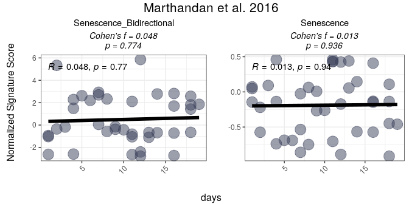

For users interested in viewing the overall distribution of scores
across gene signatures, the `PlotScores` function can be used without
specifying the `GroupingVariable` parameter, i.e, without grouping
scores by any metadata variable. In this case, the function will
automatically generate a grid of density plots, with each plot
representing the distribution of scores for a specific gene signature.

``` r
 options(error=recover)
PlotScores(data = counts_example, 
           metadata = metadata_example, 
           gene_sets = list(Senescence_Bidirectional = SimpleSenescenceSignature_bidirectional,
                            Senescence  = SimpleSenescenceSignature), 
           method ="logmedian", 
           ColorValues = NULL,  
           ncol = NULL, 
           nrow = NULL, 
           widthTitle=24, 
           limits = NULL,  
           title="Marthandan et al. 2016",
           labsize=9, 
           titlesize = 11)  
```


#### ssGSEA method

The same approach can be applied for **ssGSEA** (single-sample Gene Set
Enrichment Analysis; Barbie et al. (2009)) for score calculation and
visualization, both for unidirectional and bidirectional signatures.
ssGSEA computes an enrichment score for each gene signature in each
sample using an adaptation of the `gsva()` function from the `GSVA`
package. This method is useful for evaluating gene set enrichment in
individual samples rather than groups, as described in the sections
below.

``` r
senescence_triggers_colors <- c(
  "none" = "#E57373",  # Soft red   
  "Telomere shortening" = "#4FC3F7"  # Vivid sky blue  
)

cond_cohend <- list(A=c("Senescent"),  
                    B=c("Proliferative"))

PlotScores(data = counts_example, 
           metadata = metadata_example, 
           gene_sets = list(Senescence_Bidirectional = SimpleSenescenceSignature_bidirectional,
                          Senescence  = SimpleSenescenceSignature),
           ColorVariable = "SenescentType", 
           Variable="Condition",  
           method ="ssGSEA", 
           ColorValues = senescence_triggers_colors, 
           ConnectGroups=TRUE, 
           ncol = NULL, 
           nrow = NULL, 
           widthTitle=24, 
           limits = NULL, 
           legend_nrow = 1, 
           pointSize=4,
           compute_cohen=T,
           cond_cohend=cond_cohend,
           title="Marthandan et al. 2016",
           labsize=9, 
           titlesize = 12)  
```

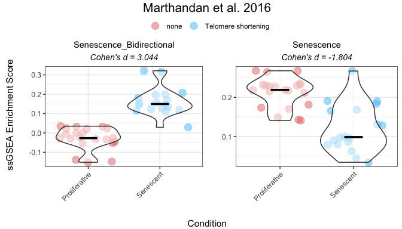

#### Ranking method

The **ranking** method computes gene signature scores for each sample by
ranking the expression of signature genes in the dataset and normalizing
the score based on the total number of genes.

The following example demonstrates the use of the “ranking” method for
both unidirectional and bidirectional signatures:

``` r
 
senescence_triggers_colors <- c(
  "none" = "#E57373",  # Soft red   
  "Telomere shortening" = "#4FC3F7"  # Vivid sky blue  
)

cond_cohend <- list(A=c("Senescent"),  
                    B=c("Proliferative"))

PlotScores(data = counts_example, 
           metadata = metadata_example, 
           gene_sets = list(Senescence_Bidirectional = SimpleSenescenceSignature_bidirectional,
                          Senescence  = SimpleSenescenceSignature),
           ColorVariable = "SenescentType", 
           Variable="Condition",  
           method ="ranking", 
           ColorValues = senescence_triggers_colors, 
           ConnectGroups=TRUE, 
           ncol = NULL, 
           nrow = NULL, 
           widthTitle=24, 
           limits = NULL, 
           legend_nrow = 1, 
           pointSize=4,
           compute_cohen=T,
           cond_cohend=cond_cohend,
           title="Marthandan et al. 2016",
           labsize=9, 
           titlesize = 12)  
```

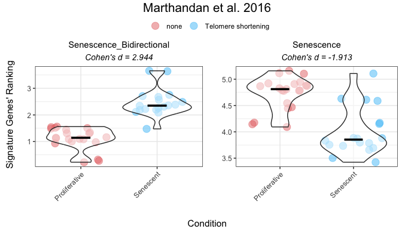

#### All methods

To compare various metrics across different condition combinations,
violin plots may not always be the best choice. In such cases, users can
set`method = "all"` to generate a summary heatmap and volcano-like plot.
The function will return one heatmap per gene set, with rows
corresponding to all possible combinations of values in the
`GroupingVariable`. In parenthesis is represented the p-value, adjusted
using the `BH` method (i.e., the Benjamini–Hochberg false discovery rate
procedure), across all combinations of contrasts and gene signatures. It
will also return a volcano-like plot (Cohen’s d effect sizes vs
-log10(adjusted p-values)), where each dot represents a method-signature
pair, faceted by contrast. The dashed lines represent user-defined
thresholds for significance and effect size.

The `mode` parameter controls how contrasts are generated for
categorical variables, allowing users to adjust the complexity of the
analysis:

-   **“simple”**: Performs the minimal number of pairwise comparisons
    between group levels (e.g., for a factor with levels A, B, C and D,
    it generates A - B, A - C, A - D, B - C, B - D, C - D).
-   **“medium”**: Includes comparisons between one group and the union
    of other groups (e.g., A - (B + C + D); B - (A + C + D)), allowing
    for broader contrasts beyond simple pairwise comparisons.
-   **“extensive”**: Allows for all possible algebraic combinations of
    group levels (e.g., (A + B) - (C + D)).

``` r
Overall_Scores <- PlotScores(data = counts_example, 
                             metadata = metadata_example,  
                             gene_sets=list(Senescence_Bidirectional = SimpleSenescenceSignature_bidirectional,
                                            Senescence  = SimpleSenescenceSignature), 
                             Variable="Condition",  
                             method ="all",   
                             ncol = NULL, 
                             nrow = NULL, 
                             widthTitle=30, 
                             limits = c(0,3.5),   
                             title="Marthandan et al. 2016", 
                             titlesize = 10,
                             ColorValues = list(heatmap=c("#F9F4AE", "#B44141"),
                                                volcano=c(Senescence="#A07395",
                                                          Senescence_Bidirectional="#CA7E45")),
                             mode="simple",
                             widthlegend=30, 
                             sig_threshold=0.05, 
                             cohen_threshold=0.6,
                             pointSize=6,
                             colorPalette="Paired")  
```

``` r
Overall_Scores$heatmap
```

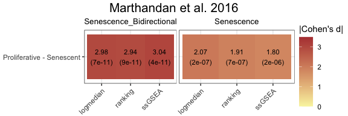

``` r
Overall_Scores$volcano
```

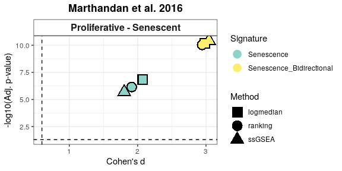

#### Classification Potential of Gene Signatures

The `ROC_Scores` and `AUC_Scores` functions allow users to evaluate the
classification potential of gene set scores based on ROC curves and
their AUC values. These functions help to assess how well a given score
can differentiate between conditions, based on predefined contrasts.
Besides `method="all"`, these functions can also be used for each method
individually.

The `ROC_Scores` function generates ROC curves for different scoring
methods across contrasts, allowing users to visualize performance
differences.

``` r
 ROC_Scores(data = counts_example, 
           metadata = metadata_example, 
           gene_sets=list(Senescence_Bidirectional = SimpleSenescenceSignature_bidirectional,
                          Senescence  = SimpleSenescenceSignature), 
           method = "all", 
           variable ="Condition",
           colors = c(logmedian = "#3E5587", ssGSEA = "#B65285", ranking = "#B68C52"), 
           grid = TRUE, 
           spacing_annotation=0.3, 
           ncol=NULL, 
           nrow=1,
            mode = "simple",
            widthTitle = 28,
           titlesize = 10,  
           title="Marthandan et al. 2016") 
```

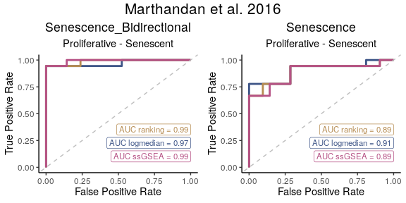

The `AUC_Scores` function generates heatmaps summarizing AUC values for
each gene signature, with methods as columns and contrasts as rows.

``` r
AUC_Scores(data = counts_example, 
           metadata = metadata_example, 
           gene_sets=list(Senescence_Bidirectional = SimpleSenescenceSignature_bidirectional,
                          Senescence  = SimpleSenescenceSignature), 
           method = "all", 
           mode = "simple", 
           variable="Condition", 
           nrow = NULL, 
           ncol = NULL, 
           limits = NULL, 
           widthTitle = 28, 
           titlesize = 10, 
           ColorValues = c("#F9F4AE", "#B44141"),   
           title="Marthandan et al. 2016") 
```

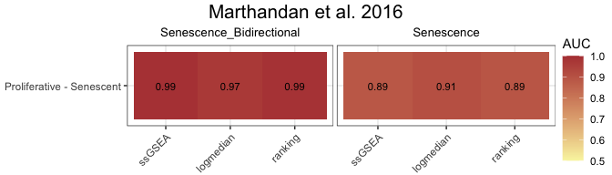

#### False Positive Rate (FPR) Calculations

The user can assess the significance of gene signature scores by
comparing observed effect sizes against a distribution of those
originated by random signatures with the same number of genes. For each
original gene signature, the function calculates the observed Cohen’s d
(and p‑value) using (`GroupingVariable`). It then generates a number of
simulated signatures (`number_of_sims`) by randomly sampling the same
number of genes from a user provided gene list (`gene_list`) and
computes their Cohen’s d values. The simulation results are visualised
as violin plots of the distribution of Cohen’s d values for each method,
overlaid with the observed values of the original signatures, and a 95th
percentile threshold. Significance is indicated by distinct point shapes
based on the associated p‑value.

``` r
FPR_Simulation(data = counts_example,
               metadata = metadata_example,
               original_signatures = list(Senescence_Bidirectional = SimpleSenescenceSignature_bidirectional,
                                          Senescence  = SimpleSenescenceSignature),
               gene_list = row.names(counts_example),
               number_of_sims = 10,
               title = "Marthandan et al. 2016",
               widthTitle = 30,
               Variable = "Condition",
               titlesize = 12,
               pointSize = 5,
               labsize = 10,
               mode = "simple",
               ColorValues=NULL,
               ncol=NULL, 
               nrow=NULL ) 
```


#### Score association with Chosen Phenotypic Variables

`markeR` provides statistical tests and visualizations to assess
relationships between phenotypic variables of different types and gene
signature scores.

-   Linear models estimate effect sizes (Cohen’s f on signature scores)
    associated with numeric and categorical variables.
-   Categorical variables are compared across all possible pairwise
    contrasts using Cohen’s d with adjusted p-values.
-   Lollipop plots highlight effect sizes, contrast plots compare
    groups, and distribution plots reveal score patterns.

The function returns a structured list containing:

-   Overall: Effect sizes and p-values for each contrasted phenotypic
    variable.
-   Contrasts: Cohen’s d and adjusted p-values for contrasts between
    levels of categorical variables, with the resolution of contrasts
    determined by the `mode` parameter.
-   plot: A combined visualization with three main panels: (1) lollipop
    plots of Cohen’s f for each variable of interest, (2) distribution
    plots of the score by variable (density or scatter depending on
    variable type), and (3, if applicable) lollipop plots of Cohen’s d
    for contrasts in categorical variables.
-   plot\_contrasts, plot\_overall, plot\_distributions: Individual
    panels from the combined plot — lollipop plots of Cohen’s f (colored
    by p-value), Cohen’s d for contrasts of non-numerical variables
    (colored by BH-adjusted p-value), and density or scatter plots of
    the score by variable type, respectively.

This approach allows users to quickly **identify potential relationships
between scores and phenotypic variables**, guiding further analysis.

This approach requires that the user is exploring a specific method for
score calculation and gene signature. For illustration purposes, we will
herein go with the `logmedian` method the Bidirectional Senescence
Signature, using the `mode=extensive`.

We will use the made-up variables created at the beginning of the script
to represent two additional types of variables: one categorical with
more than two levels, and one numerical. Specifically, “Researcher”
represents the person who processed the samples, and “DaysToSequencing”
indicates the number of days between sample preparation and sequencing.
Although these variables are synthetic, they mimic potential technical
covariates that could introduce unwanted variation into the data. If
they show an association with the senescence score, this could indicate
a batch effect, where technical variation confounds the biological
signal—requiring more careful interpretation of the results.

<!-- ```{r variableassoc_score_bidirectsen, fig.width=10, fig.height=7, out.width="100%", warning=FALSE, message=FALSE} -->
<!-- options(error=recover) -->
<!-- results_scoreassoc_bidirect <- Score_VariableAssociation(data = counts_example,  -->
<!--                           metadata = metadata_example,  -->
<!--                           cols = c("Condition","person","days"),  -->
<!--                           method="logmedian",  -->
<!--                           gene_set = list(Senescence = SimpleSenescenceSignature ), -->
<!--                           mode="extensive", -->
<!--                           nonsignif_color = "white", signif_color = "red", saturation_value=NULL,sig_threshold = 0.05, -->
<!--                           widthlabels=30, labsize=10, title=NULL, titlesize=14, pointSize=5, discrete_colors=NULL, -->
<!--                           continuous_color = "#8C6D03", color_palette = "Set2") -->
<!-- results_scoreassoc_bidirect$Overall -->
<!-- results_scoreassoc_bidirect$Contrasts -->
<!-- ``` -->

``` r
results_scoreassoc_bidirect <- Score_VariableAssociation(data = counts_example, 
                          metadata = metadata_example, 
                          cols = c("Condition","Researcher","DaysToSequencing"), 
                          method="logmedian", 
                          gene_set = list(Senescence_Bidirectional = SimpleSenescenceSignature_bidirectional),
                          mode="extensive",
                          nonsignif_color = "white", signif_color = "red", saturation_value=NULL,sig_threshold = 0.05,
                          widthlabels=30, labsize=10, title=NULL, titlesize=14, pointSize=5, discrete_colors=NULL,
                          continuous_color = "#8C6D03", color_palette = "Set2")
```

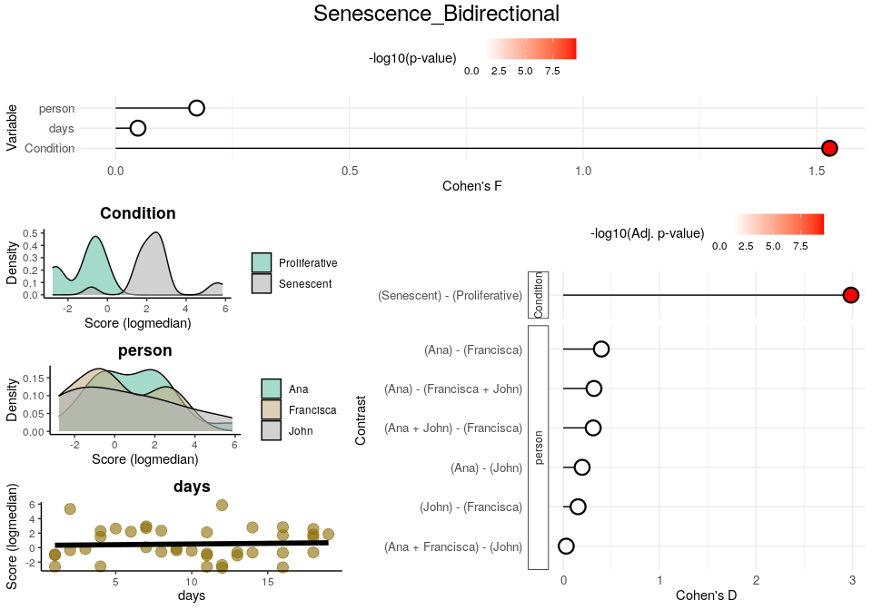

``` r
results_scoreassoc_bidirect$Overall
#>           Variable    Cohen_f      P_Value
#> 1        Condition 1.52736028 3.278479e-11
#> 2       Researcher 0.17329879 5.870614e-01
#> 3 DaysToSequencing 0.04759144 7.738244e-01
results_scoreassoc_bidirect$Contrasts
#>     Variable                  Contrast          Group1           Group2
#> 1  Condition Proliferative - Senescent   Proliferative        Senescent
#> 2 Researcher                Ana - John             Ana             John
#> 3 Researcher           Ana - Francisca             Ana        Francisca
#> 4 Researcher          Francisca - John       Francisca             John
#> 5 Researcher  Ana - (Francisca + John)             Ana Francisca + John
#> 6 Researcher  (Ana + Francisca) - John Ana + Francisca             John
#> 7 Researcher  (Ana + John) - Francisca      Ana + John        Francisca
#>        CohenD       PValue         padj
#> 1 -2.98420572 3.278479e-11 2.294935e-10
#> 2  0.19639043 6.661502e-01 8.626076e-01
#> 3  0.39561859 2.729488e-01 6.132382e-01
#> 4 -0.15441156 7.393780e-01 8.626076e-01
#> 5  0.31910742 3.294782e-01 6.132382e-01
#> 6  0.03157417 9.400893e-01 9.400893e-01
#> 7  0.31127790 3.504218e-01 6.132382e-01
```

### Enrichment-Based Methods

#### Differentially Expressed Genes

The `calculateDE` function in the `markeR` package leverages the `limma`
framework to compute differential gene expression statistics from raw
count data. This function is highly flexible and supports several modes
of operation depending on the user’s experimental design. In the
examples below, we illustrate two common scenarios:

-   **Automatic Design Matrix with Contrasts:** In the first example,
    the design matrix is built automatically from the metadata using a
    specified variable (here, `"Condition"`). The user must explicitly
    define the comparisons of interest based on the levels of this
    variable (e.g., `Senescent - Proliferative`). Internally, this
    approach fits a linear model without an intercept, enabling the user
    to define contrasts between the levels. This is ideal for simpler
    experimental designs, where quick comparison between predefined
    groups is desired without manually specifying the full model matrix.
-   **Providing an Externally Constructed Design Matrix:** In the second
    example, the user manually creates the design matrix (e.g., using
    `model.matrix(~ 0 + Condition)` for a no-intercept model) and
    provides it directly to `calculateDE`. This gives full control over
    how the design is specified, including complex experimental setups
    or custom encodings. Multiple contrasts can be defined later, based
    on this matrix, to extract specific comparisons of interest, using
    the `Contrast` parameter. If this parameter is left as `NULL`, the
    function will return results for all conditions (i.e. columns)
    defined in the design matrix. This approach is recommended when the
    user has a complex design or has already constructed the design
    matrix as part of a broader analysis pipeline.

Below are the corresponding code snippets demonstrating each scenario,
by answering the same question: **What are the genes differentially
expressed between senescence and proliferative cells?**

``` r
# Example 1: Build design matrix from variables (Condition) and apply a contrast.
# In this case, the design matrix is constructed automatically using the variable "Condition".
DEGs <- calculateDE(data = counts_example,
                    metadata = metadata_example,
                    variables = "Condition",
                    contrasts = c("Senescent - Proliferative"))
DEGs$`Senescent-Proliferative`[1:5,]
#>            logFC  AveExpr         t      P.Value    adj.P.Val        B
#> CCND2   3.816674 4.406721 12.393130 2.747202e-15 2.435712e-12 24.70982
#> MKI67  -3.581174 6.605339 -9.197510 2.007135e-11 4.992097e-10 15.96203
#> PTCHD4  3.398914 3.556007 10.740867 2.318137e-13 3.002118e-11 20.35906
#> KIF20A -3.365481 5.934893 -9.728709 4.176398e-12 1.844336e-10 17.51106
#> CDC20  -3.304602 6.104079 -9.801724 3.375212e-12 1.657492e-10 17.72110

# Example 2: Supply a custom design matrix directly.
# Here, the design matrix is created externally (using no intercept, for instance).
design <- model.matrix(~0 + Condition, data = metadata_example)
colnames(design) <- c("Proliferative","Senescent")
DEGs2 <- calculateDE(data = counts_example,
                     metadata = NULL,
                     variables = NULL,
                     modelmat = design,
                     contrasts = c("Senescent - Proliferative"))
DEGs2$`Senescent-Proliferative`[1:5,]
#>            logFC  AveExpr         t      P.Value    adj.P.Val        B
#> CCND2   3.816674 4.406721 12.393130 2.747202e-15 2.435712e-12 24.70982
#> MKI67  -3.581174 6.605339 -9.197510 2.007135e-11 4.992097e-10 15.96203
#> PTCHD4  3.398914 3.556007 10.740867 2.318137e-13 3.002118e-11 20.35906
#> KIF20A -3.365481 5.934893 -9.728709 4.176398e-12 1.844336e-10 17.51106
#> CDC20  -3.304602 6.104079 -9.801724 3.375212e-12 1.657492e-10 17.72110
```

After running your differential expression analysis (for example, using
the `calculateDE` function), you can visualize your results with the
`plotVolcano` function. This function provides a flexible interface for
exploring your data by allowing you to:

-   **Plot Differential Gene Expression Statistics:**  
    Display a volcano plot with your chosen statistics (e.g., log
    fold-change on the x-axis and –log₁₀ adjusted p-value on the
    y-axis).
-   **Color Interesting Genes:**  
    Highlight genes that pass user-specified thresholds by adjusting
    `threshold_y` and `threshold_x`.
-   **Annotate Top and Bottom N Genes:**  
    Optionally, label the top (and bottom) N genes based on the chosen
    statistic to quickly identify the most significant genes.
-   **Highlight Gene Signatures:** If the user provides a list of gene
    signatures using the `genes` argument, the function can highlight
    these genes in the plot. The user can also specify distinct colors
    for putativelyupregulated and downregulated if their direction is
    known, or a color for genes that do not have a putative direction.

Below is an example usage of `plotVolcano` that visualizes differential
expression results from a `DEResultsList`. The first plot shows the
default behavior, generating a basic volcano plot without thresholds or
gene highlights. Subsequent examples demonstrate how to customize the
plot:

-   Adding significance thresholds to highlight genes of interest,
-   Annotating the top and bottom N genes by effect size,
-   And using gene signatures to color genes across multiple plots
    arranged by contrast and signature.

These examples illustrate how users can customise the output plot to
highlight biologically meaningful patterns or focus on specific gene
sets.

``` r
# Plot Differentially Expressed Genes:
plotVolcano(DEGs, genes = NULL, N = NULL,
            x = "logFC", y = "-log10(adj.P.Val)", pointSize = 2,
            color = "#6489B4", highlightcolor = "#05254A", nointerestcolor = "#B7B7B7",
            threshold_y = NULL, threshold_x = NULL,
            xlab = NULL, ylab = NULL, ncol = NULL, nrow = NULL, title = "Marthandan et al. 2016",
            labsize = 8, widthlabs = 25, invert = FALSE)
```


``` r
# Color Interesting Genes:
plotVolcano(DEGs, genes = NULL, N = NULL,
            x = "logFC", y = "-log10(adj.P.Val)", pointSize = 2,
            color = "#6489B4", highlightcolor = "#05254A", nointerestcolor = "#B7B7B7",
            threshold_y = 0.0001, threshold_x = 1,
            xlab = NULL, ylab = NULL, ncol = NULL, nrow = NULL, title = "Marthandan et al. 2016",
            labsize = 8, widthlabs = 25, invert = FALSE)
```


``` r
# Annotate Top and Bottom N Genes:
plotVolcano(DEGs, genes = NULL, N = 5,
            x = "logFC", y = "-log10(adj.P.Val)", pointSize = 2,
            color = "pink", highlightcolor = "#05254A", nointerestcolor = "#B7B7B7",
            threshold_y = NULL, threshold_x = NULL,
            xlab = NULL, ylab = NULL, ncol = NULL, nrow = NULL, title = "Marthandan et al. 2016",
            labsize = 8, widthlabs = 25, invert = FALSE)
```


``` r
# Change order: signatures in columns, contrast in rows
plotVolcano(DEGs, genes = list(Senescence_Bidirectional = SimpleSenescenceSignature_bidirectional,
                               Senescence  = SimpleSenescenceSignature), 
            N = NULL,
            x = "logFC", y = "-log10(adj.P.Val)", pointSize = 2,
            color = "#6489B4", highlightcolor = "#05254A", highlightcolor_upreg = "#038C65", highlightcolor_downreg = "#8C0303",nointerestcolor = "#B7B7B7",
            threshold_y = NULL, threshold_x = NULL,
            xlab = NULL, ylab = NULL, ncol = NULL, nrow = NULL, title = "Marthandan et al. 2016",
            labsize = 10, widthlabs = 24, invert = TRUE)
```


##### Note on Continuous Variables

If the user wants to analyse continuous variables (e.g., time or
dosage), they must provide a custom design matrix via the `modelmat`
argument, instead of using the `variables` argument. This is because the
`variables` argument is intended to be used for categorical variables
only: internally, when using `variables` to specify a phenotypic
variable of interest, the function constructs a design matrix without an
intercept and treats each level of the variable as a discrete group.
This is appropriate for defining explicit contrasts between categorical
levels but is not suitable for continuous variables, where such
discretization would distort the relationship.

For continuous variables, the user should instead build a design matrix
manually (e.g., using `model.matrix(~ variable)`), ensuring that the
variable of interest is numeric and has a corresponding column in the
matrix with the same name. The `calculateDE()` function will then use
this matrix directly for linear modelling.

The interpretation of the differential expression results remains
consistent: the statistics reflect always the expected change in
expression associated with a 1-unit increase in the variable (e.g., one
day, one unit of dosage, “Senescent” to “Proliferative”, etc).

``` r
 
design <- model.matrix(~1 + DaysToSequencing, data = metadata_example)

DEGs_continuous1 <- calculateDE(data = counts_example,
                                metadata = metadata_example, 
                                modelmat = design,
                                contrasts = c("DaysToSequencing"))
#> Warning in limma::makeContrasts(contrasts = contrasts, levels = design_matrix):
#> Renaming (Intercept) to Intercept
#> Warning in limma::contrasts.fit(fit, contrast_matrix): row names of contrasts
#> don't match col names of coefficients
DEGs_continuous1$DaysToSequencing[1:3,]
#>                logFC  AveExpr         t   P.Value adj.P.Val         B
#> RNA45SN2 -0.07628608 7.712585 -1.626674 0.1117361 0.9997685 -6.018805
#> RNA18SN2  0.06743439 9.577467  1.554171 0.1280974 0.9997685 -6.129426
#> RNA18SN3  0.06743439 9.577467  1.554171 0.1280974 0.9997685 -6.129426
```

This usage of the `modelmat` argument allows the user to combine
categorical and numeric variables in a fully customized design matrix.
In the example below:

-   `(Intercept)`: Baseline expression when days = 0 and Condition =
    Control.
-   `DaysToSequencing`: Change in expression per unit of time (day)
    increase.
-   `Senescent`: Average difference in expression between Senescent and
    Control conditions.

This approach is useful when modeling continuous effects alongside group
comparisons, and it provides complete flexibility in specifying the
design.

``` r
# Manually construct the design matrix
model_matrix <- model.matrix(~ DaysToSequencing + Condition, data = metadata_example)
colnames(model_matrix) <- c("(Intercept)", "DaysToSequencing", "Senescent")

# Provide the custom design matrix to calculateDE using the `modelmat` argument
DEGs_continuous2 <- calculateDE(data = counts_example,
                                modelmat = model_matrix)

# Access results for each coefficient
DEGs_continuous2$`(Intercept)`[1:3, ]
#>           logFC  AveExpr         t      P.Value    adj.P.Val         B
#> FN1    13.23994 13.21879  74.04645 1.265799e-43 3.210740e-43  89.73456
#> EEF1A1 12.94192 12.85091 179.29631 1.402180e-58 9.033979e-57 121.69861
#> GAPDH  12.71139 12.53188 147.86006 2.586838e-55 5.583501e-54 115.21324
DEGs_continuous2$DaysToSequencing[1:3, ]
#>                logFC  AveExpr         t    P.Value adj.P.Val         B
#> RNA45SN2 -0.08056063 7.712585 -1.689209 0.09914647 0.9853746 -6.052523
#> RNA18SN2  0.06598991 9.577467  1.490666 0.14407989 0.9853746 -6.355482
#> RNA18SN3  0.06598991 9.577467  1.490666 0.14407989 0.9853746 -6.355482
DEGs_continuous2$Senescent[1:3, ]
#>            logFC  AveExpr         t      P.Value    adj.P.Val        B
#> CCND2   3.863054 4.406721 12.344742 4.643461e-15 4.865503e-12 24.20437
#> MKI67  -3.655159 6.605339 -9.296026 1.907736e-11 5.010329e-10 16.02834
#> PTCHD4  3.453362 3.556007 10.774059 2.907380e-13 3.864144e-11 20.14942
```

#### Gene Set Enrichment Analyses

To perform GSEA, the user can use the `runGSEA()` function. This
function takes a named list of differential expression statistics (one
per contrast) and a set of gene signatures to compute enrichment scores.

-   `DEGList`: A list of differentially expressed genes (DEGs) for each
    contrast.

-   `gene_sets`: A list of gene sets, where each entry can be:

    -   A vector of gene names (unidirectional analysis).
    -   A data frame where the first column is the gene name and the
        second column indicates the expected direction (+1 or -1,
        bidirectional analysis).

-   `stat`: The ranking statistic. If NULL, the ranking statistic is
    automatically selected:

    -   `"B"` for gene sets with **no known direction** (vectors).
    -   `"t"` for **unidirectional** or **bidirectional** gene sets
        (data frames).
    -   If provided, this argument overrides the automatic selection.

-   `ContrastCorrection`: Logical, default is `FALSE`. If `TRUE`,
    applies an additional multiple testing correction
    (Benjamini–Hochberg) across all contrasts returned in the `DEGList`
    results list. This accounts for the number of contrasts tested per
    signature and provides more stringent control of false discovery
    rate across multiple comparisons (similar to answering the question
    “Is there any signature that is significant in any of the contrasts”
    instead of “For each contrast, is there any signature that is
    significant”). If `FALSE`, the function only corrects for the number
    of gene sets.

``` r
GSEAresults <- runGSEA(DEGList = DEGs, 
                       gene_sets = list(Senescence_Bidirectional = SimpleSenescenceSignature_bidirectional,
                                        Senescence  = SimpleSenescenceSignature),
                       stat = NULL,
                        ContrastCorrection = FALSE)

GSEAresults
#> $`Senescent-Proliferative`
#>                     pathway       pval       padj    log2err        ES      NES
#>                      <char>      <num>      <num>      <num>     <num>    <num>
#> 1: Senescence_Bidirectional 0.01838843 0.03677686 0.15267586 0.7068136 1.653726
#> 2:               Senescence 0.14596611 0.14596611 0.04482895 0.5844505 1.338962
#>     size                         leadingEdge stat_used
#>    <int>                              <list>    <char>
#> 1:     7 LMNB1,MKI67,GLB1,CDKN1A,CDKN2A,CCL2         t
#> 2:     7                         LMNB1,MKI67         B
```

Depending on the statistic used, the interpretation of the plots
changes:

1.  **B Statistic vs. t Statistic:**
    -   The B statistic does not specify the direction (enriched or
        depleted) of the gene set’s alterations. It only indicates the
        strength of evidence for any alterations.
    -   The t statistic orders genes from stronger evidence of
        over-expression to stronger evidence for under-expression.
2.  **Graph’s annotation:**
    -   When using the B statistic, the plot will include “Altered Gene
        Set” beneath its title to reflect this focus on whether genes
        are altered.
    -   For the t statistic, the plot will include “Enriched/Depleted
        Gene Set” beneath its title, indicating its focus on the
        enrichment or depletion of genes.

After running GSEA, the user can visualize enrichment plots using the
`plotGSEAenrichment()` function. This function generates enrichment
plots for each gene signature and contrast, displaying also the
**Normalized Enrichment Scores (NES)** and **adjusted p-value** for each
enrichment result. As `plotGSEAenrichment`’s relevant graphical
parameters:

-   `grid = TRUE`: Arranges the plots in a grid for better
    visualization.
-   `titlesize`: Adjusts title font size.
-   `nrow`/`ncol`: Specifies the grid layout for arranging plots.

``` r
plotGSEAenrichment(GSEA_results=GSEAresults, 
                   DEGList=DEGs, 
                   gene_sets=list(Senescence_Bidirectional = SimpleSenescenceSignature_bidirectional,
                                  Senescence  = SimpleSenescenceSignature), 
                   widthTitle=40, grid = T, titlesize = 10, nrow=1, ncol=2) 
```


The `plotNESlollipop()` function creates lollipop plots for visualizing
Gene Set Enrichment Analysis (GSEA) results. Each plot displays gene
sets on the y-axis and Normalized Enrichment Scores (NES) on the x-axis,
with a color gradient proportional to the adjusted p-value. The function
supports multiple contrasts and includes options for customizing the
color gradient, significance threshold, and plot layout. It can also
arrange individual plots into a grid layout for comparative
visualization.

``` r
plotNESlollipop(GSEA_results=GSEAresults, 
                saturation_value=NULL, 
                nonsignif_color = "#F4F4F4", 
                signif_color = "red",
                sig_threshold = 0.05, 
                grid = FALSE, 
                nrow = NULL, ncol = NULL, 
                widthlabels=13, 
                title=NULL, titlesize=12) 
#> $`Senescent-Proliferative`
```


The `plotCombinedGSEA()` function generates a scatter plot to visualize
the results of Gene Set Enrichment Analysis (GSEA) across multiple
contrasts. Each point represents a pathway, with:

-   X-axis: Normalized Enrichment Score (NES)
-   Y-axis: -log10 adjusted p-value (significance)
-   Color: Gene sets
-   Shape: Contrasts
-   Dashed line: Significance threshold

This function helps compare enrichment results when the number of
contrasts and the number of pathways is high, scenario of which the
example herein is not too representative.

``` r
plotCombinedGSEA(GSEAresults, sig_threshold = 0.05, PointSize=6, widthlegend = 26 )
```


#### GSEA Association with Chosen Phenotypic Variables

Following the same rational presented in [Score association with Chosen
Variables](#score-association-with-chosen-variables), the
`GSEA_VariableAssociation` function automates assessing whether gene
expression patterns align with specific biological pathways or signature
by performing differential expression (DE) analysis across all possible
contrasts for categorical variables or using linear modeling for
continuous variables. It then applies Gene Set Enrichment Analysis
(GSEA) to evaluate the enrichment of predefined gene sets amongst
differentially expressed genes, returning both numerical results and an
intuitive lollipop plot for visualization. This approach helps users
quickly identify significant associations between metadata variables and
gene expression patterns.

Depending on the statistic used (B- or t-statistic):

1.  **Negative NES:**
    -   t Statistic: A negative NES with the t statistic indicates that
        the gene set is depleted amongst over-expressed genes (i.e.,
        genes in the set are under-expressed).
    -   B Statistic: A negative NES using the B statistic means that the
        gene set is depleted amongst the most altered genes, i.e. that
        their expression changes less than most genes’.
2.  **Dashed Lines:**
    -   The dashed lines in the plot represent B statistic results with
        negative NES, meaning gene sets putatively not altered.
3.  **Subtitle Differences:**
    -   When using the B statistic, the subtitle of the plot will read
        “Altered Contrasts”.
    -   For the t statistic, the subtitle will read “Enriched/Depleted
        Contrasts”.

``` r
 
GSEA_VariableAssociation(data=counts_example, 
                         metadata=metadata_example, 
                         cols=c("Condition","Researcher","DaysToSequencing"), 
                         mode="simple", 
                         gene_set=list(Senescence  = SimpleSenescenceSignature), 
                         saturation_value=NULL, nonsignif_color = "white", signif_color = "red",
                         sig_threshold = 0.05, widthlabels=30, labsize=10, titlesize=14, pointSize = 5) 
#> $plot
```

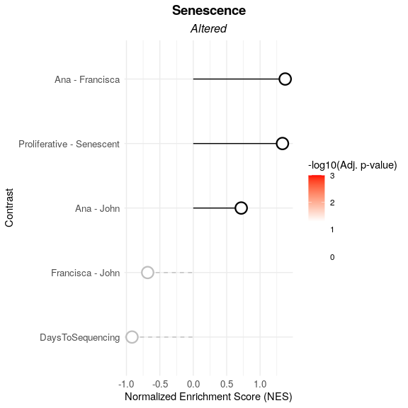

    #> 
    #> $data
    #>       pathway      pval      padj    log2err         ES        NES  size
    #>        <char>     <num>     <num>      <num>      <num>      <num> <int>
    #> 1: Senescence 0.1459661 0.3649153 0.04482895  0.5844505  1.3389622     7
    #> 2: Senescence 0.8153487 0.8596054 0.01825162  0.2197875  0.7218660     7
    #> 3: Senescence 0.1220617 0.3649153 0.05892753  0.4198163  1.3797736     7
    #> 4: Senescence 0.8596054 0.8596054 0.01599026 -0.2113031 -0.6810595     7
    #> 5: Senescence 0.5467359 0.8596054 0.02231638 -0.2849369 -0.9161661     7
    #>                                leadingEdge stat_used                  Contrast
    #>                                     <list>    <char>                    <char>
    #> 1:                             LMNB1,MKI67         B Proliferative - Senescent
    #> 2:                        GLB1,TP53,CDKN1A         B                Ana - John
    #> 3:          LMNB1,CDKN1A,GLB1,CDKN2A,MKI67         B           Ana - Francisca
    #> 4: CCL2,CDKN1A,MKI67,GLB1,LMNB1,CDKN2A,...         B          Francisca - John
    #> 5:     LMNB1,MKI67,CDKN2A,TP53,CCL2,CDKN1A         B          DaysToSequencing

``` r
GSEA_VariableAssociation(data=counts_example, 
                         metadata=metadata_example, 
                         cols=c("Condition","Researcher","DaysToSequencing"), 
                         mode="simple", 
                         gene_set=list(Senescence_Bidirectional = SimpleSenescenceSignature_bidirectional), 
                         saturation_value=NULL, nonsignif_color = "white", signif_color = "red",
                         sig_threshold = 0.05, widthlabels=30, labsize=10, titlesize=14, pointSize = 5) 
#> $plot
```

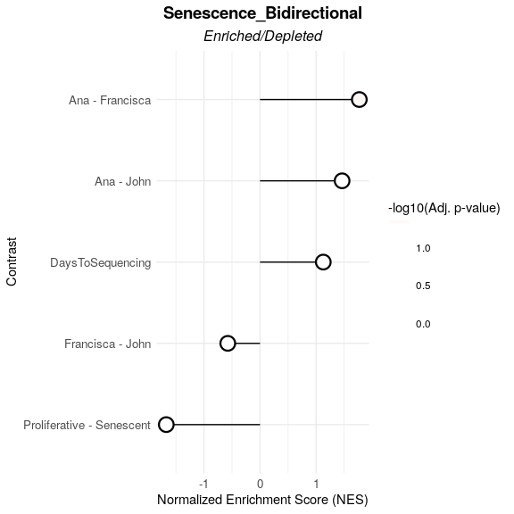

    #> 
    #> $data
    #>                     pathway        pval       padj    log2err         ES
    #>                      <char>       <num>      <num>      <num>      <num>
    #> 1: Senescence_Bidirectional 0.023760331 0.05940083 0.13405093 -0.7068136
    #> 2: Senescence_Bidirectional 0.077863457 0.12977243 0.06946518  0.6399995
    #> 3: Senescence_Bidirectional 0.006124402 0.03062201 0.25663502  0.7274186
    #> 4: Senescence_Bidirectional 0.949172812 0.94917281 0.01513268 -0.2471009
    #> 5: Senescence_Bidirectional 0.321938468 0.40242308 0.03305031  0.4899121
    #>           NES  size                         leadingEdge stat_used
    #>         <num> <int>                              <list>    <char>
    #> 1: -1.6491022     7 LMNB1,MKI67,GLB1,CDKN1A,CDKN2A,CCL2         t
    #> 2:  1.4615936     7                    GLB1,TP53,CDKN1A         t
    #> 3:  1.7675900     7      LMNB1,CDKN1A,GLB1,CDKN2A,MKI67         t
    #> 4: -0.5727763     7                  CDKN2A,LMNB1,MKI67         t
    #> 5:  1.1260283     7 GLB1,CDKN1A,CCL2,CDKN2A,MKI67,LMNB1         t
    #>                     Contrast
    #>                       <char>
    #> 1: Proliferative - Senescent
    #> 2:                Ana - John
    #> 3:           Ana - Francisca
    #> 4:          Francisca - John
    #> 5:          DaysToSequencing

## Similarities with Other Signatures

Even if a user-defined gene signature demonstrates strong discriminatory
power between conditions, it may reflect known biological pathways
rather than novel mechanisms. To address this, the
`signature_similarity()` function computes pairwise **Jaccard indices**
between user-provided gene signatures and a reference set, quantifying
their overlap as a percentage of shared genes.

Users can compare their signatures to:

-   **Custom gene sets**, defined manually, or

-   **MSigDB collections**, via the
    [`msigdbr`](https://cran.r-project.org/package=msigdbr) package.

The function provides options to:

-   Filter by **Jaccard index threshold**, using `jaccard_threshold`
    (e.g., only show sets with Jaccard ≥ 0.05), or

-   Limit the number of top-matching reference signatures shown, using
    `num_sigs_toplot`.

### Example 1: Compare against user-defined and MSigDB gene sets

``` r
# Example data (you'd replace these with your actual signatures)
signature1 <- c("TP53", "BRCA1", "MYC", "EGFR", "CDK2")
signature2 <- c("ATXN2", "FUS", "MTOR", "CASP3")

signature_list <- list(
  "User_Apoptosis" = c("TP53", "CASP3", "BAX"),
  "User_CellCycle" = c("CDK2", "CDK4", "CCNB1", "MYC"),
  "User_DNARepair" = c("BRCA1", "RAD51", "ATM"),
  "User_MTOR" = c("MTOR", "AKT1", "RPS6KB1")
)

signature_similarity(
  signatures = list(SG1 = signature1, SG2 = signature2),
  other_user_signatures = signature_list,
  collection = "C2",
  subcollection = "CP:KEGG",
  num_sigs_toplot = NULL,
  jaccard_threshold = 0.05,
  msig_subset = NULL
)
```


### Example 2: Restrict comparison to a custom subset of MSigDB

You can also specify exactly which MSigDB pathways to compare against
using the `msig_subset` argument. This is helpful if you’re only
interested in a specific set of pathways. If this argument is supplied,
filters will only apply to this subset.

``` r
signature_similarity(
  signatures = list(SG1 = signature1, SG2 = signature2),
  other_user_signatures = signature_list,
  collection = "C2",
  subcollection = "CP:KEGG",
  num_sigs_toplot = NULL,
  jaccard_threshold = 0,
  msig_subset = c("KEGG_MTOR_SIGNALING_PATHWAY", "KEGG_APOPTOSIS", "NON_EXISTENT_PATHWAY")
)
#> The following pathways from msig_subset were not found in the MSigDB collection:
#> NON_EXISTENT_PATHWAY
```

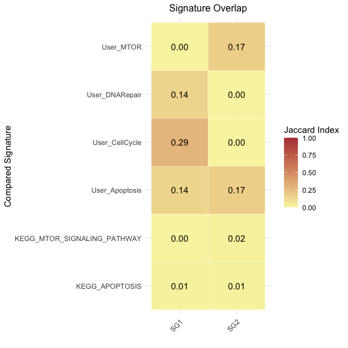

------------------------------------------------------------------------

📩 For any questions or concerns, feel free to reach out:

**Rita Martins-Silva**  
Email: <rita.silva@gimm.pt>
