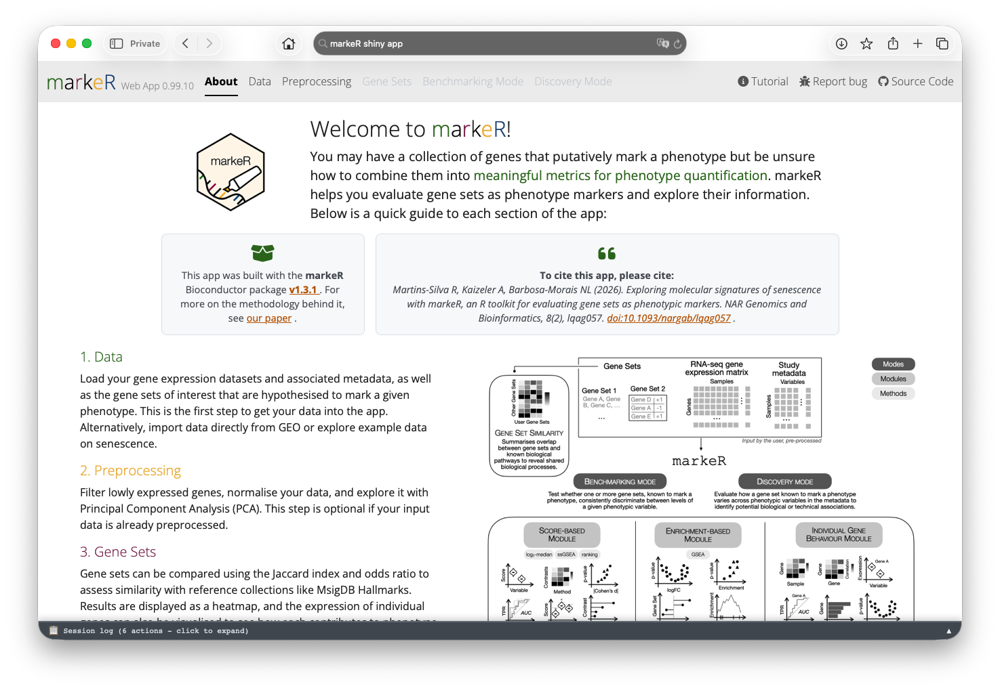

<!-- README.md is generated from README.Rmd. Please edit that file -->

# markeR <a href="https://diseasetranscriptomicslab.github.io/markeR/"></a>

<!-- badges: start -->

[](https://diseasetranscriptomicslab.github.io/markeR/)

[](https://codecov.io/gh/DiseaseTranscriptomicsLab/markeR)

<!-- badges: end -->

> ⚠️ **This is the `ShinyApp` branch.** It’s being developed in parallel
> to `main` and adds the interactive Shiny web app described below on
> top of the core `markeR` package. It will be merged into `main` once
> stable.

**`markeR`** is an R package for the systematic evaluation of gene sets
as phenotypic markers using transcriptomic data. If you have a
collection of genes putatively marking a phenotype but aren’t sure how
to combine them into a meaningful metric, `markeR` helps you quantify
and visualise how well they do.

It offers two modes of analysis:

- **Benchmarking Mode**: test whether one or more gene sets, known to
  mark a phenotype, consistently discriminate between levels of a given
  phenotypic variable.
- **Discovery Mode**: evaluate how a gene set known to mark a phenotype
  varies across phenotypic variables, to identify potential biological
  or technical associations.

Both modes combine score-based (log2-median, ranking, ssGSEA) and
enrichment-based (GSEA) quantification approaches, alongside tools for
individual gene exploration and comparison against reference gene set
collections (e.g. MSigDB).

`markeR` also comes with an interactive **Shiny web app** (screenshot
below) that wraps both modes in a point-and-click interface, so you
don’t need to write any code. You can [try it
online](https://compbio.imm.medicina.ulisboa.pt/app/markeR), no
installation needed, or run it yourself as described below.



> **To cite `markeR` please use:**
>
> Martins-Silva R, Kaizeler A, Barbosa-Morais NL (2026). “Exploring
> molecular signatures of senescence with markeR, an R Toolkit for
> evaluating gene sets as phenotypic markers.” NAR Genomics and
> Bioinformatics, 8(2), lqag057. <doi:10.1093/nargab/lqag057>

To understand the core functionalities behind `markeR`, check out [our
paper](https://doi.org/10.1093/nargab/lqag057). To learn how to use the
Shiny app itself, follow the [Shiny app
tutorial](https://github.com/DiseaseTranscriptomicsLab/markeR/tree/ShinyApp/inst/shiny/www).

## Requirements

This package is officially supported on `R > 4.5.0`. ⚠️ Older versions
of `R` may work but are not officially supported due to upstream
dependency constraints.

## Installation

Install the latest release from Bioconductor:

``` r
if (!requireNamespace("BiocManager", quietly = TRUE))
    install.packages("BiocManager")
BiocManager::install("markeR")
library(markeR)
```

Or install the latest development version from
[GitHub](https://github.com/):

``` r
# install.packages("devtools")
devtools::install_github("DiseaseTranscriptomicsLab/markeR@*release")
```

## Launching the Shiny App

### Option 1: From R

``` r
library(markeR)
markeRapp()
```

This launches the app in your default web browser. Any additional
arguments are forwarded to `shiny::runApp()`, so you can also run it as
a standalone server:

``` r
markeRapp(host = "0.0.0.0", port = 3838, launch.browser = FALSE)
```

### Option 2: With Docker

Pull the ready-to-use image from Docker Hub
([`diseasetranscriptomicslab/marker`](https://hub.docker.com/r/diseasetranscriptomicslab/marker)):

``` bash
docker pull diseasetranscriptomicslab/marker
docker run -p 3838:3838 diseasetranscriptomicslab/marker
```

Then open <http://localhost:3838> in your browser. Alternatively, build
the image yourself from the repository’s `Dockerfile`:

``` bash
git clone https://github.com/DiseaseTranscriptomicsLab/markeR.git
cd markeR
docker build -t markeR .
docker run -p 3838:3838 markeR
```

## Python Bridge

A lightweight bridge for calling `markeR` functions from Python (via
[`rpy2`](https://rpy2.github.io/)) is available in `python/`. See
[`python/README.md`](inst/python/README.md) for details.

## Contact

📩 For any questions or concerns, feel free to reach out:

**Rita Martins-Silva** Email: <rita.silva@medicina.ulisboa.pt>
