# Benchmarking Mode Tutorial

This vignette provides a comprehensive introduction to the **markeR**
package, focusing on its **Benchmarking Mode**. This mode is designed to
evaluate gene sets’ performance in marking a metadata variable, *i.e.*,
a phenotype such as disease or cellular condition, returning comparative
visualisations across scoring and enrichment methods. It allows users to
assess the robustness and reliability of gene sets across various
conditions, providing a standardized framework for benchmarking.

## Case-study: Senescence

In this vignette, we use a pre‑processed RNA-seq dataset from Marthandan
et al. (2016, GSE63577), with normalised read counts for human
fibroblasts under **replicative senescence** and **proliferative
control**. See
[`?counts_example`](https://diseasetranscriptomicslab.github.io/markeR/reference/counts_example.md)
for preprocessing details and structure. `markeR` requires as input a
filtered and normalised, non log-transformed, gene expression matrix
(genes × samples). Row names must be gene identifiers; column names must
match sample IDs in the metadata.

We use the accompanying metadata from the Marthandan et al. (2016) study
(see
[`?metadata_example`](https://diseasetranscriptomicslab.github.io/markeR/reference/metadata_example.md)).

This dataset serves as a working example to demonstrate the main
functionalities of the `markeR` package. In particular, it will be used
to showcase the two primary modules of `markeR` for quantifying
phenotypes using gene sets:

- **Score-based methods**: log2-median expression, ranking approaches,
  and single-sample gene set enrichment analysis (ssGSEA) to quantify
  coordinated expression within a gene set.
- **Enrichment-based methods**: GSEA using moderated t- or B-statistics.

To illustrate the usage of `markeR`, we use three gene sets commonly
associated with cellular senescence:

- **LiteratureMarkers**: A small, curated set of well-established
  senescence-associated genes repeatedly reported in the literature.
  This concise gene set includes key markers often used for validating
  senescence phenotypes. This set includes information on the expected
  direction of change in expression of genes upon phenotype (i.e.,
  whether genes are expected to be up- or down-regulated in senescence).
- **REACTOME_CELLULAR_SENESCENCE**: A comprehensive gene set from the
  MSigDB REACTOME collection, representing known molecular pathways
  involved in cellular senescence and commonly used in enrichment-based
  analyses. This is also treated as an undirected gene set without
  information on the up- or down-regulation of individual genes.
- **HernandezSegura**: A transcriptomic gene set identified by
  Hernandez-Segura et al. (2017) as consistently altered across multiple
  senescence models. This set includes information on the expected
  direction of change in expression of genes upon phenotype.

``` r

library(markeR)
#> Warning: markeR has been tested with ggplot2 <= 3.5.2. Using newer versions may cause incompatibilities.
```

``` r

# Load example gene sets
data("genesets_example")
lapply(genesets_example, head, n = 10)
#> $HernandezSegura
#>        gene enrichment
#> 1    ACADVL          1
#> 2     ADPGK          1
#> 3  ARHGAP35         -1
#> 4     ARID2         -1
#> 5     ASCC1         -1
#> 6   B4GALT7          1
#> 7    BCL2L2          1
#> 8     C2CD5         -1
#> 9     CCND1          1
#> 10    CHMP5          1
#> 
#> $REACTOME_CELLULAR_SENESCENCE
#>  [1] "CDC27"   "E2F2"    "SCMH1"   "MRE11"   "MAP2K3"  "MAPK9"   "ANAPC4" 
#>  [8] "MAP2K4"  "MAP4K4"  "RPS6KA2"
#> 
#> $LiteratureMarkers
#>     gene enrichment
#> 1 CDKN1A          1
#> 2 CDKN2A          1
#> 3   GLB1          1
#> 4   TP53          1
#> 5   CCL2          1
#> 6  LMNB1         -1
#> 7  MKI67         -1
```

``` r

data(counts_example)
# Load example data
counts_example[1:5,1:5]
#>          SRR1660534 SRR1660535 SRR1660536 SRR1660537 SRR1660538
#> A1BG        9.94566   9.476768   8.229231   8.515083   7.806479
#> A1BG-AS1   12.08655  11.550303  12.283976   7.580694   7.312666
#> A2M        77.50289  56.612839  58.860268   8.997624   6.981857
#> A4GALT     14.74183  15.226083  14.815891  14.675780  15.222488
#> AAAS       47.92755  46.292377  43.965972  47.109493  47.213739
```

For illustration purposes, two synthetic variables were added to the
data:

- `DaysToSequencing`, the number of days between sample preparation and
  sequencing;
- `Researcher`, identifying the person who processed each sample.

This enables exploration of associations between gene set activity and
both categorical and continuous variables.

``` r

data(metadata_example)

set.seed("123456")

metadata_example$Researcher <- sample(c("John","Ana","Francisca"),39, replace = TRUE)
metadata_example$DaysToSequencing <- sample(c(1:20),39, replace = TRUE)
 
head(metadata_example)
#>       sampleID      DatasetID   CellType     Condition       SenescentType
#> 252 SRR1660534 Marthandan2016 Fibroblast     Senescent Telomere shortening
#> 253 SRR1660535 Marthandan2016 Fibroblast     Senescent Telomere shortening
#> 254 SRR1660536 Marthandan2016 Fibroblast     Senescent Telomere shortening
#> 255 SRR1660537 Marthandan2016 Fibroblast Proliferative                none
#> 256 SRR1660538 Marthandan2016 Fibroblast Proliferative                none
#> 257 SRR1660539 Marthandan2016 Fibroblast Proliferative                none
#>                         Treatment Researcher DaysToSequencing
#> 252 PD72 (Replicative senescence)        Ana                6
#> 253 PD72 (Replicative senescence)        Ana               18
#> 254 PD72 (Replicative senescence)       John               19
#> 255                         young        Ana                2
#> 256                         young  Francisca                9
#> 257                         young       John               10
```

## Calculate Senescence Scores

The `CalculateScores` function computes the gene set scores for each
sample based on predefined gene sets, such as a senescence gene set. It
returns a named list where each entry corresponds to a specific gene set
and includes the calculated scores, along with metadata (if available).
When setting `method = "all"`, the function returns a list, where each
element corresponds to a scoring method and contains the respective data
frame of scores, allowing comparison between methods. The function
allows users to select from three different scoring methods:

- **logmedian**: mean of the across-sample normalised log2
  median-centred expression levels of the genes in the set; for
  bidirectional gene sets, the sample score is the partial score for the
  subset of putatively upregulated genes minus that of the downregulated
  subset.

- **Ranking**: mean expression rank of gene set members in each sample;
  for bidirectional gene sets, the sample score is the partial score for
  the subset of putatively upregulated genes minus that of the
  downregulated subset, and normalised by the number of genes in the
  set.

- **ssGSEA**: single-sample gene set enrichment score using ssGSEA; for
  bidirectional gene sets, the sample score is the partial score for the
  subset of putatively upregulated genes minus that of the downregulated
  subset.

These methods are very similar and, when applied to a robust gene set,
are expected to yield similar results across all three methods.
Empirically, a good gene set will be one that shows consistent results,
both in the calculated scores and in Cohen’s d or f statistics, across
different methods. If the gene set is not robust, or if there is
considerable noise, the results across methods may differ significantly.

The `PlotScores` function computes and visualizes gene set scores
according to the chosen method and variable type:

- `method = "all"`

  - Categorical `Variable`: produces a heatmap of Cohen’s *d* and a
    volcano plot of all pairwise group contrasts.  
  - Numeric `Variable`: produces a heatmap of Cohen’s *F* statistics and
    a volcano plot of associations.

- `method != "all"`

  - Categorical `Variable`: generates violin plots of scores per gene
    set.  
  - Numeric `Variable`: generates scatter plots of scores versus the
    numeric variable.  
  - `Variable` is `NULL`: displays a density plot of the score
    distribution.

This structure clearly links each combination of method and variable
type to the resulting visualization, avoiding ambiguity.

### logmedian method

The **logmedian** method computes a gene signature score per sample as
follows. First, gene expression values are log2-transformed and each
gene is median-centered across all samples. For a given sample, the
score is the mean of the median-centered expression values of the genes
in the set (De Almeida et al., 2019). Each gene’s contribution is thus
evaluated relative to its baseline expression, and the resulting score
quantifies the coordinated activity of the gene set.

For bidirectional gene sets, where genes are annotated by expected
direction of regulation, the score is calculated as the difference
between the mean of the upregulated genes and the mean of the
downregulated genes. Users can compute scores for individual samples
using one or more predefined gene sets.

The following example demonstrates calculation of a gene signature score
using the logmedian method:

``` r

df_Scores <- CalculateScores(data = counts_example,
                             metadata = metadata_example,
                             method = "logmedian",
                             gene_sets = genesets_example)
#> Considering bidirectional gene signature mode for signature HernandezSegura
#> Considering unidirectional gene signature mode for signature REACTOME_CELLULAR_SENESCENCE
#> Considering bidirectional gene signature mode for signature LiteratureMarkers


head(df_Scores$REACTOME_CELLULAR_SENESCENCE)
#>       sample       score      DatasetID   CellType     Condition
#> 1 SRR1660534 -0.06074782 Marthandan2016 Fibroblast     Senescent
#> 2 SRR1660535 -0.06410952 Marthandan2016 Fibroblast     Senescent
#> 3 SRR1660536 -0.04015762 Marthandan2016 Fibroblast     Senescent
#> 4 SRR1660537 -0.01926335 Marthandan2016 Fibroblast Proliferative
#> 5 SRR1660538 -0.01133686 Marthandan2016 Fibroblast Proliferative
#> 6 SRR1660539 -0.00950118 Marthandan2016 Fibroblast Proliferative
#>         SenescentType                     Treatment Researcher DaysToSequencing
#> 1 Telomere shortening PD72 (Replicative senescence)        Ana                6
#> 2 Telomere shortening PD72 (Replicative senescence)        Ana               18
#> 3 Telomere shortening PD72 (Replicative senescence)       John               19
#> 4                none                         young        Ana                2
#> 5                none                         young  Francisca                9
#> 6                none                         young       John               10
head(df_Scores$HernandezSegura)
#>       sample      score      DatasetID   CellType     Condition
#> 1 SRR1660534  0.4460830 Marthandan2016 Fibroblast     Senescent
#> 2 SRR1660535  0.4564033 Marthandan2016 Fibroblast     Senescent
#> 3 SRR1660536  0.4727664 Marthandan2016 Fibroblast     Senescent
#> 4 SRR1660537 -0.1676110 Marthandan2016 Fibroblast Proliferative
#> 5 SRR1660538 -0.1198661 Marthandan2016 Fibroblast Proliferative
#> 6 SRR1660539 -0.1467108 Marthandan2016 Fibroblast Proliferative
#>         SenescentType                     Treatment Researcher DaysToSequencing
#> 1 Telomere shortening PD72 (Replicative senescence)        Ana                6
#> 2 Telomere shortening PD72 (Replicative senescence)        Ana               18
#> 3 Telomere shortening PD72 (Replicative senescence)       John               19
#> 4                none                         young        Ana                2
#> 5                none                         young  Francisca                9
#> 6                none                         young       John               10
head(df_Scores$LiteratureMarkers)
#>       sample      score      DatasetID   CellType     Condition
#> 1 SRR1660534  2.2008955 Marthandan2016 Fibroblast     Senescent
#> 2 SRR1660535  1.8078284 Marthandan2016 Fibroblast     Senescent
#> 3 SRR1660536  1.8542998 Marthandan2016 Fibroblast     Senescent
#> 4 SRR1660537 -0.3543785 Marthandan2016 Fibroblast Proliferative
#> 5 SRR1660538 -0.3799436 Marthandan2016 Fibroblast Proliferative
#> 6 SRR1660539 -0.4281760 Marthandan2016 Fibroblast Proliferative
#>         SenescentType                     Treatment Researcher DaysToSequencing
#> 1 Telomere shortening PD72 (Replicative senescence)        Ana                6
#> 2 Telomere shortening PD72 (Replicative senescence)        Ana               18
#> 3 Telomere shortening PD72 (Replicative senescence)       John               19
#> 4                none                         young        Ana                2
#> 5                none                         young  Francisca                9
#> 6                none                         young       John               10
```

Users can directly visualize gene set scores with the plotting
functions.

Effect sizes are computed via the `compute_cohen` parameter (default =
`TRUE`). For a categorical metadata variable with two levels, Cohen’s d
is calculated; for more than two levels, Cohen’s f is used unless a
specific pairwise comparison is specified via `cond_cohend`, in which
case Cohen’s d is reported for that comparison.

If `pvalcalc = TRUE` (default = `FALSE`), an associated p-value is
reported (uncorrected for multiple testing). p-values are derived from a
two-sample t-test for two-group or numeric-variable comparisons, and
from ANOVA for multi-group comparisons.

``` r


senescence_triggers_colors <- c(
  "none" = "#E57373",  # Soft red   
  "Telomere shortening" = "#4FC3F7"  # Vivid sky blue  
)

cond_cohend <- list(A=c("Senescent"),  
                    B=c("Proliferative"))

PlotScores(data = counts_example, 
           metadata = metadata_example, 
           gene_sets = genesets_example,
           ColorVariable = "SenescentType", 
           Variable="Condition",  
           method ="logmedian", 
           ColorValues = senescence_triggers_colors, 
           ConnectGroups=TRUE, 
           ncol = NULL, 
           nrow = 1, 
           widthTitle=24, 
           limits = NULL, 
           legend_nrow = 1, 
           pointSize=4,
           compute_cohen=TRUE,
           cond_cohend=cond_cohend,
           title="Marthandan et al. 2016",
           labsize=9, 
           titlesize = 12)  
```

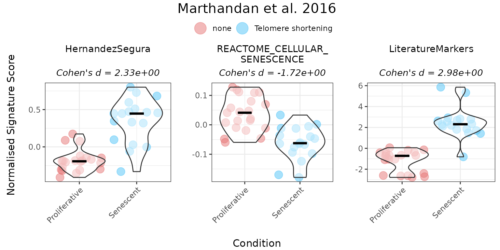

Providing gene directionality can substantially affect score
interpretation. For example, in the *Literature_Senescence* signature,
omitting direction of change in expression of genes upon phenotype may
lead to senescent samples appearing to have lower scores than
proliferative ones. Incorporating directionality aligns the scores with
biological expectations. Therefore, it is **strongly recommended** to
specify the expected direction of gene expression changes in a set
whenever this information is available, ensuring more accurate and
meaningful interpretation of the results.

``` r

 
GeneSets_Example_Bidirectionality <- list(LiteratureMarkers=genesets_example$LiteratureMarkers,
                                          LiteratureMarkers_Unidirectional =  genesets_example$LiteratureMarkers$gene)
print(GeneSets_Example_Bidirectionality)
#> $LiteratureMarkers
#>     gene enrichment
#> 1 CDKN1A          1
#> 2 CDKN2A          1
#> 3   GLB1          1
#> 4   TP53          1
#> 5   CCL2          1
#> 6  LMNB1         -1
#> 7  MKI67         -1
#> 
#> $LiteratureMarkers_Unidirectional
#> [1] "CDKN1A" "CDKN2A" "GLB1"   "TP53"   "CCL2"   "LMNB1"  "MKI67"

PlotScores(data = counts_example, 
           metadata = metadata_example, 
           gene_sets =  GeneSets_Example_Bidirectionality,
           ColorVariable = "SenescentType", 
           Variable="Condition",  
           method ="logmedian", 
           ColorValues = senescence_triggers_colors, 
           ConnectGroups=TRUE, 
           ncol = NULL, 
           nrow = NULL, 
           widthTitle=24, 
           limits = NULL, 
           legend_nrow = 1, 
           pointSize=4,
           compute_cohen=TRUE,
           cond_cohend=cond_cohend,
           title="Marthandan et al. 2016",
           labsize=9, 
           titlesize = 12)  
```

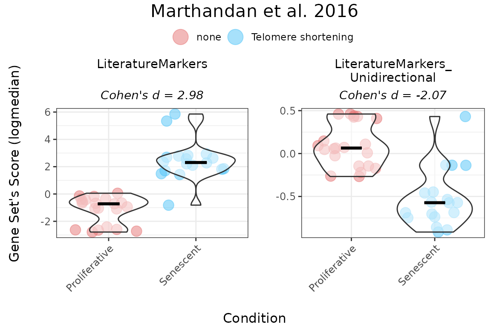

When analyzing a numeric variable, the function generates a scatter plot
of the variable against gene set scores and can optionally compute an
effect size using Cohen’s f. The user may select a correlation method
(Pearson, Spearman, or Kendall) to quantify the association between the
numeric variable and the scores. Optional p-value calculations for the
association can also be included.

The following example illustrates how to configure the function for a
numeric variable:

``` r

PlotScores(data = counts_example,
           metadata = metadata_example,
           gene_sets = genesets_example,
           Variable = "DaysToSequencing",               
           method = "logmedian",            
           ColorValues = "#3B415B",             
           ConnectGroups = FALSE,          
           ncol = NULL,                    
           nrow = 1,                    
           pointSize = 6,                  
           compute_cohen = TRUE,          
           pvalcalc = TRUE,                
           title = "Marthandan et al. 2016",  
           labsize=9, 
           titlesize = 12, 
           widthTitle = 26,
           cor = "pearson")
```

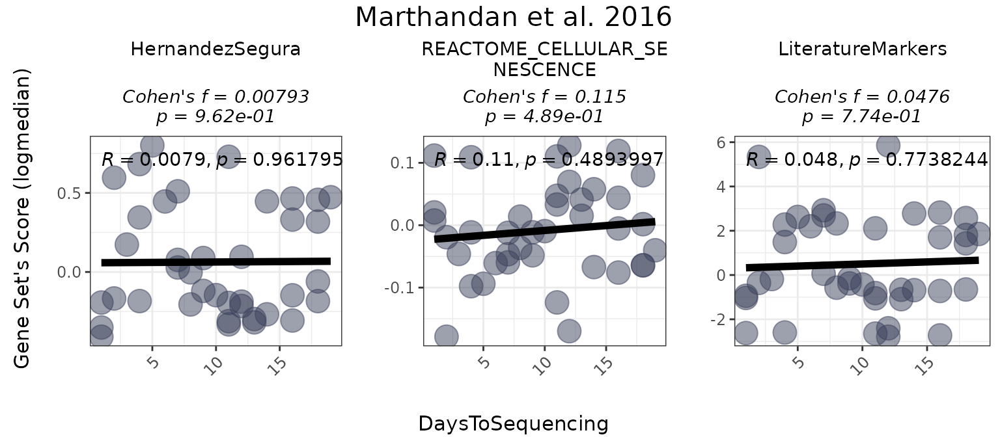

To visualize the overall distribution of scores across gene sets, the
`PlotScores` function can be used without specifying the
`GroupingVariable` parameter, i.e, without grouping scores by any
metadata variable.. In this case, it generates a grid of density plots,
with each plot representing the score distribution for a specific gene
set.

``` r

 
PlotScores(data = counts_example, 
           metadata = metadata_example, 
           gene_sets = genesets_example, 
           method ="logmedian", 
           ColorValues = NULL,  
           ncol = NULL, 
           nrow = 1, 
           widthTitle=24, 
           limits = NULL,  
           title="Marthandan et al. 2016",
           labsize=9, 
           titlesize = 11)  
```

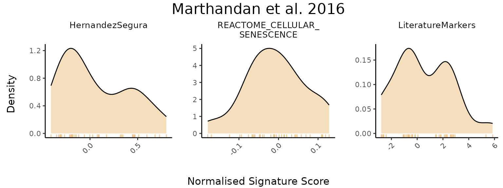

### ssGSEA method

Single sample Gene Set Enrichment Analysis (**ssGSEA**) was implemented
using a modified version of the `GSVA` package’s `gsva()` function
(Barbie et al., 2009), based on the original Gene Set Enrichment
Analysis (GSEA) method (Subramanian et al., 2005). ssGSEA ranks all
genes by their expression within each sample and computes a running-sum
statistic over the ranked list. For unidirectional gene sets (i.e., with
no information on the expected direction of each gene’s regulation upon
phenotype), the ssGSEA sample score reflects overall coordinated
expression of the genes in the set. For bidirectional gene sets, the
score is calculated as the ssGSEA score computed for the upregulated
subset of genes minus the score computed for the downregulated subset.

``` r


senescence_triggers_colors <- c(
  "none" = "#E57373",  # Soft red   
  "Telomere shortening" = "#4FC3F7"  # Vivid sky blue  
)

cond_cohend <- list(A=c("Senescent"),  
                    B=c("Proliferative"))

PlotScores(data = counts_example, 
           metadata = metadata_example, 
           gene_sets = genesets_example,
           ColorVariable = "SenescentType", 
           Variable="Condition",  
           method ="ssGSEA", 
           ColorValues = senescence_triggers_colors, 
           ConnectGroups=TRUE, 
           ncol = NULL, 
           nrow = 1, 
           widthTitle=24, 
           limits = NULL, 
           legend_nrow = 1, 
           pointSize=4,
           compute_cohen=TRUE,
           cond_cohend=cond_cohend,
           title="Marthandan et al. 2016",
           labsize=9, 
           titlesize = 12)  
```

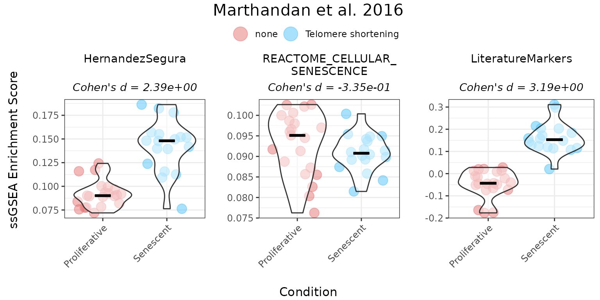

### Ranking method

The **ranking** method calculates gene signature scores using a
non-parametric approach based on the relative expression of genes within
a set. For each sample, all genes are ranked by expression. The score is
then calculated as the sum of the ranks of the genes in the gene set,
multiplied by +1 (for upregulated genes those with unspecified direction
of regulation change upon phenotype) or -1 (downregulated genes), and
normalised by the number of genes in the set.

The following example demonstrates the use of the “ranking” method for
both unidirectional and bidirectional gene sets:

``` r

 
senescence_triggers_colors <- c(
  "none" = "#E57373",  # Soft red   
  "Telomere shortening" = "#4FC3F7"  # Vivid sky blue  
)

cond_cohend <- list(A=c("Senescent"),  
                    B=c("Proliferative"))

PlotScores(data = counts_example, 
           metadata = metadata_example, 
           gene_sets = genesets_example,
           ColorVariable = "SenescentType", 
           Variable="Condition",  
           method ="ranking", 
           ColorValues = senescence_triggers_colors, 
           ConnectGroups=TRUE, 
           ncol = NULL, 
           nrow = 1, 
           widthTitle=24, 
           limits = NULL, 
           legend_nrow = 1, 
           pointSize=4,
           compute_cohen=TRUE,
           cond_cohend=cond_cohend,
           title="Marthandan et al. 2016",
           labsize=9, 
           titlesize = 12)  
```

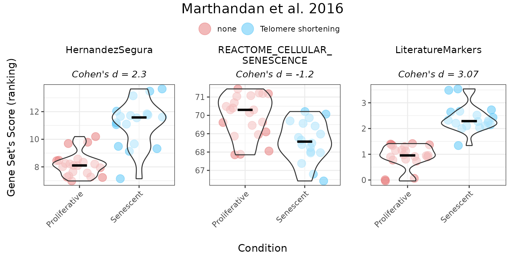

### All methods

To compare various metrics across different condition combinations,
violin plots may not always be the best choice. In such cases, users can
set`method = "all"` to generate a summary heatmap and volcano-like plot.
The function will return one heatmap per gene set, with rows
corresponding to all possible combinations of values in the
`GroupingVariable`. In parenthesis is represented the p-value, adjusted
using the `BH` method (i.e., the Benjamini–Hochberg false discovery rate
procedure), across all combinations of contrasts and gene signatures. It
will also return a volcano-like plot (Cohen’s d effect sizes vs
-log10(adjusted p-values)), where each dot represents a method-signature
pair, faceted by contrast. The dashed lines represent user-defined
thresholds for significance and effect size.

The `mode` parameter controls how contrasts are generated for
categorical variables, allowing users to adjust the complexity of the
analysis:

- **“simple”**: Performs the minimal number of pairwise comparisons
  between group levels (e.g., for a factor with levels A, B, C and D, it
  generates A - B, A - C, A - D, B - C, B - D, C - D).
- **“medium”**: Includes comparisons between one group and the union of
  other groups (e.g., A - (B + C + D); B - (A + C + D)), allowing for
  broader contrasts beyond simple pairwise comparisons.
- **“extensive”**: Allows for all possible algebraic combinations of
  group levels (e.g., (A + B) - (C + D)).

In this example, HernandezSegura and LiteratureMarkers consistently
discriminate Senescent from Proliferative samples, while
REACTOME_CELLULAR_SENESCENCE shows weaker and less consistent
separation.

``` r


Overall_Scores <- PlotScores(data = counts_example, 
                             metadata = metadata_example,  
                             gene_sets=genesets_example, 
                             Variable="Condition",  
                             method ="all",   
                             ncol = NULL, 
                             nrow = 1, 
                             widthTitle=30, 
                             limits = c(0,3.5),   
                             title="Marthandan et al. 2016", 
                             titlesize = 10,
                             ColorValues = list(heatmap=c("#F9F4AE", "#B44141"),
                                                volcano=signature_colors <- c(
                                                  HernandezSegura = "#A07395",               
                                                  REACTOME_CELLULAR_SENESCENCE = "#6B8E9E",  
                                                  LiteratureMarkers = "#CA7E45"             
                                                )
                             ),
                             mode="simple",
                             widthlegend=30, 
                             sig_threshold=0.05, 
                             cohen_threshold=0.6,
                             pointSize=6,
                             colorPalette="Paired")  
```

``` r

Overall_Scores$heatmap
```

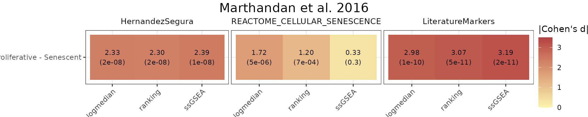

``` r

Overall_Scores$volcano
```

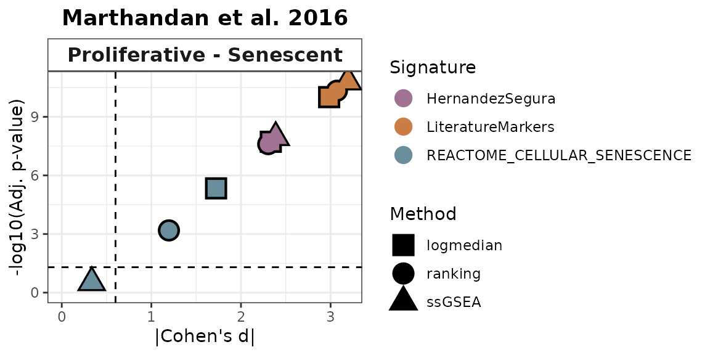

### Classification Potential of Gene Signatures

The `ROC_Scores` and `AUC_Scores` functions allow users to evaluate the
classification potential of gene set scores based on ROC curves and
their AUC values. These functions help to assess how well a given score
can differentiate between conditions, based on predefined contrasts.
Besides `method="all"`, these functions can also be used for each method
individually.

The `ROC_Scores` function generates ROC curves for different scoring
methods across contrasts, allowing users to visualize performance
differences.

``` r

 ROC_Scores(data = counts_example, 
           metadata = metadata_example, 
           gene_sets=genesets_example, 
           method = "all", 
           variable ="Condition",
           colors = c(logmedian = "#3E5587", ssGSEA = "#B65285", ranking = "#B68C52"), 
           grid = TRUE, 
           spacing_annotation=0.3, 
           ncol=NULL, 
           nrow=1,
            mode = "simple",
            widthTitle = 28,
           titlesize = 10,  
           title="Marthandan et al. 2016") 
```

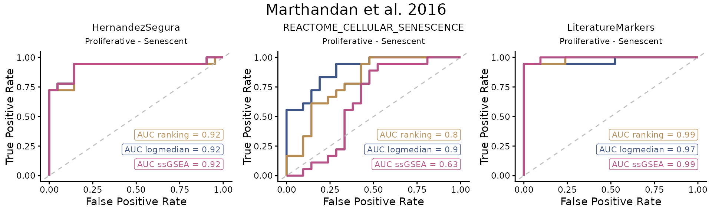

The `AUC_Scores` function generates heatmaps summarizing AUC values for
each gene set, with methods as columns and contrasts as rows. The plot
is returned in the `$plt` element, and the underlying data used to
generate it is available in the `$data` element.

``` r

AUC_Scores(data = counts_example, 
           metadata = metadata_example, 
           gene_sets=genesets_example, 
           method = "all", 
           mode = "simple", 
           variable="Condition", 
           nrow = 1, 
           ncol = NULL, 
           limits = NULL, 
           widthTitle = 28, 
           titlesize = 10, 
           ColorValues = c("#F9F4AE", "#B44141"),   
           title="Marthandan et al. 2016") 
```

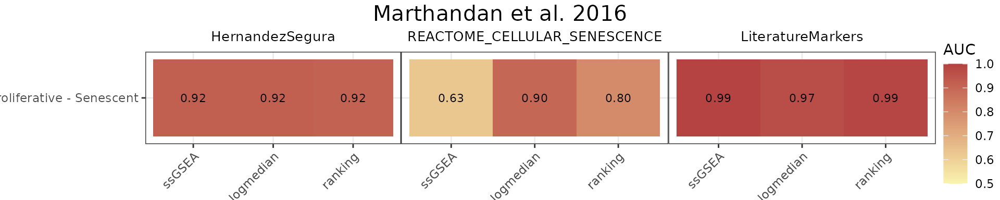

HernandezSegura and LiteratureMarkers exhibit consistently high AUCs
across scoring methods, while REACTOME_CELLULAR_SENESCENCE shows more
heterogeneous performance.

### False Positive Rate (FPR) Calculations

The user can assess the significance of gene set scores by comparing
observed effect sizes against a distribution of those originated by
random gene sets with the same number of genes and matched
directionality. For each original gene set, the function calculates the
observed Cohen’s d (and p‑value) using (`GroupingVariable`). It then
generates a number of simulated gene sets (`number_of_sims`) by randomly
sampling the same number of genes from a user provided gene list
(`gene_list`) and computes their Cohen’s d values. The simulation
results are visualised as violin plots of the distribution of Cohen’s d
values for each method, overlaid with the observed values of the
original gene sets, and a 95th percentile threshold. Significance is
indicated by distinct point shapes based on the associated p‑value.

``` r


FPR_Simulation(data = counts_example,
               metadata = metadata_example,
               original_signatures = genesets_example,
               gene_list = row.names(counts_example),
               number_of_sims = 100,
               title = "Marthandan et al. 2016",
               widthTitle = 30,
               Variable = "Condition",
               titlesize = 12,
               pointSize = 5,
               labsize = 10,
               mode = "simple",
               ColorValues=NULL,
               ncol=NULL, 
               nrow=1 ) 
```

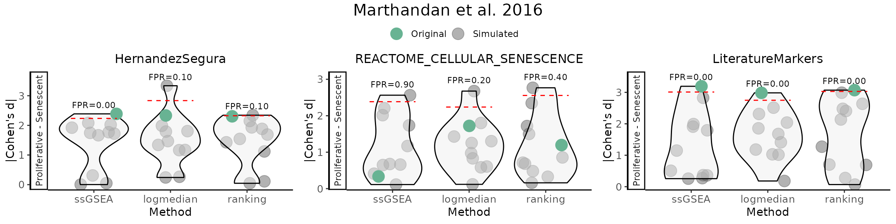

## Enrichment-Based Methods

### Differentially Expressed Genes

The `calculateDE` function in the `markeR` package leverages the `limma`
framework to compute differential gene expression statistics from raw
count data. This function is highly flexible and supports several modes
of operation depending on the user’s experimental design. In the
examples below, we illustrate two common scenarios:

- **Automatic Design Matrix with Contrasts:** In the first example, the
  design matrix is built automatically from the metadata using a
  specified variable (here, `"Condition"`). The user must explicitly
  define the comparisons of interest based on the levels of this
  variable (e.g., `Senescent - Proliferative`). Internally, this
  approach fits a linear model without an intercept, enabling the user
  to define contrasts between the levels. This is ideal for simpler
  experimental designs, where quick comparison between predefined groups
  is desired without manually specifying the full model matrix.
- **Providing an Externally Constructed Design Matrix:** In the second
  example, the user manually creates the design matrix (e.g., using
  `model.matrix(~ 0 + Condition)` for a no-intercept model) and provides
  it directly to `calculateDE`. This gives full control over how the
  design is specified, including complex experimental setups or custom
  encodings. Multiple contrasts can be defined later, based on this
  matrix, to extract specific comparisons of interest, using the
  `Contrast` parameter. If this parameter is left as `NULL`, the
  function will return results for all conditions (i.e. columns) defined
  in the design matrix. This approach is recommended when the user has a
  complex design or has already constructed the design matrix as part of
  a broader analysis pipeline.

Below are the corresponding code snippets demonstrating each scenario,
by answering the same question: **What are the genes differentially
expressed between senescence and proliferative cells?**

``` r

# Example 1: Build design matrix from variables (Condition) and apply a contrast.
# In this case, the design matrix is constructed automatically using the variable "Condition".
DEGs <- calculateDE(data = counts_example,
                    metadata = metadata_example,
                    variables = "Condition",
                    contrasts = c("Senescent - Proliferative"))
#> Using metadata column 'sampleID' to match samples (data column names).
DEGs$`Senescent-Proliferative`[1:5,]
#>            logFC  AveExpr         t      P.Value    adj.P.Val        B
#> CCND2   3.816674 4.406721 12.379571 2.944841e-15 2.349757e-12 24.64395
#> MKI67  -3.581174 6.605339 -9.187514 2.110510e-11 4.769568e-10 15.91258
#> PTCHD4  3.398914 3.556007 10.729126 2.461327e-13 2.868691e-11 20.30116
#> KIF20A -3.365481 5.934893 -9.718104 4.406643e-12 1.771710e-10 17.45858
#> CDC20  -3.304602 6.104079 -9.791031 3.562991e-12 1.592176e-10 17.66821

# Example 2: Supply a custom design matrix directly.
# Here, the design matrix is created externally (using no intercept, for instance).
design <- model.matrix(~0 + Condition, data = metadata_example)
colnames(design) <- c("Proliferative","Senescent")
DEGs2 <- calculateDE(data = counts_example,
                     metadata = NULL,
                     variables = NULL,
                     modelmat = design,
                     contrasts = c("Senescent - Proliferative"))
DEGs2$`Senescent-Proliferative`[1:5,]
#>            logFC  AveExpr         t      P.Value    adj.P.Val        B
#> CCND2   3.816674 4.406721 12.379571 2.944841e-15 2.349757e-12 24.64395
#> MKI67  -3.581174 6.605339 -9.187514 2.110510e-11 4.769568e-10 15.91258
#> PTCHD4  3.398914 3.556007 10.729126 2.461327e-13 2.868691e-11 20.30116
#> KIF20A -3.365481 5.934893 -9.718104 4.406643e-12 1.771710e-10 17.45858
#> CDC20  -3.304602 6.104079 -9.791031 3.562991e-12 1.592176e-10 17.66821
```

After running differential expression analysis (using the `calculateDE`
function), the user can visualize their results with the `plotVolcano`
function. This function provides a flexible interface for exploring
their data by allowing the user to:

- **Plot Differential Gene Expression Statistics:**  
  Display a volcano plot with chosen statistics (e.g., log fold-change
  on the x-axis and –log₁₀ adjusted p-value on the y-axis).
- **Color Interesting Genes:**  
  Highlight genes that pass user-specified thresholds by adjusting
  `threshold_y` and `threshold_x`.
- **Annotate Top and Bottom N Genes:**  
  Optionally, label the top (and bottom) N genes based on the chosen
  statistic to quickly identify the most significant genes.
- **Highlight Gene Signatures:** If the user provides a list of gene
  signatures using the `genes` argument, the function can highlight
  these genes in the plot. The user can also specify distinct colors for
  putatively upregulated and downregulated if their direction is known,
  or a color for genes that do not have a putative direction.

Below is an example usage of `plotVolcano` that visualizes differential
expression results from a `DEResultsList`. The first plot shows the
default behavior, generating a basic volcano plot without thresholds or
gene highlights. Subsequent examples demonstrate how to customize the
plot:

- Adding significance thresholds to highlight genes of interest,
- Annotating the top and bottom N genes by effect size,
- And using gene signatures to color genes across multiple plots
  arranged by contrast and signature.

These examples illustrate how users can customise the output plot to
highlight biologically meaningful patterns or focus on specific gene
sets.

``` r


# Color Interesting Genes:
plotVolcano(DEGs, genes = NULL, N = NULL,
            x = "logFC", y = "-log10(adj.P.Val)", pointSize = 2,
            color = "#6489B4", highlightcolor = "#05254A", nointerestcolor = "#B7B7B7",
            threshold_y = 0.0001, threshold_x = 1,
            xlab = NULL, ylab = NULL, ncol = NULL, nrow = NULL, title = "Marthandan et al. 2016",
            labsize = 8, widthlabs = 25, invert = FALSE)
```

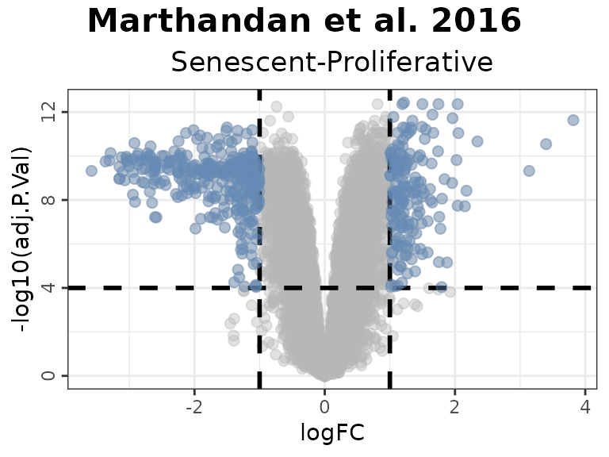

``` r


# Annotate Top and Bottom N Genes:
plotVolcano(DEGs, genes = NULL, N = 5,
            x = "logFC", y = "-log10(adj.P.Val)", pointSize = 2,
            color = "pink", highlightcolor = "#05254A", nointerestcolor = "#B7B7B7",
            threshold_y = NULL, threshold_x = NULL,
            xlab = NULL, ylab = NULL, ncol = NULL, nrow = NULL, title = "Marthandan et al. 2016",
            labsize = 8, widthlabs = 25, invert = FALSE)
```

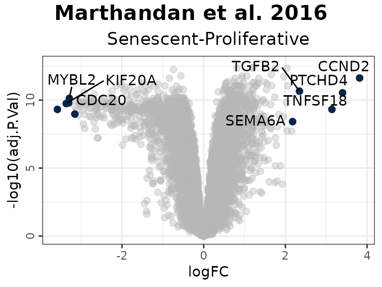

In this example:

- Genes in the HernandezSegura set annotated as upregulated (green)
  display positive log2 fold changes, whereas those annotated as
  downregulated (red) show negative log2 fold changes. This pattern is
  consistent with the annotation of the set, although these genes are
  not necessarily those exhibiting the largest absolute fold changes.
- In the LiteratureMarkers set, *LMNB1* and *MKI67* exhibit strongly
  negative log2 fold change, consistent with their roles as
  proliferation markers absent in senescent cells.
- Genes from the REACTOME_CELLULAR_SENESCENCE set are undirected and
  appear across the full range of log2 fold change values, diluting
  discriminatory power.

``` r


# Change order: signatures in columns, contrast in rows
plotVolcano(DEGs, genes = genesets_example, 
            N = NULL,
            x = "logFC", y = "-log10(adj.P.Val)", pointSize = 2,
            color = "#6489B4", highlightcolor = "#05254A", highlightcolor_upreg = "#038C65", highlightcolor_downreg = "#8C0303",nointerestcolor = "#B7B7B7",
            threshold_y = NULL, threshold_x = NULL,
            xlab = NULL, ylab = NULL, ncol = NULL, nrow = NULL, title = "Marthandan et al. 2016",
            labsize = 10, widthlabs = 24, invert = TRUE)
```

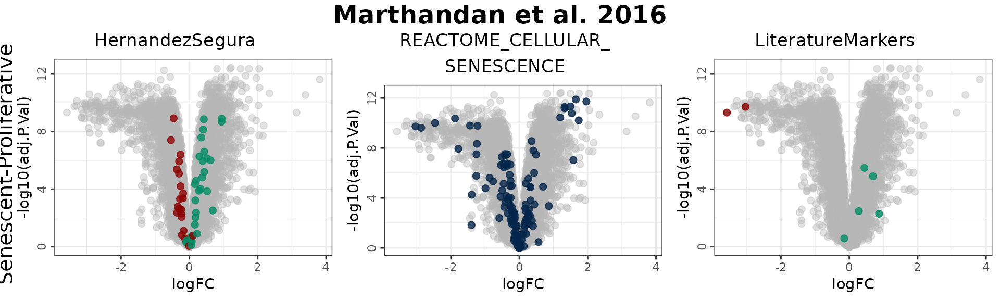

#### Note on Continuous Variables

If the user wants to analyse continuous variables (e.g., time or
dosage), they must provide a custom design matrix via the `modelmat`
argument, instead of using the `variables` argument. This is because the
`variables` argument is intended to be used for categorical variables
only: internally, when using `variables` to specify a phenotypic
variable of interest, the function constructs a design matrix without an
intercept and treats each level of the variable as a discrete group.
This is appropriate for defining explicit contrasts between categorical
levels but is not suitable for continuous variables, where such
discretization would distort the relationship.

For continuous variables, the user should instead build a design matrix
manually (e.g., using `model.matrix(~ variable)`), ensuring that the
variable of interest is numeric and has a corresponding column in the
matrix with the same name. The
[`calculateDE()`](https://diseasetranscriptomicslab.github.io/markeR/reference/calculateDE.md)
function will then use this matrix directly for linear modelling.

The interpretation of the differential expression results remains
consistent: the statistics reflect always the expected change in
expression associated with a 1-unit increase in the variable (e.g., one
day, one unit of dosage, “Senescent” to “Proliferative”, etc).

``` r

 
design <- model.matrix(~1 + DaysToSequencing, data = metadata_example)

DEGs_continuous1 <- calculateDE(data = counts_example,
                                metadata = metadata_example, 
                                modelmat = design,
                                contrasts = c("DaysToSequencing"))
#> Using metadata column 'sampleID' to match samples (data column names).
#> Renaming (Intercept) to Intercept
DEGs_continuous1$DaysToSequencing[1:3,]
#>                logFC  AveExpr         t   P.Value adj.P.Val         B
#> RNA45SN2 -0.07628608 7.712585 -1.625668 0.1119602 0.9997783 -5.988570
#> RNA18SN2  0.06743439 9.577467  1.553201 0.1283381 0.9997783 -6.099036
#> RNA18SN3  0.06743439 9.577467  1.553201 0.1283381 0.9997783 -6.099036
```

This usage of the `modelmat` argument allows the user to combine
categorical and numeric variables in a fully customized design matrix.
In the example below:

- `(Intercept)`: Baseline expression when days = 0 and Condition =
  Control.
- `DaysToSequencing`: Change in expression per unit of time (day)
  increase.
- `Senescent`: Average difference in expression between Senescent and
  Control conditions.

This approach is useful when modeling continuous effects alongside group
comparisons, and it provides complete flexibility in specifying the
design.

``` r


# Manually construct the design matrix
model_matrix <- model.matrix(~ DaysToSequencing + Condition, data = metadata_example)
colnames(model_matrix) <- c("(Intercept)", "DaysToSequencing", "Senescent")

# Provide the custom design matrix to calculateDE using the `modelmat` argument
DEGs_continuous2 <- calculateDE(data = counts_example,
                                modelmat = model_matrix)

# Access results for each coefficient
DEGs_continuous2$`(Intercept)`[1:3, ]
#>           logFC  AveExpr         t      P.Value    adj.P.Val         B
#> FN1    13.23994 13.21879  73.96021 1.569180e-43 3.711997e-43  89.51149
#> EEF1A1 12.94192 12.85091 179.01981 1.901624e-58 1.114438e-56 121.27052
#> GAPDH  12.71139 12.53188 147.65172 3.433305e-55 6.719561e-54 114.84594
DEGs_continuous2$DaysToSequencing[1:3, ]
#>                logFC  AveExpr         t    P.Value adj.P.Val         B
#> RNA45SN2 -0.08056063 7.712585 -1.687353 0.09952278 0.9846604 -6.035003
#> RNA18SN2  0.06598991 9.577467  1.489026 0.14452696 0.9846604 -6.337271
#> RNA18SN3  0.06598991 9.577467  1.489026 0.14452696 0.9846604 -6.337271
DEGs_continuous2$Senescent[1:3, ]
#>            logFC  AveExpr        t      P.Value    adj.P.Val        B
#> CCND2   3.863054 4.406721 12.33101 4.977309e-15 4.693603e-12 24.13824
#> MKI67  -3.655159 6.605339 -9.28576 2.007809e-11 4.809931e-10 15.97848
#> PTCHD4  3.453362 3.556007 10.76209 3.088396e-13 3.703704e-11 20.09121
```

### Gene Set Enrichment Analyses

To perform GSEA, the user can use the
[`runGSEA()`](https://diseasetranscriptomicslab.github.io/markeR/reference/runGSEA.md)
function. This function takes a named list of differential expression
statistics (one per contrast) and a set of gene signatures to compute
enrichment scores.

- `DEGList`: A list of differentially expressed genes (DEGs) for each
  contrast.

- `gene_sets`: A list of gene sets, where each entry can be:

  - A vector of gene names (unidirectional analysis).
  - A data frame where the first column is the gene name and the second
    column indicates the expected direction (+1 or -1, bidirectional
    analysis).

- `stat`: The ranking statistic. If NULL, the ranking statistic is
  automatically selected:

  - `"B"` for gene sets with **no known direction** (vectors).
  - `"t"` for **unidirectional** or **bidirectional** gene sets (data
    frames).
  - If provided, this argument overrides the automatic selection.

- `ContrastCorrection`: Logical, default is `FALSE`. If `TRUE`, applies
  an additional multiple testing correction (Benjamini–Hochberg) across
  all contrasts returned in the `DEGList` results list. This accounts
  for the number of contrasts tested per signature and provides more
  stringent control of false discovery rate across multiple comparisons
  (similar to answering the question “Is there any signature that is
  significant in any of the contrasts” instead of “For each contrast, is
  there any signature that is significant”). If `FALSE`, the function
  only corrects for the number of gene sets.

``` r

GSEAresults <- runGSEA(DEGList = DEGs, 
                       gene_sets = genesets_example,
                       stat = NULL,
                        ContrastCorrection = FALSE)

GSEAresults
#> $`Senescent-Proliferative`
#>                         pathway         pval         padj   log2err        ES
#>                          <char>        <num>        <num>     <num>     <num>
#> 1:              HernandezSegura 5.005591e-10 1.501677e-09 0.8012156 0.6263554
#> 2: REACTOME_CELLULAR_SENESCENCE 1.396249e-02 2.094374e-02 0.1226374 0.3687291
#> 3:            LiteratureMarkers 2.115744e-02 2.115744e-02 0.1424704 0.6948631
#>         NES  size                                    leadingEdge stat_used
#>       <num> <int>                                         <list>    <char>
#> 1: 2.645040    52 CNTLN,DYNLT3,SLC10A3,CCND1,TOLLIP,DDA1,...[37]         t
#> 2: 1.444964   128   H1-2,H2BC4,H2BC5,H4C15,IGFBP7,H2BC12,...[31]         B
#> 3: 1.647261     7            LMNB1,MKI67,GLB1,CDKN1A,CDKN2A,CCL2         t
```

Depending on the statistic used, the interpretation of the plots
changes:

1.  **B Statistic vs. t Statistic:**
    - The B statistic does not specify the direction (enriched or
      depleted) of the gene set’s alterations. It only indicates the
      strength of evidence for any alterations.
    - The t statistic orders genes from stronger evidence of
      over-expression to stronger evidence for under-expression.
2.  **Graph’s annotation:**
    - When using the B statistic, the plot will include “Altered Gene
      Set” beneath its title to reflect this focus on whether genes are
      altered.
    - For the t statistic, the plot will include “Enriched/Depleted Gene
      Set” beneath its title, indicating its focus on the enrichment or
      depletion of genes.

After running GSEA, the user can visualize enrichment plots using the
[`plotGSEAenrichment()`](https://diseasetranscriptomicslab.github.io/markeR/reference/plotGSEAenrichment.md)
function. This function generates enrichment plots for each gene
signature and contrast, displaying also the **Normalized Enrichment
Scores (NES)** and **adjusted p-value** for each enrichment result. As
`plotGSEAenrichment`’s relevant graphical parameters:

- `grid = TRUE`: Arranges the plots in a grid for better visualization.
- `titlesize`: Adjusts title font size.
- `nrow`/`ncol`: Specifies the grid layout for arranging plots.

``` r

plotGSEAenrichment(GSEA_results=GSEAresults, 
                   DEGList=DEGs, 
                   gene_sets=genesets_example, 
                   widthTitle=40, grid = TRUE, titlesize = 10, nrow=1, ncol=3) 
```

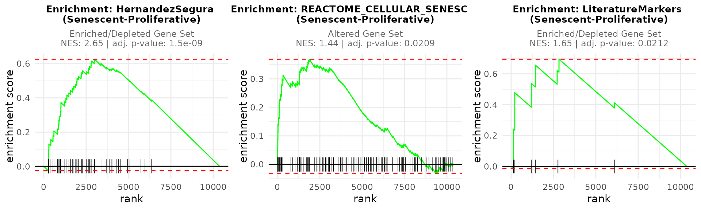

The
[`plotNESlollipop()`](https://diseasetranscriptomicslab.github.io/markeR/reference/plotNESlollipop.md)
function creates lollipop plots for visualizing Gene Set Enrichment
Analysis (GSEA) results. Each plot displays gene sets on the y-axis and
Normalized Enrichment Scores (NES) on the x-axis, with a color gradient
proportional to the adjusted p-value. The function supports multiple
contrasts and includes options for customizing the color gradient,
significance threshold, and plot layout. It can also arrange individual
plots into a grid layout for comparative visualization.

``` r

plotNESlollipop(GSEA_results=GSEAresults, 
                saturation_value=NULL, 
                nonsignif_color = "#F4F4F4", 
                signif_color = "red",
                sig_threshold = 0.05, 
                grid = FALSE, 
                nrow = NULL, ncol = NULL, 
                widthlabels=13, 
                title=NULL, titlesize=12) 
#> $`Senescent-Proliferative`
```

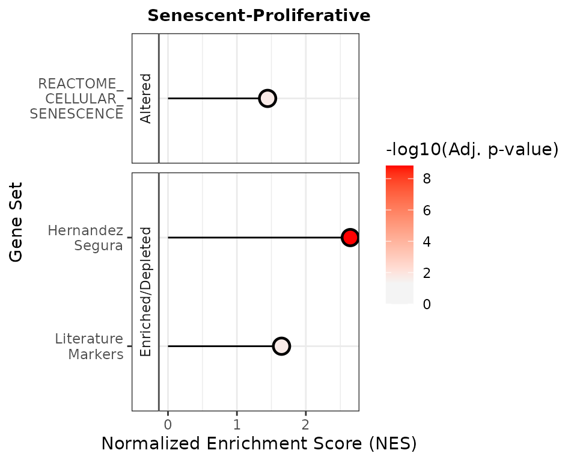

The
[`plotCombinedGSEA()`](https://diseasetranscriptomicslab.github.io/markeR/reference/plotCombinedGSEA.md)
function generates a scatter plot to visualize the results of Gene Set
Enrichment Analysis (GSEA) across multiple contrasts. Each point
represents a pathway, with:

- X-axis: Normalized Enrichment Score (NES)
- Y-axis: -log10 adjusted p-value (significance)
- Color: Gene sets
- Shape: Contrasts
- Dashed line: Significance threshold

This function helps compare enrichment results when the number of
contrasts and the number of pathways is high, scenario of which the
example herein is not too representative.

``` r

plotCombinedGSEA(GSEAresults, sig_threshold = 0.05, PointSize=6, widthlegend = 26 )
```

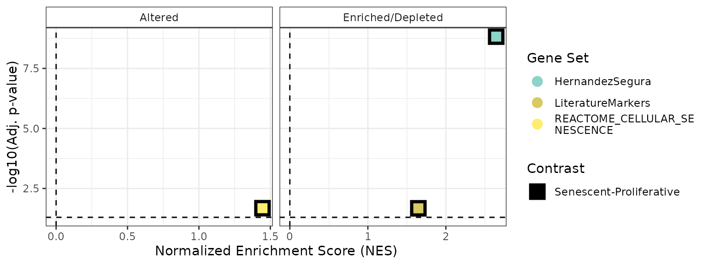

#### Note on GSEA for All-negative gene sets

In gene set enrichment analysis, the behaviour of gene sets annotated
with regulatory direction must be interpreted carefully. In our current
implementation, if a gene set includes both positive and negative
regulators of a process, the statistics for the negatively annotated
genes are inverted, meaning that the enrichment reflects their effect on
the process rather than simply their expression direction. This ensures
that the final enrichment score captures the coordinated functional
outcome of the gene set.

The same logic is preserved when a gene set contains **only negatively
annotated genes** (*e.g.* negative regulators of senescence): the
statistics are inverted so that a positive normalised enrichment score
(NES) implies these inhibitors are less expressed, thereby supporting
the activation of the process they repress (*e.g.* senescence).
Conversely, a negative NES would suggest their upregulation, which could
potentially suppress the process.

## Comparison of both approaches

Based on these very simple analyses, the REACTOME_CELLULAR_SENESCENCE
showed consistently poor performance, highlighing caution when this or
other MSigDB pathways appear in common enrichment-based analyses with
RNA-seq data. The HernandezSegura signature, with its moderate size (55
genes) and annotated gene direction, performed best in enrichment-based
methods such as GSEA. In contrast, the LiteratureMarkers set yielded
stronger results in scoring approaches, likely due to a small number of
highly informative genes rather than coordinated activity across the
entire set.

These findings highlight important trade-offs: while scoring methods
offer per-sample resolution and are less sensitive (in terms of
statistical significance) to gene set size, making them useful for
classification tasks, they may be overly influenced by a small subset of
genes, which could limit biological interpretability. While more robust
to sample heterogeneity and better at capturing coordinated expression
changes, enrichment-based methods are sensitive to gene set composition
and size. Caution is warranted when interpreting results, especially
from score-based approaches, as strong signals may not always reflect
the intended biological process, but rather a handful of dominant genes.

### Visualise Individual Gene Behaviour.

As highlighted in the previous section, score-based approaches can be
disproportionately influenced by a small subset of genes. To address
this, `markeR` includes dedicated functions for exploring individual
gene behaviour, enabling users to assess if and which genes may be
driving the overall signal. We demonstrate this functionality using the
`LiteratureMarkers` gene set.

`markeR` provides the wrapper function `VisualiseIndividualGenes` for
plotting individual genes. In this tutorial, we illustrate each
visualization function separately for clarity. However, the same outputs
can be generated through the wrapper by setting the `type` argument to
the desired visualization strategy (i.e., `"expression"`,
`"correlation"`,`"violin"`, `"roc"`, `"auc"`, `"rocauc"`, `"cohend"`,
`"pca"`), and the wrapper automatically dispatches to the correct
function with the appropriate parameters.

The `ExpressionHeatmap` function generates a heatmap to display the
expression levels of selected senescence genes across samples. Samples
are annotated by a chosen condition, and expression values are
color-scaled for easy visual comparison. Clustering options and
customizable color palettes allow for flexible and informative
visualization.

``` r


annotation_colors <- list( 
  Condition = c(
    "Senescent"     = "#65AC7C",  # Example color: greenish
    "Proliferative" = "#5F90D4"  # Example color: blueish 
  )
)

ExpressionHeatmap(data=counts_example, 
                  metadata = metadata_example, 
                  genes=genesets_example$LiteratureMarkers$gene,  
                  annotate.by = c("Condition"),
                  annotation_colors = annotation_colors,
                  colorlist = list(low = "#3F4193", mid = "#F9F4AE", high = "#B44141"),
                  cluster_rows = TRUE, 
                  cluster_columns = FALSE,
                  title = "Senescence Genes", 
                  titlesize = 20,
                  legend_position = "right",
                  scale_position="right")
```

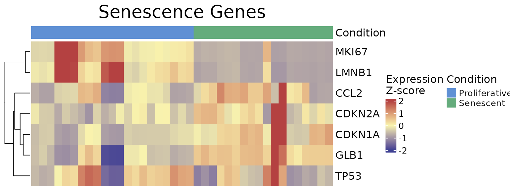

``` r

VisualiseIndividualGenes(type="expression",
                  data=counts_example, 
                  metadata = metadata_example, 
                  genes=genesets_example$LiteratureMarkers$gene,  
                  annotate.by = c("Condition"),
                  annotation_colors = annotation_colors,
                  colorlist = list(low = "#3F4193", mid = "#F9F4AE", high = "#B44141"),
                  cluster_rows = TRUE, 
                  cluster_columns = FALSE,
                  title = "Senescence Genes", 
                  titlesize = 20,
                  legend_position = "right",
                  scale_position="right")
```


The `IndividualGenes_Violins` function creates violin plots to visualize
the expression distributions of selected senescence genes across
conditions. Jittered points represent individual samples, and grouping
(x axis, `GroupingVariable`) and color variables (`ColorVariable` and
`ColorValues`) from the metadata allow for additional stratification and
insight. Customization options include layout, point size, colors, and
axis labeling.

``` r


senescence_triggers_colors <- c(
  "none" = "#E57373",  # Soft red   
  "Telomere shortening" = "#4FC3F7"  # Vivid sky blue  
)


IndividualGenes_Violins(data = counts_example, 
                        metadata = metadata_example, 
                        genes = genesets_example$LiteratureMarkers$gene, 
                        GroupingVariable = "Condition", 
                        plot=TRUE, 
                        ncol=NULL, 
                        nrow=1, 
                        divide=NULL, 
                        invert_divide=FALSE,
                        ColorValues=senescence_triggers_colors, 
                        pointSize=2, 
                        ColorVariable="SenescentType", 
                        title="Senescence Genes", 
                        widthTitle=16,
                        y_limits = NULL,
                        legend_nrow=1, 
                        xlab="Condition",
                        colorlab="") 
```

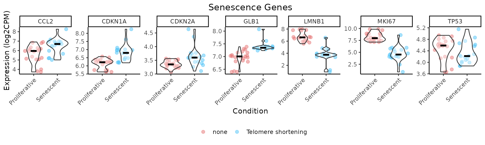

The `CorrelationHeatmap` function displays pairwise correlations between
selected genes, helping to reveal co-expression patterns within the
senescence signature. Correlations can be computed separately for
different conditions, and the heatmap is fully customizable with options
for clustering, color scaling, and correlation method (e.g., Spearman or
Pearson).

``` r


CorrelationHeatmap(data=counts_example, 
                   metadata = metadata_example, 
                   genes=genesets_example$LiteratureMarkers$gene, 
                   separate.by = "Condition", 
                   method = "spearman",  
                   colorlist = list(low = "#3F4193", mid = "#F9F4AE", high = "#B44141"),
                   limits_colorscale = c(-1,0,1), 
                   widthTitle = 16, 
                   title = "Senescence Genes", 
                   cluster_rows = TRUE, 
                   cluster_columns = TRUE,  
                   detailedresults = FALSE, 
                   legend_position="right",
                   titlesize=20)
```

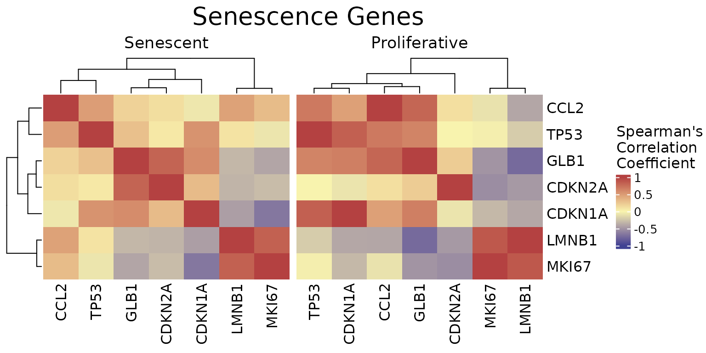

The `ROCandAUCplot` function evaluates the discriminatory power of
individual genes in the signature by computing ROC curves and AUC values
based on a binary classification (e.g., senescent vs. proliferative). If
the selected grouping variable has more than two levels, the user can
specify the reference group using the class parameter. For example, if a
variable has levels A, B, C, and D, setting `class = c("A", "B")` will
group samples from A and B together as the positive class\*, while the
remaining samples (C and D) are automatically grouped as the negative
class. Additionally, the user can use the `group_var` parameter to split
and display results separately for each level of another metadata
variable — allowing for subgroup-specific ROC analyses. Outputs include
individual ROC plots and an AUC heatmap, with customisable layout, color
schemes, and clustering options—ideal for identifying genes with strong
discriminatory ability. If `group_var`is not specified, the AUC values
will be displayed in a barplot.

- For ease of interpretation, the directionality of the comparison is
  adjusted so that the AUC is always \>=0.5, showing only discriminatory
  power rather than directionality.

``` r

 
ROCandAUCplot(counts_example, 
              metadata_example, 
              condition_var = "Condition", 
              class = "Senescent", 
              group_var=NULL,
              title = NULL,
              genes=genesets_example$LiteratureMarkers$gene, 
              plot_type = "all",
              auc_params =  list(colors =  "#3B415B",
                                    limits = c(0.5,1) ),
              roc_params = list(nrow=3,
                                ncol=3, 
                                colors="#3B415B"),
              commomplot_params = list(widths=c(0.5,0.3)))
```

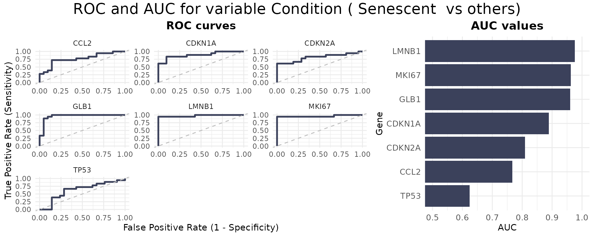

The `CohenD_IndividualGenes` function computes the effect size (Cohen’s
d) of the difference in expression of each gene between two conditions,
given by the variable `condition_var`. If the selected condition
variable has more than two levels, the `class` parameter specifies which
condition will be compared to the rest. Additionally, the user can use
the `group_var` parameter to split and display results separately for
each level of another metadata variable. Results are visualized as a
heatmap, with customizable color scales and clustering options for easy
interpretation of effect sizes across genes. If `group_var` is not
specified, the function will return a barplot instead.

``` r

 
CohenD_IndividualGenes(counts_example, 
                       metadata_example, 
                       genes=genesets_example$LiteratureMarkers$gene,
                       condition_var = "Condition", 
                       class = "Senescent", 
                       group_var = NULL,  
                       params = list(colors = "#3B415B",
                                             limits = NULL,
                                             cluster_rows=TRUE))
```

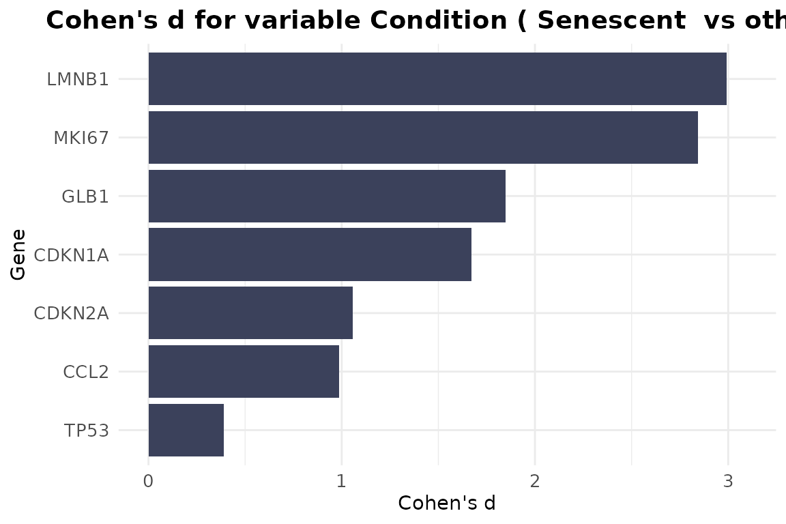

The `plotPCA` function performs a PCA on the expression of a selected
set of genes to understand if they explain enough variance in the data,
allowing the user to test if the genes in the signature are sufficient
to separate the group of interest (given by the \`ColourVariable’
parameter). While previous metrics assess discriminatory power
quantitatively (e.g., AUC), PCA provides a complementary, unsupervised
visualization that can help assess whether the gene signature is
sufficient to visually separate groups of interest. Users can customize
which principal components to display using the PCs argument and adjust
layout, point size, and colour annotations for comparison across
conditions.

``` r


annotation_colors <- c(  
  "Senescent"     = "#65AC7C",  # Example color: greenish
  "Proliferative" = "#5F90D4"  # Example color: blueish 
)


plotPCA(data = counts_example, 
        metadata = metadata_example, 
        genes=genesets_example$LiteratureMarkers$gene, 
        scale=FALSE, 
        center=TRUE, 
        PCs=list(c(1,2), c(2,3), c(3,4)), 
        ColorVariable="Condition",
        ColorValues=annotation_colors,
        pointSize=5,
        legend_nrow=1, 
        ncol=3, 
        nrow=NULL)
```

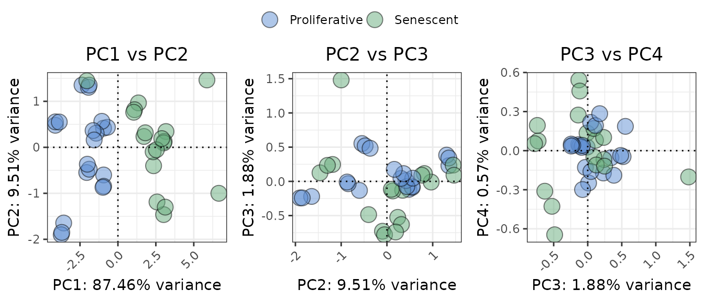

### Comment

As demonstrated by the behaviour of individual genes in the
`LiteratureMarkers` gene set, *LMNB1*, *MKI67*, and *GLB1* appear to
drive the overall signal. These genes consistently show higher
performance metrics (e.g., Cohen’s d, AUC), strong expression changes
between conditions, and *LMNB1* and *MKI67* specifically have correlated
expression patterns. This underscores the importance of examining
gene-level behaviour, as a strong overall signature score may reflect
the influence of only a few informative genes, rather than coordinated
activity across the entire set. In this case, the strong performance of
the `LiteratureMarkers` set in scoring approaches is likely driven by
these genes. However, relying heavily on a few markers can be a caveat:
for example, *MKI67* and *LMNB1* (proliferation-related genes) may also
change in other biological contexts like quiescence or differentiation,
potentially limiting their specificity for senescence. Thus, the choice
of gene set and analysis strategy should be guided by the research
question, and complemented with both score distributions, enrichment
analyses, and individual gene behaviour. Notably, scoring with just
these three genes yielded results similar to the full
`LiteratureMarkers` set.

``` r

 
GeneSets_Example_DrivingGenes <- list(LiteratureMarkers=genesets_example$LiteratureMarkers,
                                          LiteratureMarkers_subset=genesets_example$LiteratureMarkers[genesets_example$LiteratureMarkers$gene %in% c("LMNB1", "MKI67","GLB1"),])
print(GeneSets_Example_DrivingGenes)
#> $LiteratureMarkers
#>     gene enrichment
#> 1 CDKN1A          1
#> 2 CDKN2A          1
#> 3   GLB1          1
#> 4   TP53          1
#> 5   CCL2          1
#> 6  LMNB1         -1
#> 7  MKI67         -1
#> 
#> $LiteratureMarkers_subset
#>    gene enrichment
#> 3  GLB1          1
#> 6 LMNB1         -1
#> 7 MKI67         -1

PlotScores(data = counts_example, 
           metadata = metadata_example, 
           gene_sets =  GeneSets_Example_DrivingGenes,
           ColorVariable = "SenescentType", 
           Variable="Condition",  
           method ="logmedian", 
           ColorValues = senescence_triggers_colors, 
           ConnectGroups=TRUE, 
           ncol = NULL, 
           nrow = NULL, 
           widthTitle=24, 
           limits = NULL, 
           legend_nrow = 1, 
           pointSize=4,
           compute_cohen=TRUE,
           cond_cohend=cond_cohend,
           title="Marthandan et al. 2016",
           labsize=9, 
           titlesize = 12)  
```

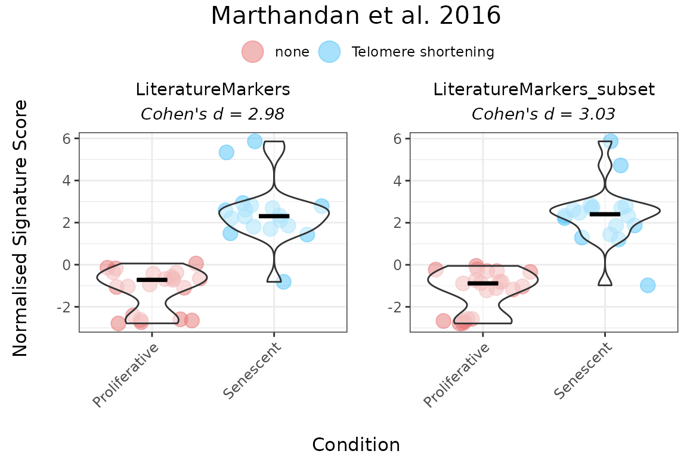

## Session Information

``` r

sessionInfo()
#> R version 4.6.1 (2026-06-24)
#> Platform: x86_64-pc-linux-gnu
#> Running under: Ubuntu 24.04.4 LTS
#> 
#> Matrix products: default
#> BLAS:   /usr/lib/x86_64-linux-gnu/openblas-pthread/libblas.so.3 
#> LAPACK: /usr/lib/x86_64-linux-gnu/openblas-pthread/libopenblasp-r0.3.26.so;  LAPACK version 3.12.0
#> 
#> locale:
#>  [1] LC_CTYPE=C.UTF-8       LC_NUMERIC=C           LC_TIME=C.UTF-8       
#>  [4] LC_COLLATE=C.UTF-8     LC_MONETARY=C.UTF-8    LC_MESSAGES=C.UTF-8   
#>  [7] LC_PAPER=C.UTF-8       LC_NAME=C              LC_ADDRESS=C          
#> [10] LC_TELEPHONE=C         LC_MEASUREMENT=C.UTF-8 LC_IDENTIFICATION=C   
#> 
#> time zone: UTC
#> tzcode source: system (glibc)
#> 
#> attached base packages:
#> [1] stats     graphics  grDevices utils     datasets  methods   base     
#> 
#> other attached packages:
#> [1] markeR_1.3.1
#> 
#> loaded via a namespace (and not attached):
#>   [1] pROC_1.19.0.1         gridExtra_2.3.1       rlang_1.3.0          
#>   [4] magrittr_2.0.5        clue_0.3-68           GetoptLong_1.1.1     
#>   [7] msigdbr_26.1.0        otel_0.2.0            matrixStats_1.5.0    
#>  [10] compiler_4.6.1        mgcv_1.9-4            png_0.1-9            
#>  [13] systemfonts_1.3.2     vctrs_0.7.3           reshape2_1.4.5       
#>  [16] stringr_1.6.0         pkgconfig_2.0.3       shape_1.4.6.1        
#>  [19] crayon_1.5.3          fastmap_1.2.0         magick_2.9.1         
#>  [22] backports_1.5.1       labeling_0.4.3        effectsize_1.0.3     
#>  [25] rmarkdown_2.31        ragg_1.5.2            purrr_1.2.2          
#>  [28] xfun_0.59             cachem_1.1.0          jsonlite_2.0.0       
#>  [31] BiocParallel_1.46.0   broom_1.0.13          parallel_4.6.1       
#>  [34] cluster_2.1.8.2       R6_2.6.1              stringi_1.8.7        
#>  [37] bslib_0.11.0          RColorBrewer_1.1-3    limma_3.68.4         
#>  [40] car_3.1-5             jquerylib_0.1.4       Rcpp_1.1.2           
#>  [43] assertthat_0.2.1      iterators_1.0.14      knitr_1.51           
#>  [46] parameters_0.29.2     IRanges_2.46.0        splines_4.6.1        
#>  [49] Matrix_1.7-5          tidyselect_1.2.1      abind_1.4-8          
#>  [52] yaml_2.3.12           doParallel_1.0.17     codetools_0.2-20     
#>  [55] curl_7.1.0            plyr_1.8.9            lattice_0.22-9       
#>  [58] tibble_3.3.1          withr_3.0.3           bayestestR_0.18.1    
#>  [61] S7_0.2.2              evaluate_1.0.5        desc_1.4.3           
#>  [64] circlize_0.4.18       pillar_1.11.1         ggpubr_1.0.0         
#>  [67] carData_3.0-6         foreach_1.5.2         stats4_4.6.1         
#>  [70] insight_1.5.2         generics_0.1.4        S4Vectors_0.50.1     
#>  [73] ggplot2_4.0.3         scales_1.4.0          glue_1.8.1           
#>  [76] tools_4.6.1           data.table_1.18.4     fgsea_1.38.0         
#>  [79] locfit_1.5-9.12       ggsignif_0.6.4        babelgene_22.9       
#>  [82] fs_2.1.0              fastmatch_1.1-8       cowplot_1.2.0        
#>  [85] grid_4.6.1            tidyr_1.3.2           datawizard_1.3.1     
#>  [88] edgeR_4.10.1          colorspace_2.1-2      nlme_3.1-169         
#>  [91] Formula_1.2-5         cli_3.6.6             textshaping_1.0.5    
#>  [94] ComplexHeatmap_2.28.0 dplyr_1.2.1           gtable_0.3.6         
#>  [97] ggh4x_0.3.1           rstatix_1.0.0         sass_0.4.10          
#> [100] digest_0.6.39         BiocGenerics_0.58.1   ggrepel_0.9.8        
#> [103] rjson_0.2.23          htmlwidgets_1.6.4     farver_2.1.2         
#> [106] htmltools_0.5.9       pkgdown_2.2.1         lifecycle_1.0.5      
#> [109] GlobalOptions_0.1.4   statmod_1.5.2
```
