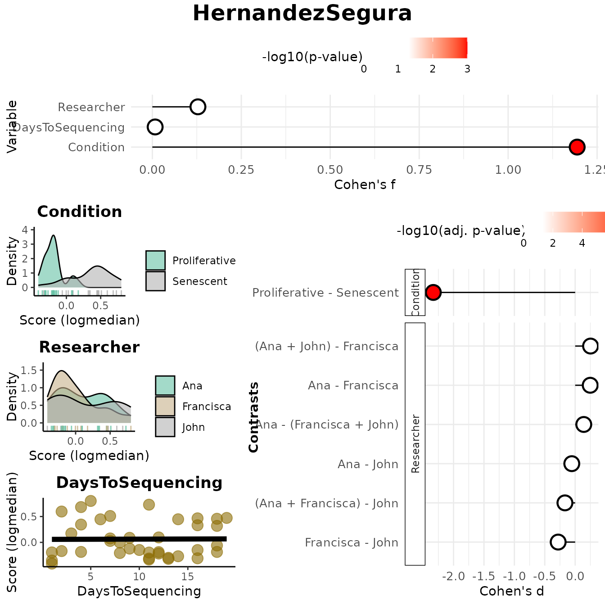
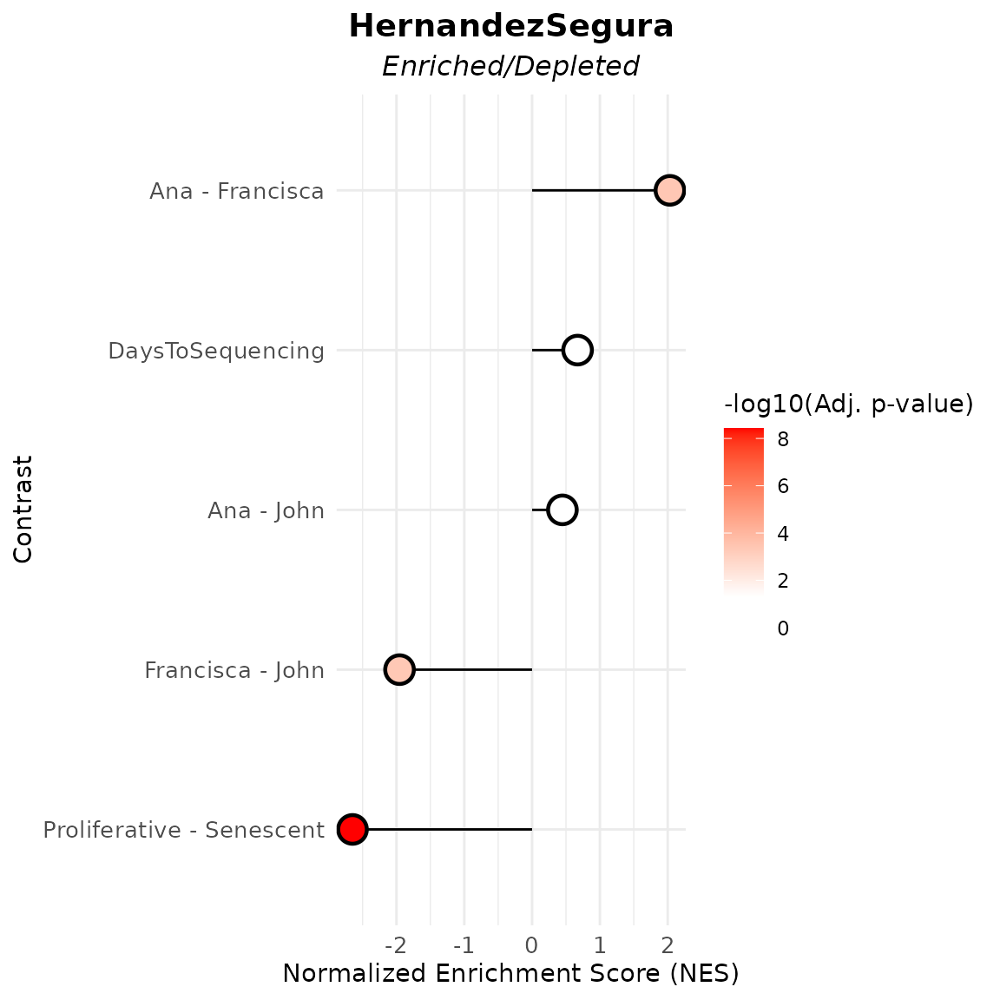

# Discovery Mode Tutorial

This vignette provides a comprehensive introduction to the **`markeR`**
package, focusing on its **Discovery Mode**. The discovery mode was
designed for users who are interested in examining the relationship
between a gene set and one or more metadata variables of interest, being
suitable for exploratory or hypothesis-generating analyses.

## Case-study: Senescence

In this vignette, we use a pre‑processed RNA-seq dataset from Marthandan
et al. (2016, GSE63577), with normalised read counts for human
fibroblasts under **replicative senescence** and **proliferative
control**. See
[`?counts_example`](https://diseasetranscriptomicslab.github.io/markeR/reference/counts_example.md)
for preprocessing details and structure. `markeR` requires as input a
filtered and normalised, non log-transformed, gene expression matrix
(genes × samples). Row names must be gene identifiers; column names must
match sample IDs in the metadata.

We use the accompanying metadata from the Marthandan et al. (2016) study
(see
[`?metadata_example`](https://diseasetranscriptomicslab.github.io/markeR/reference/metadata_example.md)).

This dataset serves as a working example to demonstrate the main
functionalities of the `markeR` package. In particular, it will be used
to showcase the two primary modules of `markeR` for quantifying
phenotypes using gene sets:

- **Score-based methods**: log2-median expression, ranking approaches,
  and single-sample gene set enrichment analysis (ssGSEA) to quantify
  coordinated expression within a gene set.
- **Enrichment-based methods**: GSEA using moderated t- or B-statistics.

To illustrate the usage of `markeR`, we use the **HernandezSegura** gene
set: A transcriptomic gene set identified by Hernandez-Segura et
al. (2017) as consistently altered across multiple senescence models.
This set includes information on the direction of change in expression
of genes upon phenotype.

``` r
library(markeR)
#> Warning: markeR has been tested with ggplot2 <= 3.5.2. Using newer versions may cause incompatibilities.
```

``` r
# Load example gene sets
data("genesets_example")
HernandezSegura_GeneSet <- list(HernandezSegura=genesets_example$HernandezSegura)
head(HernandezSegura_GeneSet) 
#> $HernandezSegura
#>        gene enrichment
#> 1    ACADVL          1
#> 2     ADPGK          1
#> 3  ARHGAP35         -1
#> 4     ARID2         -1
#> 5     ASCC1         -1
#> 6   B4GALT7          1
#> 7    BCL2L2          1
#> 8     C2CD5         -1
#> 9     CCND1          1
#> 10    CHMP5          1
#> 11    CNTLN         -1
#> 12   CREBBP         -1
#> 13     DDA1          1
#> 14     DGKA          1
#> 15   DYNLT3          1
#> 16    EFNB3         -1
#> 17  FAM214B          1
#> 18     GBE1          1
#> 19     GDNF          1
#> 20    GSTM4         -1
#> 21     ICE1         -1
#> 22    KCTD3         -1
#> 23     KLC1          1
#> 24    MEIS1         -1
#> 25   MT-CYB          1
#> 26     NFIA         -1
#> 27     NOL3          1
#> 28    P4HA2          1
#> 29    PATZ1         -1
#> 30    PCIF1         -1
#> 31   PDLIM4          1
#> 32    PDS5B         -1
#> 33     PLK3          1
#> 34   PLXNA3          1
#> 35   POFUT2          1
#> 36    RAI14          1
#> 37    RHNO1         -1
#> 38     SCOC          1
#> 39  SLC10A3          1
#> 40  SLC16A3          1
#> 41      SMO         -1
#> 42   SPATA6         -1
#> 43    SPIN4         -1
#> 44    STAG1         -1
#> 45    SUSD6          1
#> 46    TAF13          1
#> 47  TMEM87B          1
#> 48   TOLLIP          1
#> 49   TRDMT1         -1
#> 50  TSPAN13          1
#> 51     UFM1          1
#> 52   USP6NL         -1
#> 53   ZBTB7A          1
#> 54    ZC3H4         -1
#> 55   ZNHIT1          1
```

``` r
data(counts_example)
# Load example data
counts_example[1:5,1:5]
#>          SRR1660534 SRR1660535 SRR1660536 SRR1660537 SRR1660538
#> A1BG        9.94566   9.476768   8.229231   8.515083   7.806479
#> A1BG-AS1   12.08655  11.550303  12.283976   7.580694   7.312666
#> A2M        77.50289  56.612839  58.860268   8.997624   6.981857
#> A4GALT     14.74183  15.226083  14.815891  14.675780  15.222488
#> AAAS       47.92755  46.292377  43.965972  47.109493  47.213739
```

For illustration purposes, two synthetic variables were added to the
data:

- `DaysToSequencing`, the number of days between sample preparation and
  sequencing;
- `Researcher`, identifying the person who processed each sample.

This enables exploration of associations between gene set activity and
both categorical and continuous variables.

``` r
data(metadata_example)

set.seed("123456")

metadata_example$Researcher <- sample(c("John","Ana","Francisca"),39, replace = TRUE)
metadata_example$DaysToSequencing <- sample(c(1:20),39, replace = TRUE)
 
head(metadata_example)
#>       sampleID      DatasetID   CellType     Condition       SenescentType
#> 252 SRR1660534 Marthandan2016 Fibroblast     Senescent Telomere shortening
#> 253 SRR1660535 Marthandan2016 Fibroblast     Senescent Telomere shortening
#> 254 SRR1660536 Marthandan2016 Fibroblast     Senescent Telomere shortening
#> 255 SRR1660537 Marthandan2016 Fibroblast Proliferative                none
#> 256 SRR1660538 Marthandan2016 Fibroblast Proliferative                none
#> 257 SRR1660539 Marthandan2016 Fibroblast Proliferative                none
#>                         Treatment Researcher DaysToSequencing
#> 252 PD72 (Replicative senescence)        Ana                6
#> 253 PD72 (Replicative senescence)        Ana               18
#> 254 PD72 (Replicative senescence)       John               19
#> 255                         young        Ana                2
#> 256                         young  Francisca                9
#> 257                         young       John               10
```

## Score-Based approaches

A score summarising the collective expression of a gene set is assigned
**to each sample**. Scores can be visualised using built-in functions,
or used directly in downstream analyses (*e.g.*, comparisons between
phenotypic groups of samples, correlations with numerical phenotypes).

### Outputs

If `method = "logmedian"` (or `ssGSEA`, `ranking`), the main function
[`VariableAssociation()`](https://diseasetranscriptomicslab.github.io/markeR/reference/VariableAssociation.md)
returns a structured list with:

- **`overall`**: Effect sizes (*Cohen’s f*) and p-values for each
  variable.
- **`contrasts`**: For categorical variables, pairwise or grouped
  comparisons using *Cohen’s d* with BH-adjusted p-values.
- **`plot`**: A combined visualization showing:
  1.  Lollipop plot of effect sizes (i.e., *Cohen’s f* per variable)
  2.  Distribution plots of the score by variable (density or scatter)
  3.  Lollipop plots of contrasts (*Cohen’s d*) for categorical
      variables, if applicable
- **`plot_overall`**, **`plot_contrasts`**, **`plot_distributions`**:
  Individual components of the combined plot.

### Controlling Contrast Resolution

The `mode` parameter determines the level of contrast detail for
categorical variables:

- **`"simple"`**: All pairwise contrasts between group levels (e.g., A
  vs B, A vs C, B vs C).
- **`"medium"`**: One group vs. the union of all others (e.g., A vs
  B+C+D).
- **`"extensive"`**: All algebraic combinations of group levels (e.g.,
  A+B vs C+D).

### Results

For this example, we use:

- The **HernandezSegura** gene signature
- The **`logmedian`** scoring method
- **`mode = "extensive"`** for thorough contrast analysis

Though artificial, `DaysToSequencing` and `Researcher` mimic potential
**technical covariates**. Strong associations between these and the
score could indicate **batch effects**, where technical variation may
confound biological interpretation.

In this example, the `Condition` variable shows a large effect size
(Cohen’s f and Cohen’s d), confirming strong discrimination between
Senescent and Proliferative samples. The remaining variables don’t show
significant associations, suggesting no major batch effects that might
be reflected in the computed scores.

``` r
results_scoreassoc_bidirect <- VariableAssociation(data = counts_example, 
                          metadata = metadata_example, 
                          method = "logmedian",
                          cols = c("Condition","Researcher","DaysToSequencing"),  
                          gene_set = HernandezSegura_GeneSet,
                          mode="extensive",
                          nonsignif_color = "white", signif_color = "red", saturation_value=NULL,sig_threshold = 0.05,
                          widthlabels=30, labsize=10, titlesize=14, pointSize=5, discrete_colors=NULL,
                          continuous_color = "#8C6D03", color_palette = "Set2")
```



``` r

results_scoreassoc_bidirect$Overall
#>           Variable    Cohen_f      P_Value
#> 1        Condition 1.19407625 1.267423e-08
#> 2       Researcher 0.12816159 7.458318e-01
#> 3 DaysToSequencing 0.00792836 9.617953e-01
results_scoreassoc_bidirect$Contrasts
#>     Variable                  Contrast          Group1           Group2
#> 1  Condition Proliferative - Senescent   Proliferative        Senescent
#> 2 Researcher                Ana - John             Ana             John
#> 3 Researcher           Ana - Francisca             Ana        Francisca
#> 4 Researcher          Francisca - John       Francisca             John
#> 5 Researcher  Ana - (Francisca + John)             Ana Francisca + John
#> 6 Researcher  (Ana + Francisca) - John Ana + Francisca             John
#> 7 Researcher  (Ana + John) - Francisca      Ana + John        Francisca
#>        CohenD       PValue         padj
#> 1 -2.33302465 1.267423e-08 8.871962e-08
#> 2 -0.05584444 9.021669e-01 9.021669e-01
#> 3  0.24731622 4.904610e-01 8.034391e-01
#> 4 -0.27989036 5.477802e-01 8.034391e-01
#> 5  0.14113793 6.646037e-01 8.034391e-01
#> 6 -0.16850285 6.886621e-01 8.034391e-01
#> 7  0.25285837 4.472210e-01 8.034391e-01
```

## Enrichment-based approaches

Enrichment-based methods implement **Gene Set Enrichment Analysis
(GSEA)**. Genes are ranked according to differential expression
statistics, and a Normalised Enrichment Score (NES) per variable of
interest is computed, accompanied by a p-value adjusted for multiple
hypothesis testing.

### Outputs

If `method = "GSEA"`, the main function
[`VariableAssociation()`](https://diseasetranscriptomicslab.github.io/markeR/reference/VariableAssociation.md)
returns a structured list with:

- **`data`**: A tidy data frame of GSEA results. For each variable
  contrast, this includes:
  - **Contrast**: The comparison performed (e.g., A - B, A - (B+C))
  - **Statistic**: The metric used for gene ranking (either *t* or *B*)
  - **NES**: Normalized Enrichment Score
  - **Adjusted p-value**: Multiple-testing corrected p-value
    (Benjamini–Hochberg)
  - **Gene Set Name**: The gene set being tested
- **`plot`**: A `ggplot2` object showing the NES and significance of
  each contrast as a **lollipop plot**:
  - **Point position** reflects NES (directional enrichment)
  - **Point color** reflects adjusted p-value significance
  - **Dashed lines** represent contrasts with negative NES under the **B
    statistic**, indicating likely non-alteration

### Output Interpretation

Depending on the statistic used (`t` or `B`), the interpretation of
results varies:

- **Negative NES (Normalized Enrichment Score):**
  - **t statistic**: A negative NES implies the gene set is **depleted**
    in over-expressed genes — i.e., genes in the set are under-expressed
    relative to others.
  - **B statistic**: A negative NES suggests the gene set is **less
    altered** than most other genes — indicating a lack of strong
    expression change.
- **Dashed Lines in the Plot:**
  - Dashed lines denote contrasts with **negative NES** using the **B
    statistic**, indicating gene sets that are putatively *not* altered.
- **Subtitle Differences in the Plot:**
  - When using the **B statistic**, the plot subtitle is **“Altered
    Contrasts”**.
  - When using the **t statistic**, the subtitle becomes
    **“Enriched/Depleted Contrasts”**.

### Example: Exploring Gene Set Enrichment by Variable

The following code evaluates how three phenotypic variables
(`Condition`, `Researcher`, and `DaysToSequencing`) are associated with
the **HernandezSegura** gene set.

In this example, the HernandezSegura gene set shows significant
enrichment in samples sequenced by Francisca relative to those processed
by Ana or John, which would suggest a differentiated
researcher-associated technical impact on the samples’ biological
phenotype. This gene set shows also a strong depletion in proliferative
samples, which is expected given its annotation as senescence-associated
and results from the score-based approach.

``` r
varassoc_gsea <- VariableAssociation(
  data = counts_example,
  metadata = metadata_example,
  method = "GSEA",
  cols = c("Condition", "Researcher", "DaysToSequencing"),
  mode = "simple",
  gene_set = HernandezSegura_GeneSet,
  saturation_value = NULL,
  nonsignif_color = "white",
  signif_color = "red",
  sig_threshold = 0.05,
  widthlabels = 30,
  labsize = 10,
  titlesize = 14,
  pointSize = 5
)
```



``` r

varassoc_gsea$data
#>            pathway         pval         padj    log2err         ES        NES
#>             <char>        <num>        <num>      <num>      <num>      <num>
#> 1: HernandezSegura 7.420457e-10 3.710228e-09 0.80121557 -0.6263553 -2.6486833
#> 2: HernandezSegura 9.994967e-01 9.994967e-01 0.01188457  0.1127391  0.4471673
#> 3: HernandezSegura 1.644800e-04 4.111999e-04 0.51884808  0.4544704  2.0326219
#> 4: HernandezSegura 2.632307e-04 4.387178e-04 0.49849311 -0.4726426 -1.9550716
#> 5: HernandezSegura 9.636917e-01 9.994967e-01 0.01516609  0.1677355  0.6709891
#>     size                                    leadingEdge stat_used
#>    <int>                                         <list>    <char>
#> 1:    52 CNTLN,DYNLT3,SLC10A3,CCND1,TOLLIP,DDA1,...[37]         t
#> 2:    52 P4HA2,SUSD6,POFUT2,ZBTB7A,TOLLIP,PDS5B,...[11]         t
#> 3:    52     NOL3,PLK3,SUSD6,CNTLN,TOLLIP,SPIN4,...[36]         t
#> 4:    52     MEIS1,SPIN4,DGKA,ARID2,NOL3,DYNLT3,...[28]         t
#> 5:    52   BCL2L2,ZBTB7A,CCND1,KLC1,STAG1,P4HA2,...[16]         t
#>                     Contrast
#>                       <char>
#> 1: Proliferative - Senescent
#> 2:                Ana - John
#> 3:           Ana - Francisca
#> 4:          Francisca - John
#> 5:          DaysToSequencing
```

## Session Information

``` r
sessionInfo()
#> R version 4.5.3 (2026-03-11)
#> Platform: x86_64-pc-linux-gnu
#> Running under: Ubuntu 24.04.3 LTS
#> 
#> Matrix products: default
#> BLAS:   /usr/lib/x86_64-linux-gnu/openblas-pthread/libblas.so.3 
#> LAPACK: /usr/lib/x86_64-linux-gnu/openblas-pthread/libopenblasp-r0.3.26.so;  LAPACK version 3.12.0
#> 
#> locale:
#>  [1] LC_CTYPE=C.UTF-8       LC_NUMERIC=C           LC_TIME=C.UTF-8       
#>  [4] LC_COLLATE=C.UTF-8     LC_MONETARY=C.UTF-8    LC_MESSAGES=C.UTF-8   
#>  [7] LC_PAPER=C.UTF-8       LC_NAME=C              LC_ADDRESS=C          
#> [10] LC_TELEPHONE=C         LC_MEASUREMENT=C.UTF-8 LC_IDENTIFICATION=C   
#> 
#> time zone: UTC
#> tzcode source: system (glibc)
#> 
#> attached base packages:
#> [1] stats     graphics  grDevices utils     datasets  methods   base     
#> 
#> other attached packages:
#> [1] markeR_1.1.2
#> 
#> loaded via a namespace (and not attached):
#>   [1] pROC_1.19.0.1         gridExtra_2.3         rlang_1.1.7          
#>   [4] magrittr_2.0.4        clue_0.3-67           GetoptLong_1.1.0     
#>   [7] msigdbr_26.1.0        otel_0.2.0            matrixStats_1.5.0    
#>  [10] compiler_4.5.3        mgcv_1.9-4            png_0.1-8            
#>  [13] systemfonts_1.3.2     vctrs_0.7.1           reshape2_1.4.5       
#>  [16] stringr_1.6.0         pkgconfig_2.0.3       shape_1.4.6.1        
#>  [19] crayon_1.5.3          fastmap_1.2.0         backports_1.5.0      
#>  [22] labeling_0.4.3        effectsize_1.0.2      rmarkdown_2.30       
#>  [25] ragg_1.5.1            purrr_1.2.1           xfun_0.56            
#>  [28] cachem_1.1.0          jsonlite_2.0.0        BiocParallel_1.44.0  
#>  [31] broom_1.0.12          parallel_4.5.3        cluster_2.1.8.2      
#>  [34] R6_2.6.1              stringi_1.8.7         bslib_0.10.0         
#>  [37] RColorBrewer_1.1-3    limma_3.66.0          car_3.1-5            
#>  [40] jquerylib_0.1.4       Rcpp_1.1.1            assertthat_0.2.1     
#>  [43] iterators_1.0.14      knitr_1.51            parameters_0.28.3    
#>  [46] IRanges_2.44.0        splines_4.5.3         Matrix_1.7-4         
#>  [49] tidyselect_1.2.1      abind_1.4-8           yaml_2.3.12          
#>  [52] doParallel_1.0.17     codetools_0.2-20      curl_7.0.0           
#>  [55] plyr_1.8.9            lattice_0.22-9        tibble_3.3.1         
#>  [58] withr_3.0.2           bayestestR_0.17.0     S7_0.2.1             
#>  [61] evaluate_1.0.5        desc_1.4.3            circlize_0.4.17      
#>  [64] pillar_1.11.1         ggpubr_0.6.3          carData_3.0-6        
#>  [67] foreach_1.5.2         stats4_4.5.3          insight_1.4.6        
#>  [70] generics_0.1.4        S4Vectors_0.48.0      ggplot2_4.0.2        
#>  [73] scales_1.4.0          glue_1.8.0            tools_4.5.3          
#>  [76] data.table_1.18.2.1   fgsea_1.36.2          locfit_1.5-9.12      
#>  [79] ggsignif_0.6.4        babelgene_22.9        fs_1.6.7             
#>  [82] fastmatch_1.1-8       cowplot_1.2.0         grid_4.5.3           
#>  [85] tidyr_1.3.2           datawizard_1.3.0      edgeR_4.8.2          
#>  [88] colorspace_2.1-2      nlme_3.1-168          Formula_1.2-5        
#>  [91] cli_3.6.5             textshaping_1.0.5     ComplexHeatmap_2.26.1
#>  [94] dplyr_1.2.0           gtable_0.3.6          ggh4x_0.3.1          
#>  [97] rstatix_0.7.3         sass_0.4.10           digest_0.6.39        
#> [100] BiocGenerics_0.56.0   ggrepel_0.9.7         rjson_0.2.23         
#> [103] htmlwidgets_1.6.4     farver_2.1.2          htmltools_0.5.9      
#> [106] pkgdown_2.2.0         lifecycle_1.0.5       GlobalOptions_0.1.3  
#> [109] statmod_1.5.1
```
