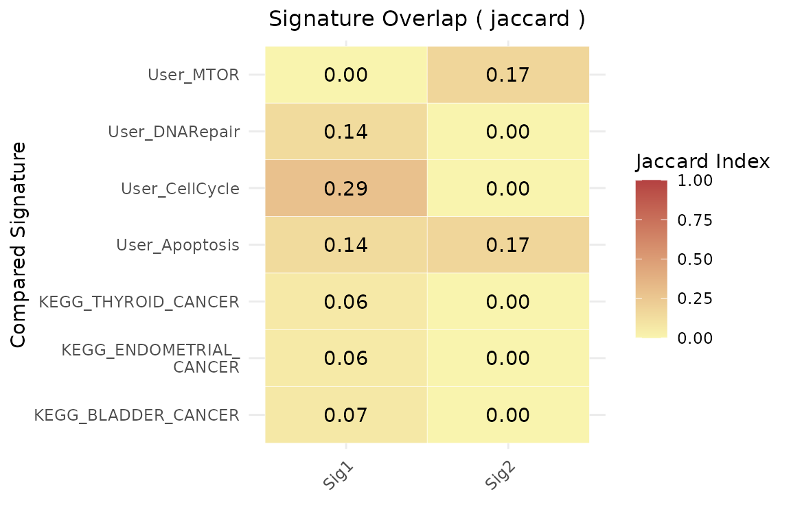
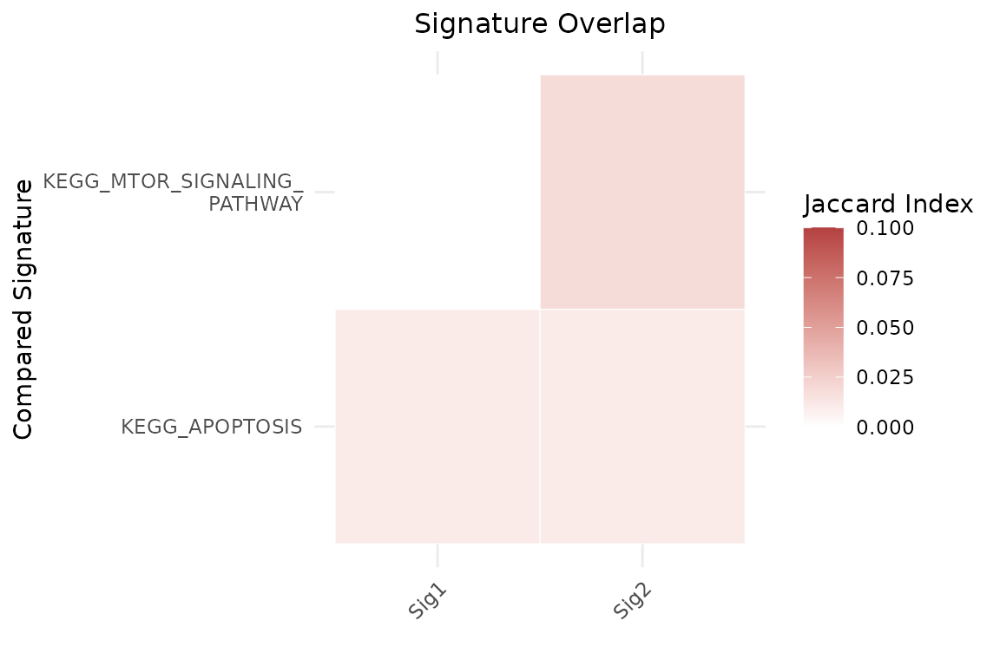
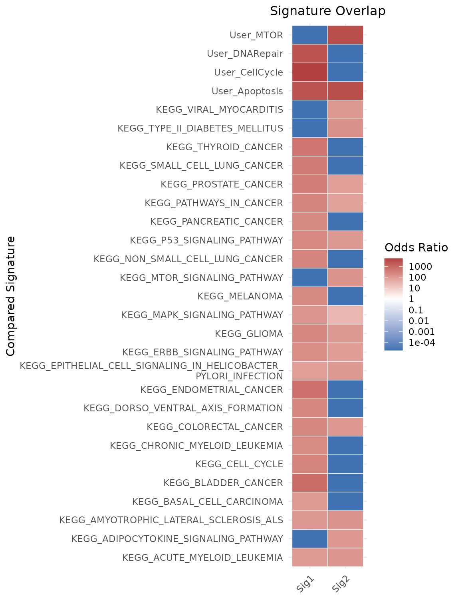

# Gene Set Similarity Tutorial

Even if a user-defined gene signature demonstrates strong discriminatory
power between conditions, it may reflect known biological pathways
rather than novel mechanisms. To address this, the
[`geneset_similarity()`](https://diseasetranscriptomicslab.github.io/markeR/reference/geneset_similarity.md)
function implements two complementary similarity metrics:

- **Jaccard Index**: the ratio of the number of genes in common over the
  total number of genes in the two sets.

- **Log Odds Ratio (logOR)** from Fisher’s exact test of association
  between gene sets, given a specified gene universe.

Users can compare their signatures to:

- **Custom gene sets**, defined manually;  
- **MSigDB collections**, via the
  [`msigdbr`](https://cran.r-project.org/package=msigdbr) package.

The function provides options to:

- Filter by **Jaccard index threshold**, using `jaccard_threshold`;
- Filter by **odds ratio and p-value**, using `or_threshold` and
  `pval_threshold`, respectively.

## Similarity via Jaccard Index

The **Jaccard index** measures raw set overlap:

``` math
\text{Jaccard}(A, B) = \frac{|A \cap B|}{|A \cup B|}
```

### Example 1: Compare against user-defined and MSigDB gene sets

``` r

library(markeR)
#> Warning: markeR has been tested with ggplot2 <= 3.5.2. Using newer versions may cause incompatibilities.
```

``` r

# Example data
signature1 <- c("TP53", "BRCA1", "MYC", "EGFR", "CDK2")
signature2 <- c("ATXN2", "FUS", "MTOR", "CASP3")

signature_list <- list(
  "User_Apoptosis" = c("TP53", "CASP3", "BAX"),
  "User_CellCycle" = c("CDK2", "CDK4", "CCNB1", "MYC"),
  "User_DNARepair" = c("BRCA1", "RAD51", "ATM"),
  "User_MTOR" = c("MTOR", "AKT1", "RPS6KB1")
)

geneset_similarity(
  signatures = list(Sig1 = signature1, Sig2 = signature2),
  other_user_signatures = signature_list,
  collection = "C2",
  subcollection = "CP:KEGG_LEGACY", 
  jaccard_threshold = 0.05,
  msig_subset = NULL, 
  metric = "jaccard"
)$plot
```



### Example 2: Restrict comparison to a custom subset of MSigDB

``` r


geneset_similarity(
  signatures = list(Sig1 = signature1, Sig2 = signature2),
  other_user_signatures = NULL,
  collection = "C2",
  subcollection = "CP:KEGG_LEGACY", 
  jaccard_threshold = 0,
  msig_subset = c("KEGG_MTOR_SIGNALING_PATHWAY", "KEGG_APOPTOSIS", "NON_EXISTENT_PATHWAY"), 
  metric = "jaccard",
  limits=c(0,0.1)
)$plot
```



## Similarity via Log Odds Ratio

The log odds ratio (logOR) provides a statistically grounded alternative
for assessing gene set similarity. It measures **enrichment of one set
within another**, relative to a defined background or **gene universe**,
using a 2×2 contingency table.

- **Log odds ratio (logOR)**:  
  Derived from contingency tables using:
  - Genes in both sets
  - Genes in one but not the other
  - Gene universe as background

> **Note**: When using `metric = "odds_ratio"`, the `universe` parameter
> **must** be supplied.

### Example 3: Compare against user-defined and MSigDB gene sets

``` r


geneset_similarity(
  signatures = list(Sig1 = signature1, Sig2 = signature2),
  other_user_signatures = signature_list,
  collection = "C2",
  subcollection = "CP:KEGG_LEGACY",
  metric = "odds_ratio",
  # Define gene universe (e.g., genes from HPA or your dataset)
  universe = unique(c(
    signature1, signature2,
    unlist(signature_list),
    msigdbr::msigdbr(species = "Homo sapiens", category = "C2")$gene_symbol
  )),
  or_threshold = 100, #log10OR = 2
  width_text=50, 
  pval_threshold = 0.05 
)$plot
#> Warning: The `category` argument of `msigdbr()` is deprecated as of msigdbr 10.0.0.
#> ℹ Please use the `collection` argument instead.
#> This warning is displayed once per session.
#> Call `lifecycle::last_lifecycle_warnings()` to see where this warning was
#> generated.
```



## Session Information

``` r

sessionInfo()
#> R version 4.6.0 (2026-04-24)
#> Platform: x86_64-pc-linux-gnu
#> Running under: Ubuntu 24.04.4 LTS
#> 
#> Matrix products: default
#> BLAS:   /usr/lib/x86_64-linux-gnu/openblas-pthread/libblas.so.3 
#> LAPACK: /usr/lib/x86_64-linux-gnu/openblas-pthread/libopenblasp-r0.3.26.so;  LAPACK version 3.12.0
#> 
#> locale:
#>  [1] LC_CTYPE=C.UTF-8       LC_NUMERIC=C           LC_TIME=C.UTF-8       
#>  [4] LC_COLLATE=C.UTF-8     LC_MONETARY=C.UTF-8    LC_MESSAGES=C.UTF-8   
#>  [7] LC_PAPER=C.UTF-8       LC_NAME=C              LC_ADDRESS=C          
#> [10] LC_TELEPHONE=C         LC_MEASUREMENT=C.UTF-8 LC_IDENTIFICATION=C   
#> 
#> time zone: UTC
#> tzcode source: system (glibc)
#> 
#> attached base packages:
#> [1] stats     graphics  grDevices utils     datasets  methods   base     
#> 
#> other attached packages:
#> [1] markeR_1.1.2
#> 
#> loaded via a namespace (and not attached):
#>   [1] pROC_1.19.0.1         gridExtra_2.3         rlang_1.2.0          
#>   [4] magrittr_2.0.5        clue_0.3-68           GetoptLong_1.1.1     
#>   [7] msigdbr_26.1.0        otel_0.2.0            matrixStats_1.5.0    
#>  [10] compiler_4.6.0        png_0.1-9             systemfonts_1.3.2    
#>  [13] vctrs_0.7.3           reshape2_1.4.5        stringr_1.6.0        
#>  [16] pkgconfig_2.0.3       shape_1.4.6.1         crayon_1.5.3         
#>  [19] fastmap_1.2.0         backports_1.5.1       labeling_0.4.3       
#>  [22] effectsize_1.0.2      rmarkdown_2.31        ragg_1.5.2           
#>  [25] purrr_1.2.2           xfun_0.57             cachem_1.1.0         
#>  [28] jsonlite_2.0.0        BiocParallel_1.46.0   broom_1.0.12         
#>  [31] parallel_4.6.0        cluster_2.1.8.2       R6_2.6.1             
#>  [34] stringi_1.8.7         bslib_0.10.0          RColorBrewer_1.1-3   
#>  [37] limma_3.68.2          car_3.1-5             jquerylib_0.1.4      
#>  [40] Rcpp_1.1.1-1.1        assertthat_0.2.1      iterators_1.0.14     
#>  [43] knitr_1.51            parameters_0.28.3     IRanges_2.46.0       
#>  [46] Matrix_1.7-5          tidyselect_1.2.1      abind_1.4-8          
#>  [49] yaml_2.3.12           doParallel_1.0.17     codetools_0.2-20     
#>  [52] curl_7.1.0            plyr_1.8.9            lattice_0.22-9       
#>  [55] tibble_3.3.1          withr_3.0.2           bayestestR_0.17.0    
#>  [58] S7_0.2.2              evaluate_1.0.5        desc_1.4.3           
#>  [61] circlize_0.4.18       pillar_1.11.1         ggpubr_0.6.3         
#>  [64] carData_3.0-6         foreach_1.5.2         stats4_4.6.0         
#>  [67] insight_1.5.0         generics_0.1.4        S4Vectors_0.50.0     
#>  [70] ggplot2_4.0.3         scales_1.4.0          glue_1.8.1           
#>  [73] tools_4.6.0           data.table_1.18.4     fgsea_1.38.0         
#>  [76] locfit_1.5-9.12       ggsignif_0.6.4        babelgene_22.9       
#>  [79] fs_2.1.0              fastmatch_1.1-8       cowplot_1.2.0        
#>  [82] grid_4.6.0            tidyr_1.3.2           datawizard_1.3.1     
#>  [85] edgeR_4.10.0          colorspace_2.1-2      Formula_1.2-5        
#>  [88] cli_3.6.6             textshaping_1.0.5     ComplexHeatmap_2.28.0
#>  [91] dplyr_1.2.1           gtable_0.3.6          ggh4x_0.3.1          
#>  [94] rstatix_0.7.3         sass_0.4.10           digest_0.6.39        
#>  [97] BiocGenerics_0.58.0   ggrepel_0.9.8         rjson_0.2.23         
#> [100] htmlwidgets_1.6.4     farver_2.1.2          htmltools_0.5.9      
#> [103] pkgdown_2.2.0         lifecycle_1.0.5       GlobalOptions_0.1.4  
#> [106] statmod_1.5.1
```
