# Introduction to markeR

## Introduction

**`markeR`** is an R package that provides a modular and extensible
framework for the systematic evaluation of gene sets as phenotypic
markers using transcriptomic data. The package is designed to support
both quantitative analyses and visual exploration of gene set behaviour
across experimental and clinical phenotypes.

In this vignette, we demonstrate the core functionalities of `markeR`
using a pre-processed gene expression dataset and associated metadata
from Marthandan et al. (2016) (GSE63577). This dataset comprises human
fibroblast samples cultured under two experimental conditions:
replicative senescence and proliferative control.

### Primary Objectives

The primary objectives of **`markeR`** are to:

- Establish a reproducible and standardised framework for quantifying
  gene sets as phenotypic markers across transcriptomic datasets.
- Provide a unified interface for complementary analytical strategies,
  including score-based and enrichment-based methods.
- Enable systematic comparison of user-defined gene sets with curated
  reference collections (e.g., MSigDB) to enhance biological
  interpretability.
- Deliver modular tools for visualisation and evaluation, allowing
  exploration of both gene set behaviour and individual gene-level
  contributions.

### Features and Capabilities

The package integrates multiple analytical strategies for quantifying
phenotypes using gene sets, supporting both unidirectional and
bidirectional (*i.e.*, respectively without and with information on the
expected direction of change in expression of genes upon phenotype) gene
set definitions:

- **Score-based methods**: log2-median expression, ranking approaches,
  and single-sample gene set enrichment analysis (ssGSEA) to quantify
  coordinated expression within a gene set.
- **Enrichment-based methods**: GSEA using moderated t- or B-statistics.
- **Gene-level exploration**: expression heatmaps, violin plots, ROC
  curve analysis, area under the curve (AUC) calculations, effect size
  estimation, and principal component analysis (PCA) to characterise the
  contribution of individual genes.
- **Gene set similarity assessment**: Jaccard index and log odds ratio
  (logOR) calculations to compare user-defined gene sets with reference
  or user-defined collections.

The package is implemented with flexibility and extensibility as core
design principles. Visualisation leverages `ggplot2`, `ComplexHeatmap`,
`ggpubr`, `cowplot`, and `grid`, enabling a wide range of customisation
options. The modular structure ensures compatibility with additional
methods in future versions of the package.

## Installation

Install the latest release from Bioconductor:

``` r

# Install from Bioconductor
if (!requireNamespace("BiocManager", quietly = TRUE))
  install.packages("BiocManager")
BiocManager::install("markeR")
```

Or install the latest development release of `markeR` from
[GitHub](https://github.com/) with:

``` r

devtools::install_github("DiseaseTranscriptomicsLab/markeR@*release")
```

## Common Workflow

### Input Requirements

#### Gene Sets

A named list where each element is a gene set.

- Use a **character vector** when putative direction of change in
  expression of genes upon phenotype is unknown (unidirectional).
- Use a **data frame** with columns `gene` and `direction` (values `+1`
  for up-, `-1` for down-regulation) when direction is known
  (bidirectional).

``` r

# Example
gene_sets
```

    ## $Set1
    ## [1] "GeneA" "GeneB" "GeneC" "GeneD"
    ## 
    ## $Set2
    ##    gene direction
    ## 1 GeneX         1
    ## 2 GeneY        -1
    ## 3 GeneZ         1

For this vignette, we will use three senescence-related gene sets that
ship with the package (see
[`?genesets_example`](https://diseasetranscriptomicslab.github.io/markeR/reference/genesets_example.md)
for more information):

- **LiteratureMarkers** (bidirectional; gene set of commonly reported
  senescence markers in the literature)
- **REACTOME_CELLULAR_SENESCENCE** (unidirectional; from the MSigDB
  database)
- **HernandezSegura** (bidirectional; from [Hernandez-Segura et
  al. (2017)](https://pubmed.ncbi.nlm.nih.gov/28844647/))

``` r

# Load example gene sets
data(genesets_example)
```

#### Expression Data Frame

A filtered and normalised, non log-transformed, gene expression matrix
(genes × samples). Row names must be gene identifiers; column names must
match sample IDs in the metadata.

**Warning:** If you are using microarray data or outputs from common
RNA-seq pipelines (*e.g.*, edgeR), note that the expression values may
already be log2-normalised. The input to `markeR` must necessarily be
**non-log-transformed**. If your data are log2-transformed, you can
revert them by applying `2^data`.

In this vignette, we use a pre‑processed RNA-seq dataset from Marthandan
et al. (2016, GSE63577), with normalised read counts for human
fibroblasts under **replicative senescence** and **proliferative
control**. See
[`?counts_example`](https://diseasetranscriptomicslab.github.io/markeR/reference/counts_example.md)
for structure.

``` r

# Load example expression data
data(counts_example)
counts_example[1:5, 1:5]
```

    ##          SRR1660534 SRR1660535 SRR1660536 SRR1660537 SRR1660538
    ## A1BG        9.94566   9.476768   8.229231   8.515083   7.806479
    ## A1BG-AS1   12.08655  11.550303  12.283976   7.580694   7.312666
    ## A2M        77.50289  56.612839  58.860268   8.997624   6.981857
    ## A4GALT     14.74183  15.226083  14.815891  14.675780  15.222488
    ## AAAS       47.92755  46.292377  43.965972  47.109493  47.213739

#### Sample Metadata

A data frame with samples as rows and annotations as columns. The first
column should contain sample IDs matching the expression matrix column
names.

We use the accompanying metadata from the Marthandan et al. (2016)
study. See
[`?metadata_example`](https://diseasetranscriptomicslab.github.io/markeR/reference/metadata_example.md).

``` r

# Load example metadata
data(metadata_example)
head(metadata_example)
```

    ##       sampleID      DatasetID   CellType     Condition       SenescentType
    ## 252 SRR1660534 Marthandan2016 Fibroblast     Senescent Telomere shortening
    ## 253 SRR1660535 Marthandan2016 Fibroblast     Senescent Telomere shortening
    ## 254 SRR1660536 Marthandan2016 Fibroblast     Senescent Telomere shortening
    ## 255 SRR1660537 Marthandan2016 Fibroblast Proliferative                none
    ## 256 SRR1660538 Marthandan2016 Fibroblast Proliferative                none
    ## 257 SRR1660539 Marthandan2016 Fibroblast Proliferative                none
    ##                         Treatment
    ## 252 PD72 (Replicative senescence)
    ## 253 PD72 (Replicative senescence)
    ## 254 PD72 (Replicative senescence)
    ## 255                         young
    ## 256                         young
    ## 257                         young

### Select Mode of Analysis

`markeR` provides two modes of operation:

- **Benchmarking**: evaluates gene sets’ performance in marking a
  metadata variable, *i.e.*, a phenotype, returning comparative
  visualisations across scoring and enrichment methods.

- **Discovery**: examines the relationship between a gene set and one or
  more variables of interest, suitable for exploratory or
  hypothesis-generating analyses.

### Choose a Quantification Approach

Two complementary strategies are implemented for quantifying
associations between gene sets and phenotypes:

#### Score-Based Approach

A score summarising the collective expression of a gene set therein is
assigned **to each sample**. Scores can be visualised using built-in
functions, or used directly in downstream analyses (*e.g.*, comparisons
between phenotypic groups of samples, correlations with numerical
phenotypes).

Available methods:

- **Log2-median**: mean of the across-sample normalised log2
  median-centred expression levels of the genes in the set; for
  bidirectional gene sets, the sample score is the partial score for the
  subset of putatively upregulated genes minus that of the downregulated
  subset.

- **Ranking**: mean expression rank of gene set members in each sample;
  for bidirectional gene sets, the sample score is the partial score for
  the subset of putatively upregulated genes minus that of the
  downregulated subset, and normalised by the number of genes in the
  set.

- **ssGSEA**: single-sample gene set enrichment score using ssGSEA; for
  bidirectional gene sets, the sample score is the partial score for the
  subset of putatively upregulated genes minus that of the downregulated
  subset.

Gene sets that are robust phenotypic markers are expected to yield
consistently high scores across methods.

#### Enrichment-Based Approach

Enrichment-based methods implement **Gene Set Enrichment Analysis
(GSEA)**. Genes are ranked according to differential expression
statistics, and a Normalised Enrichment Score (NES) per variable of
interest is computed, accompanied by a p-value adjusted for multiple
hypothesis testing.

### Visualisation and Evaluation

#### Benchmarking Mode

`markeR` offers a range of visual summaries for Benchmarking:

- Violin plots of score distributions by categorical phenotype;
- Scatter plots of association between scores and numerical phenotypes;
- Volcano plots and heatmaps of scores or differential gene set
  expression based on effect sizes (Cohen’s *d* or *f*);
- ROC curves and respective AUC values of gene sets’ phenotypic
  classification performance;
- Violin plots of effect size distributions (Cohen’s *d*) for pairwise
  group differences in scores, for original and simulated gene sets;
- Plots summarising NES alongside adjusted p-values (*e.g.*, lollipop
  plots);
- GSEA plots showing running enrichment scores across ranked gene lists.

Example of common workflows in Benchmarking Mode (full tutorial
[here](https://diseasetranscriptomicslab.github.io/markeR/articles/Article_BenchmarkingMode.html)):

##### Score-based approaches

Score-based methods facilitate direct comparisons of gene set activity
between phenotypic groups (*e.g.*, being senescent) and can be used in
downstream analyses, including for example correlation with other
metadata variables of interest (*e.g.*, day of sequencing) . We first
compute log2-median scores. In this dataset, the HernandezSegura and
LiteratureMarkers gene sets yield large effect sizes (\|Cohen’s d\|),
whereas REACTOME_CELLULAR_SENESCENCE shows more modest separation
between senescent and proliferative fibroblasts.

``` r

# Quantification approach: scores
# Method: log2-median 
PlotScores(data = counts_example, 
           metadata = metadata_example, 
           gene_sets = genesets_example, 
           Variable="Condition",  
           method ="logmedian",    
           nrow = 1,    
           pointSize=4,  
           title="Marthandan et al. 2016", 
           widthTitle = 24,
           labsize=12, 
           titlesize = 12)  
```

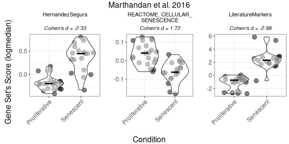

Next, scores are calculated using multiple methods (log2-median,
ranking, ssGSEA) to assess consistency across strategies. Outputs
include heatmaps and volcano plots of effect sizes (\|Cohen’s d\|).
HernandezSegura and LiteratureMarkers consistently discriminate
Senescent from Proliferative samples, while REACTOME_CELLULAR_SENESCENCE
shows weaker and less consistent separation.

``` r

Overall_Scores <- PlotScores(data = counts_example, 
                             metadata = metadata_example,  
                             gene_sets=genesets_example, 
                             Variable="Condition",  
                             method ="all",   
                             ncol = NULL, 
                             nrow = 1, 
                             widthTitle=30, 
                             limits = c(0,3.5),   
                             title="Marthandan et al. 2016", 
                             titlesize = 10,
                             ColorValues = list(heatmap=c("#F9F4AE", "#B44141"),
                                                volcano=signature_colors <- c(
                                                  HernandezSegura = "#A07395",               
                                                  REACTOME_CELLULAR_SENESCENCE = "#6B8E9E",  
                                                  LiteratureMarkers = "#CA7E45"             
                                                )
                             ),
                             mode="simple",
                             widthlegend=30, 
                             sig_threshold=0.05, 
                             cohen_threshold=0.6,
                             pointSize=6,
                             colorPalette="Paired")  
```

``` r

Overall_Scores$heatmap
```

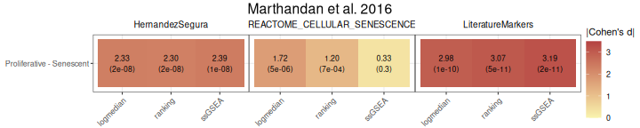

``` r

Overall_Scores$volcano
```

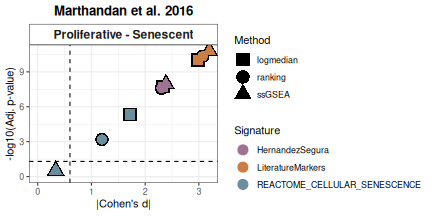

The discriminatory capacity of gene set scores can also be assessed
using ROC curves and corresponding AUC values. HernandezSegura and
LiteratureMarkers exhibit consistently high AUCs across scoring methods,
while REACTOME_CELLULAR_SENESCENCE shows more heterogeneous performance.

``` r

ROC_Scores(data = counts_example, 
           metadata = metadata_example, 
           gene_sets=genesets_example, 
           method = "all", 
           variable ="Condition",
           colors = c(logmedian = "#3E5587", ssGSEA = "#B65285", ranking = "#B68C52"), 
           grid = TRUE, 
           spacing_annotation=0.3, 
           ncol=NULL, 
           nrow=1,
           mode = "simple",
           widthTitle = 28,
           titlesize = 10,  
           title="Marthandan et al. 2016") 
```

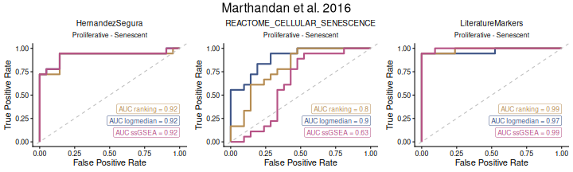

Finally, false positive rates for effect sizes are estimated by
simulating random gene sets of equal size. This step provides a null
distribution against which observed scores can be compared. In this
example, the LiteratureMarkers signature demonstrates the strongest
performance. Increasing the number of simulations would yield finer
resolution at the cost of additional computational time.

``` r

set.seed("123456")
FPR_Simulation(data = counts_example,
               metadata = metadata_example,
               original_signatures = genesets_example,
               gene_list = row.names(counts_example),
               number_of_sims = 100,
               title = "Marthandan et al. 2016",
               widthTitle = 30,
               Variable = "Condition",
               titlesize = 12,
               pointSize = 5,
               labsize = 10,
               mode = "simple",
               ColorValues=NULL,
               ncol=NULL, 
               nrow=1 ) 
```

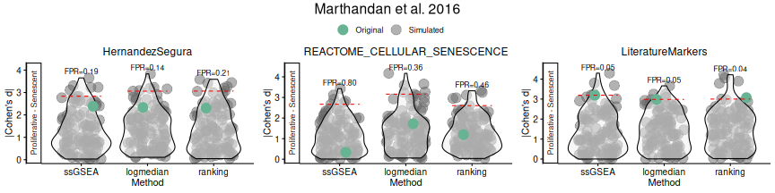

##### Enrichment-based approaches

The first step is the quantification of differential expression. Here, a
design matrix (as defined by the `limma` package) is automatically
constructed from the `Condition` variable in the metadata, defining the
contrast `Senescent - Proliferative`. Internally, this fits a linear
model without an intercept, enabling quick comparison between levels of
a categorical variable.

``` r

# Build design matrix from variables (Condition) and apply a contrast.
# The design matrix is constructed automatically using the variable "Condition".
DEGs <- calculateDE(data = counts_example,
                    metadata = metadata_example,
                    variables = "Condition",
                    contrasts = c("Senescent - Proliferative"))
DEGs$`Senescent-Proliferative`[1:5,]
```

    ##            logFC  AveExpr         t      P.Value    adj.P.Val        B
    ## CCND2   3.816674 4.406721 12.379571 2.944841e-15 2.349757e-12 24.64395
    ## MKI67  -3.581174 6.605339 -9.187514 2.110510e-11 4.769568e-10 15.91258
    ## PTCHD4  3.398914 3.556007 10.729126 2.461327e-13 2.868691e-11 20.30116
    ## KIF20A -3.365481 5.934893 -9.718104 4.406643e-12 1.771710e-10 17.45858
    ## CDC20  -3.304602 6.104079 -9.791031 3.562991e-12 1.592176e-10 17.66821

Differential expression results can be visualised with volcano plots.
These highlight the magnitude of expression changes (log2 fold change)
against statistical significance (adjusted p-value for the moderated
t-statistic), with genes from predefined sets emphasised (up- in green
and downregulated in red). In this example:

- Genes in the HernandezSegura set annotated as upregulated (green)
  display positive log2 fold changes, whereas those annotated as
  downregulated (red) show negative log2 fold changes. This pattern is
  consistent with the annotation of the set, although these genes are
  not necessarily those exhibiting the largest absolute fold changes.
- In the LiteratureMarkers set, *LMNB1* and *MKI67* exhibit strongly
  negative log2 fold change, consistent with their roles as
  proliferation markers absent in senescent cells.
- Genes from the REACTOME_CELLULAR_SENESCENCE set are undirected and
  appear across the full range of log2 fold change values, diluting
  discriminatory power.

``` r

# Change order: gene sets in columns, contrast in rows
plotVolcano(DEGs, genes = genesets_example, 
            N = NULL,
            x = "logFC", y = "-log10(adj.P.Val)", pointSize = 2,
            color = "#6489B4", highlightcolor = "#05254A", highlightcolor_upreg = "#038C65", highlightcolor_downreg = "#8C0303",nointerestcolor = "#B7B7B7",
            threshold_y = NULL, threshold_x = NULL,
            xlab = NULL, ylab = NULL, ncol = NULL, nrow = NULL, title = "Marthandan et al. 2016",
            labsize = 10, widthlabs = 24, invert = TRUE)
```

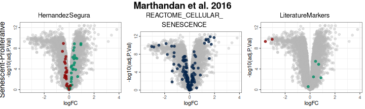

We next apply GSEA to the differential expression results. This
evaluates whether genes from each set are non-randomly concentrated at
the top or bottom of the ranked list. Results are reported as NES with
multiple-testing adjusted p-values. Gene ranking can be based on
alternative statistics (*e.g.*, moderated t or B-statistic), which
influence whether results are interpreted as enrichment/depletion or as
altered directionality. For a full example and explanation, see the
online tutorial
[here](https://diseasetranscriptomicslab.github.io/markeR/articles/Article_BenchmarkingMode.html).

``` r

GSEAresults <- runGSEA(DEGList = DEGs, 
                       gene_sets = genesets_example,
                       stat = NULL,
                       ContrastCorrection = FALSE)

GSEAresults
```

    ## $`Senescent-Proliferative`
    ##                         pathway         pval         padj   log2err        ES
    ##                          <char>        <num>        <num>     <num>     <num>
    ## 1:              HernandezSegura 9.855198e-10 2.956560e-09 0.7881868 0.6263554
    ## 2: REACTOME_CELLULAR_SENESCENCE 1.575684e-02 2.363525e-02 0.1151671 0.3687291
    ## 3:            LiteratureMarkers 2.571070e-02 2.571070e-02 0.1295475 0.6948631
    ##         NES  size                                    leadingEdge stat_used
    ##       <num> <int>                                         <list>    <char>
    ## 1: 2.639527    52 CNTLN,DYNLT3,SLC10A3,CCND1,TOLLIP,DDA1,...[37]         t
    ## 2: 1.450469   128   H1-2,H2BC4,H2BC5,H4C15,IGFBP7,H2BC12,...[31]         B
    ## 3: 1.648483     7            LMNB1,MKI67,GLB1,CDKN1A,CDKN2A,CCL2         t

Enrichment curves from `fgsea` show the running enrichment score across
the ranked list, indicating the distribution of set members therein.

``` r

plotGSEAenrichment(GSEA_results=GSEAresults, 
                   DEGList=DEGs, 
                   gene_sets=genesets_example, 
                   widthTitle=40, grid = TRUE, titlesize = 10, nrow=1, ncol=3) 
```

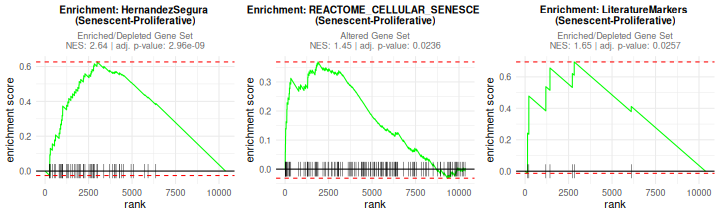

Enrichment results can also be summarised with a lollipop plot, which
compactly shows the NES and highlights statistically significant gene
sets. Here, we can see that the HernandezSegura gene set clearly
exhibits the strongest enrichment signal. When many gene sets and
contrasts are evaluated (which is not the case in this vignette), NES
and adjusted p-values can be summarized in a scatter (volcano-style)
plot for a simpler visualisation, using `plotCombinedGSEA`.

``` r

plotNESlollipop(GSEA_results=GSEAresults, 
                saturation_value=NULL, 
                nonsignif_color = "#F4F4F4", 
                signif_color = "red",
                sig_threshold = 0.05, 
                grid = FALSE, 
                nrow = NULL, ncol = NULL, 
                widthlabels=13, 
                title=NULL, titlesize=12) 
```

    ## $`Senescent-Proliferative`

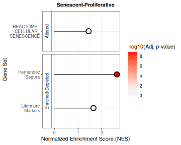

From this exercise in Benchmarking Mode, we can see that two gene sets
clearly perform best at discriminating between Senescent and
Proliferative conditions: HernandezSegura and LiteratureMarkers. The
REACTOME_CELLULAR_SENESCENCE gene set does not show a strong signal; the
absense of information on putative gene up- or downregulation upon
phenotype potentially dilutes the signal, highlighting the importance of
providing directionality when available.

Scoring and enrichment approaches provide complementary insights.
Score-based methods offer sample-level resolution, capturing strong
contributions from individual genes, while enrichment-based methods
evaluate coordinated behaviour across the set.

#### Discovery Mode

In **Discovery** (full tutorial
[here](https://diseasetranscriptomicslab.github.io/markeR/articles/Article_DiscoveryMode.html)),
analyses focus on a single gene set of interest, providing a targeted
view of its behaviour across experimental variables (*i.e.*,
phenotypes). The output includes:

- Score distributions stratified by variable;
- Effect sizes for pairwise and multiple-group differences (Cohen’s *d*
  and *f*, respectively);
- Cross-variable summaries of NES and adjusted p-values (*e.g.*,
  lollipop plots).

We illustrate this using the HernandezSegura gene set from our example
collection:

``` r

HernandezSegura_GeneSet <- list(HernandezSegura=genesets_example$HernandezSegura) 
```

For illustration purposes, two synthetic variables were added to the
data:

- `DaysToSequencing`, the number of days between sample preparation and
  sequencing;
- `Researcher`, identifying the person who processed each sample.

This enables exploration of associations between gene set activity and
both categorical and continuous variables.

``` r

data(metadata_example)
set.seed("123456")
metadata_example$Researcher <- sample(c("John","Ana","Francisca"),39, replace = TRUE)
metadata_example$DaysToSequencing <- sample(c(1:20),39, replace = TRUE)
head(metadata_example)
```

    ##       sampleID      DatasetID   CellType     Condition       SenescentType
    ## 252 SRR1660534 Marthandan2016 Fibroblast     Senescent Telomere shortening
    ## 253 SRR1660535 Marthandan2016 Fibroblast     Senescent Telomere shortening
    ## 254 SRR1660536 Marthandan2016 Fibroblast     Senescent Telomere shortening
    ## 255 SRR1660537 Marthandan2016 Fibroblast Proliferative                none
    ## 256 SRR1660538 Marthandan2016 Fibroblast Proliferative                none
    ## 257 SRR1660539 Marthandan2016 Fibroblast Proliferative                none
    ##                         Treatment Researcher DaysToSequencing
    ## 252 PD72 (Replicative senescence)        Ana                6
    ## 253 PD72 (Replicative senescence)        Ana               18
    ## 254 PD72 (Replicative senescence)       John               19
    ## 255                         young        Ana                2
    ## 256                         young  Francisca                9
    ## 257                         young       John               10

We can then examine how the gene set associates with these variables
using enrichment-based approaches in Discovery Mode. The resulting plot
highlights significant associations across variables and visually
summarises the direction and strength of the effects. The “simple” mode
provides comparison of effect sizes across pairwise contrasts between
only two levels of the variable, but can be changed to more levels of
comparison (see
[`?VariableAssociation`](https://diseasetranscriptomicslab.github.io/markeR/reference/VariableAssociation.md)).

In this example, the HernandezSegura gene set shows significant
enrichment in samples sequenced by Francisca relative to those processed
by Ana or John, which would suggest a differentiated
researcher-associated technical impact on the samples’ biological
phenotype. This gene set shows also a strong depletion in proliferative
samples, which is expected given its annotation as senescence-associated
and results from the Benchmarking Mode.

``` r

VariableAssociation(
  data = counts_example,
  metadata = metadata_example,
  method = "GSEA",
  cols = c("Condition","Researcher","DaysToSequencing"),
  mode = "simple",
  gene_set = HernandezSegura_GeneSet,
  saturation_value = NULL,
  nonsignif_color = "white",
  signif_color = "red",
  sig_threshold = 0.05,
  widthlabels = 30,
  labsize = 10,
  titlesize = 14,
  pointSize = 5
) $plot
```

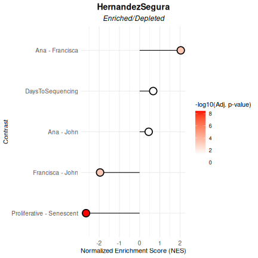

Alternatively, **score-based methods** provide a per-sample metric of
gene set activity, which can then be summarised across variables. Here,
we compute log2-median scores. The `Condition` variable shows a large
effect size (Cohen’s f), confirming strong discrimination between
Senescent and Proliferative samples. In contrast, `Researcher` does not
show a detectable association, in contrast to enrichment-based results.
This divergence illustrates the value of applying both enrichment- and
score-based approaches in a complementary manner.

``` r

VariableAssociation(data = counts_example, 
                    metadata = metadata_example, 
                    method = "logmedian",
                    cols = c("Condition","Researcher","DaysToSequencing"),  
                    gene_set = HernandezSegura_GeneSet,
                    mode="simple",
                    nonsignif_color = "white", signif_color = "red", saturation_value=NULL,sig_threshold = 0.05,
                    widthlabels=30, labsize=10, titlesize=14, pointSize=5, discrete_colors=NULL,
                    continuous_color = "#8C6D03", color_palette = "Set2")$Overall 
```

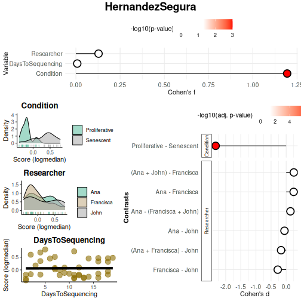

    ##           Variable    Cohen_f      P_Value
    ## 1        Condition 1.19407625 1.267423e-08
    ## 2       Researcher 0.12816159 7.458318e-01
    ## 3 DaysToSequencing 0.00792836 9.617953e-01

The Benchmarking Mode offers the most comprehensive set of features.
Users are allowed to seamlessly move from Discovery to Benchmarking once
a variable of interest has been identified and further testing is
required. Benchmarking is designed to evaluate multiple gene sets
simultaneously, whereas Discovery focuses on the performance of a single
gene set.

### Individual Gene Exploration

To better understand the contribution of individual genes within a gene
set, and identify whether specific genes drive the set’s collective
signal, `markeR` provides `VisualiseIndividualGenes.` Available options
include:

- Expression heatmaps of genes across samples or groups of samples;
- Violin plots showing cross-sample expression distributions of
  individual genes;
- Heatmaps of pairwise cross-sample expression correlation between genes
  in the set;
- ROC curves and AUC values to evaluate single genes’ performance as
  phenotypic markers;
- Effect size estimation (Cohen’s *d*) of expression differences between
  groups of samples;
- Principal Component Analysis (PCA) of expression of genes in the set,
  to evaluate which genes dominate collective variance and how samples
  separate according to the gene set’s expression.

For a complete overview, see
[`?VisualiseIndividualGenes`](https://diseasetranscriptomicslab.github.io/markeR/reference/VisualiseIndividualGenes.md)
and the extended online tutorial
[here](https://diseasetranscriptomicslab.github.io/markeR/articles/Tutorial_BenchmarkingMode.html#visualise-individual-gene-behaviour).

### Compare with Reference Gene Sets

`markeR` also supports comparison of user-defined gene sets against
reference collections (e.g., MSigDB). Two complementary similarity
metrics are implemented:

- **Jaccard Index**: the ratio of the number of genes in common over the
  total number of genes in the two sets.

- **Log Odds Ratio (logOR)** from Fisher’s exact test of association
  between gene sets, given a specified gene universe.

Filters can be applied based on similarity thresholds (e.g., minimum
Jaccard, OR, or Fisher’s test p-value).

Example of Gene Set Similarity (full tutorial
[here](https://diseasetranscriptomicslab.github.io/markeR/articles/Article_GeneSetSimilarity.html)):
We compare two user-defined gene sets against other user gene set and
the MSigDB C2:CP:KEGG_LEGACY collection. Similarity is summarised in a
heatmap of log odds ratios, highlighting associations above a defined
threshold (e.g., OR \> 100 for at least one of the signatures being
compared). The underlying data for the heatmap can be accessed via
`$data` for further analysis.

``` r

# Example data
signature1 <- c("TP53", "BRCA1", "MYC", "EGFR", "CDK2")
signature2 <- c("ATXN2", "FUS", "MTOR", "CASP3")

signature_list <- list(
  "User_Apoptosis" = c("TP53", "CASP3", "BAX"),
  "User_CellCycle" = c("CDK2", "CDK4", "CCNB1", "MYC"),
  "User_DNARepair" = c("BRCA1", "RAD51", "ATM"),
  "User_MTOR" = c("MTOR", "AKT1", "RPS6KB1")
)

geneset_similarity(
  signatures = list(Sig1 = signature1, Sig2 = signature2),
  other_user_signatures = signature_list,
  collection = "C2",
  subcollection = "CP:KEGG_LEGACY",
  metric = "odds_ratio",
  # Define gene universe (e.g., genes from HPA or your dataset)
  universe = unique(c(
    signature1, signature2,
    unlist(signature_list),
    msigdbr::msigdbr(species = "Homo sapiens", category = "C2")$gene_symbol
  )),
  or_threshold = 100, 
  width_text=50, 
  pval_threshold = 0.05
)$plot
```

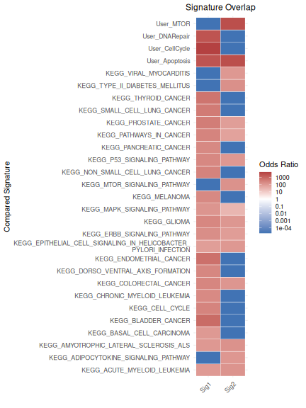

## Further Reading

Full tutorials with extended examples:

- [Benchmarking
  Mode](https://diseasetranscriptomicslab.github.io/markeR/articles/Article_BenchmarkingMode.html)  
- [Discovery
  Mode](https://diseasetranscriptomicslab.github.io/markeR/articles/Article_DiscoveryMode.html)  
- [Signature
  Similarity](https://diseasetranscriptomicslab.github.io/markeR/articles/Article_GeneSetSimilarity.html)

## Contact

📩 For questions, contact:

**Rita Martins-Silva**  
Email: <rita.silva@medicina.ulisboa.pt>

## Session Information

``` r

sessionInfo()
```

    ## R version 4.6.0 (2026-04-24)
    ## Platform: x86_64-pc-linux-gnu
    ## Running under: Ubuntu 24.04.4 LTS
    ## 
    ## Matrix products: default
    ## BLAS:   /usr/lib/x86_64-linux-gnu/openblas-pthread/libblas.so.3 
    ## LAPACK: /usr/lib/x86_64-linux-gnu/openblas-pthread/libopenblasp-r0.3.26.so;  LAPACK version 3.12.0
    ## 
    ## locale:
    ##  [1] LC_CTYPE=C.UTF-8       LC_NUMERIC=C           LC_TIME=C.UTF-8       
    ##  [4] LC_COLLATE=C.UTF-8     LC_MONETARY=C.UTF-8    LC_MESSAGES=C.UTF-8   
    ##  [7] LC_PAPER=C.UTF-8       LC_NAME=C              LC_ADDRESS=C          
    ## [10] LC_TELEPHONE=C         LC_MEASUREMENT=C.UTF-8 LC_IDENTIFICATION=C   
    ## 
    ## time zone: UTC
    ## tzcode source: system (glibc)
    ## 
    ## attached base packages:
    ## [1] stats     graphics  grDevices utils     datasets  methods   base     
    ## 
    ## other attached packages:
    ## [1] markeR_1.2       BiocStyle_2.40.0
    ## 
    ## loaded via a namespace (and not attached):
    ##   [1] pROC_1.19.0.1         gridExtra_2.3         rlang_1.2.0          
    ##   [4] magrittr_2.0.5        clue_0.3-68           GetoptLong_1.1.1     
    ##   [7] msigdbr_26.1.0        otel_0.2.0            matrixStats_1.5.0    
    ##  [10] compiler_4.6.0        mgcv_1.9-4            reshape2_1.4.5       
    ##  [13] png_0.1-9             systemfonts_1.3.2     vctrs_0.7.3          
    ##  [16] stringr_1.6.0         pkgconfig_2.0.3       shape_1.4.6.1        
    ##  [19] crayon_1.5.3          fastmap_1.2.0         backports_1.5.1      
    ##  [22] labeling_0.4.3        effectsize_1.0.2      rmarkdown_2.31       
    ##  [25] ragg_1.5.2            purrr_1.2.2           xfun_0.57            
    ##  [28] cachem_1.1.0          jsonlite_2.0.0        BiocParallel_1.46.0  
    ##  [31] broom_1.0.12          parallel_4.6.0        cluster_2.1.8.2      
    ##  [34] R6_2.6.1              stringi_1.8.7         bslib_0.10.0         
    ##  [37] RColorBrewer_1.1-3    limma_3.68.2          car_3.1-5            
    ##  [40] jquerylib_0.1.4       Rcpp_1.1.1-1.1        bookdown_0.46        
    ##  [43] assertthat_0.2.1      iterators_1.0.14      knitr_1.51           
    ##  [46] parameters_0.28.3     IRanges_2.46.0        splines_4.6.0        
    ##  [49] Matrix_1.7-5          tidyselect_1.2.1      abind_1.4-8          
    ##  [52] yaml_2.3.12           doParallel_1.0.17     codetools_0.2-20     
    ##  [55] curl_7.1.0            plyr_1.8.9            lattice_0.22-9       
    ##  [58] tibble_3.3.1          withr_3.0.2           bayestestR_0.17.0    
    ##  [61] S7_0.2.2              evaluate_1.0.5        desc_1.4.3           
    ##  [64] circlize_0.4.18       pillar_1.11.1         BiocManager_1.30.27  
    ##  [67] ggpubr_0.6.3          carData_3.0-6         foreach_1.5.2        
    ##  [70] stats4_4.6.0          insight_1.5.0         generics_0.1.4       
    ##  [73] S4Vectors_0.50.0      ggplot2_4.0.3         scales_1.4.0         
    ##  [76] glue_1.8.1            tools_4.6.0           data.table_1.18.4    
    ##  [79] fgsea_1.38.0          locfit_1.5-9.12       ggsignif_0.6.4       
    ##  [82] babelgene_22.9        fs_2.1.0              fastmatch_1.1-8      
    ##  [85] cowplot_1.2.0         grid_4.6.0            tidyr_1.3.2          
    ##  [88] datawizard_1.3.1      edgeR_4.10.0          colorspace_2.1-2     
    ##  [91] nlme_3.1-169          Formula_1.2-5         cli_3.6.6            
    ##  [94] textshaping_1.0.5     ComplexHeatmap_2.28.0 dplyr_1.2.1          
    ##  [97] gtable_0.3.6          ggh4x_0.3.1           rstatix_0.7.3        
    ## [100] sass_0.4.10           digest_0.6.39         BiocGenerics_0.58.0  
    ## [103] ggrepel_0.9.8         rjson_0.2.23          htmlwidgets_1.6.4    
    ## [106] farver_2.1.2          htmltools_0.5.9       pkgdown_2.2.0        
    ## [109] lifecycle_1.0.5       GlobalOptions_0.1.4   statmod_1.5.1
